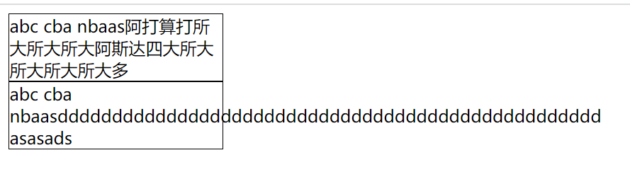

### 1.font-size

- 设置文字的大小
  - 像素：100px
  - em（不推荐）
  - 百分比：基于父元素的font-size进行计算，50%等于父元素font-size的一半
- 调试时可以在style下使用滚轮进行调试
- 具体的em和百分比是如何设置的，最好的办法是查文档

### 2.font-family

- 设置字体
  
  - 可以设置一种或者多种字体，用逗号隔开
  
- 当用户在自己的电脑上访问我们的网站时，我们为这个网站设置了字体

- 用户的浏览器运行在用户的操作系统上，所以浏览器会去找操作系统中是否存在这个字体

- 如果存在就使用，如果不存在就会使用浏览器默认字体

- 如果你设置了多个字体，浏览器就会一一对照，直到有一种字体，操作系统中也有，就可以进行使用

- 如果你就想使用自己的字体，可以使用@font-face指定在网络上可以下载的字体

- 淘宝设置的字体

  ```css
  textarea {
    font: 12px/1.5 tahoma, arial, 'Hiragino Sans GB', '\5b8b\4f53', sans-serif;
  }
  
  @font-face {
    font-family: "global-iconfont";
    src: url("//at.alicdn.com/t/font_1404888168_2057645.eot");
    src: url("//at.alicdn.com/t/font_1404888168_2057645.eot?#iefix")
    format("embedded-opentype"),
    url("//at.alicdn.com/t/font_1404888168_2057645.woff") format("woff"), 
    url("//at.alicdn.com/t/font_1404888168_2057645.ttf") format("truetype"), 
    url("//at.alicdn.com/t/font_1404888168_2057645.svg#uxiconfont") format("svg");
  }
  ```
  


- 加引号是因为字体间有空格，把它变成一个整体
  - 还有的加引号是因为Unicode编码，不加引号可能会引起浏览器报错，所以加引号
  - 为什么要给好多个元素设置字体
    - 因为害怕浏览器默认给不同的元素设置不同的字体
  
- 京东设置的字体

  

  - 12px/1.5：一般表示行高是1.5倍字体大小
  
- 之前学的设置字体

  
  
  - 具体的@font-face后面会详细讲

### 3.font-weight

- 设置文字的粗细
  - 100|200|300|400|500|600|700|800|900
  - normal = 400
  - bold [boʊl d]  = 700

### 4.font-style

- 设置文字的常规，斜体和倾斜
  - normal：常规
  - italic [ɪ ˈtæ lɪ k] ：在设计字体时，会把字体的斜体也设计一套，这个属性就是去找这套字体的斜体字体再进行展示
  - oblique [ə ˈb liː k] ：单纯的让文字倾斜

### 5.font-variant [ˈve riən t] 

- normal：没有变化
- small-caps：把小写字母变成大写字母，这个大写字母的高度依然是小写字母的高度

### 6.line-height

- 设置文本的行高
- 行高
  - 两行文字基线（baseline）之间的距离


- 1是一段合在一起的线，所以去除掉

- 2和3相等，是毋庸置疑的

- 那么只需要证明4和5相等就可以证明基线到基线的距离，等于整个文字所占据的内容高度

- 在这里要引入一个概念就是行距，行距总是由两个相等的部分组成，所以7等于6

- 相应的6和8也相等，即4和5相等，从而证明基线到基线的距离就是文字所占据的内容高度

- line-height还可以单独设置一个数字，比如2

  ```html
  <style>
    div {
      line-height: 2;
      border: 1px solid #000;
    }
  </style>
  
  <body>
    <div>123</div>
  </body>
  ```

  - 行高为两倍字体大小

### 7.height和line-height

- height是元素的整体高度

- line-height是每行文字所占据的高度

  

  
  - 蓝色部分的高度是line-height
  - 整体的高度是height

- 假设div中只有一行文字，如何让这行文字垂直居中

  ```html
  <style>
    div {
      width: 200px;
      border: 1px solid #000;
      height: 100px;
      line-height: 100px;
    }
  </style>
  
  <div>大所大所大所大所大多</div>
  ```

  

### 8.问题

```html
<style>
  div {
    width: 200px;
    border: 1px solid #000;
  }
</style>

<div>abc cba nbaas阿打算打所大所大所大阿斯达四大所大所大所大所大多</div>
<div>abc cba nbaasdddddddddddddddddddddddddddddddddddddddddddddddddddddddddddddddd</div>
```


- 为什么有的文字可以自动换行，而有的文字却超出了边框？

- 浏览器认为多个字母在一行，是一个单词整体，不能随便换行，我们只能主动使用强制换行，它才能换行

  ```html
  <div>abc cba nbaasdddddddddddddddddddddddddddddddddddddddddddddddddd asasads</div>
  ```

  

### 9.font

- 缩写属性

  ```css
  font: font-style font-variant font-weight font-size/line-height font-family;
  ```

- font-style font-variant font-weight

  - 这三个可以都不写，也可以都写，也可以只写几个，顺序随便

- font-size/line-height

  - font-size必须写
  - line-height可以不写

- font-family

  - 必须写


```js
div {
  font: 90px, tahoma, arial, 'Hiragino Sans GB', '\5b8b\4f53', sans-serif;
  font: 90px tahoma, arial, 'Hiragino Sans GB', '\5b8b\4f53', sans-serif;
}
```

- 第一行和第二行有什么区别
  - 逗号的问题
- 第一行不应该在90px之后加逗号
  - 属性值与属性值之间不能用逗号隔开，而是用空格分开
  - 某一个属性值，需要设置多个，比如字体要设置多种字体，每种字体之间需要设置逗号，但是这些是作为一个整体，属于一个属性值。

