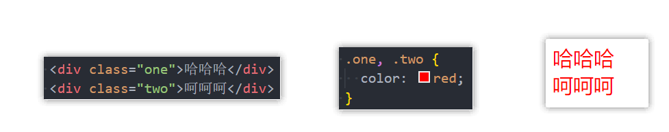

### 1.通用选择器

```css
* {
  margin: 0;
  padding: 0;
}
```

- 不太推荐使用，因为它会把所有的元素全部设置一遍，如果我们没有用到某个元素，但依然为其设置了，就会降低性能，不过还是比较常用的，比较方便嘛

- 推荐

  ```css
  body, h2, p, div, span {
    margin: 0;
    padding: 0;
  }
  ```

### 2.简单选择器

- 元素选择器：元素 {}
- 类选择器：.class {}
- id选择器：#id {}

### 3.属性选择器

- [attr]

  ```html
  <style>
    [title] {
      color: red;
    }
  </style>
  
  <div title="abc">大所大所大所大所大多</div>
  ```

- [attr=val]

  ```html
  <style>
    [title="abc"] {
      color: red;
    }
  </style>
  
  <div title="abc">大所大所大所大所大多</div>
  ```

### 4.后代选择器

- 所有后代选择器（儿孙选择器）

  - 以空格分割

    

- 直接后代选择器（儿子选择器）

  - 以 `>` 分割

    

### 5.兄弟选择器

- 相邻兄弟选择器

  - 以 + 相连

    

- 普通兄弟选择器

  - 以 ~ 相连

    

### 6.选择器组

- 交集选择器

  - 需要同时符合两个选择器条件

    

    1. 是div元素
    2. div元素存在one这个类
  
- 并集选择器

  - 为多个元素设置相同的样式

  - 以 `,` 进行分割

    

    - 存在one类的元素需要被选中
    - 存在two类的元素也需要被选中

### 7.伪类

- 动态伪类

  - :link
  - :visited
  - :hover
  - :active
  - :focus

- 目标伪类

  - :target

- 语言伪类

  - lang()

- 元素状态伪类

  - :enabled
  - :disabled
  - :checked

- 结构伪类

  - :nth-child()
  - :nth-last-child()
  - :nth-of-type()
  - :nth-last-of-type()
  - :first-child
  - :last-child
  - :first-of-type
  - :last-of-type
  - :root
  - :only-child
  - :only-of-type
  - :empty

- 否定伪类

  - :not

- 所有伪类请参考

  https://developer.mozilla.org/zh-CN/docs/Web/CSS/Pseudo-classes

### 8.伪类——动态伪类

- 使用顺序

  - :link：访问前
  - :visited：访问后
  - :focus：焦点被找到
  - :hover：鼠标悬停
  - :active：右键长按

- 对于a元素可以使用的伪类

  - 上面5个都可以
  - :hover必须放到:link和:visited后面
  - :active必须放到:hover后面

- 对input和a元素使用的伪类

  - :focus

    ```html
    <style>
      a:focus {
        color: red;
      }
      input:focus {
        background-color: aqua;
      }
    </style>
    
    <body>
      <a href="#">abc</a>
      <a href="#">cba</a>
      <input type="text">
    </body>
    ```

    

    - 按Tab键，寻找焦点

- 对于除了a元素以外可以使用的伪类

  - :hover
  - :active
  
- 直接给a元素设置样式，相当于给a元素的所有伪类都设置了同一种样式

