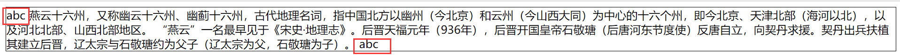
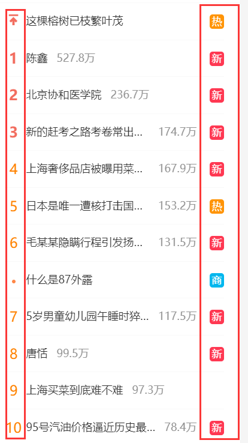
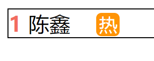
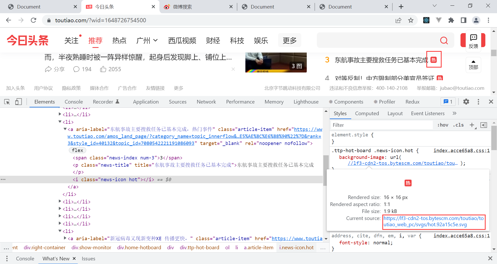

### 1.伪元素——::first-line和::first-letter

- ::first-line：给第一行加样式

  ```html
  <style>
    div::first-line {
      color: red;
    }
  </style>
  
  <div>
    燕云十六州，又称幽云十六州、幽蓟十六州，古代地理名词，指中国北方以幽州（今北京）和云州（今山西大同）为中心的十六个州，即今北京、天津北部（海河以北），以及河北北部、山西北部地区。 “燕云”一名最早见于《宋史·地理志》。后晋天福元年（936年），后晋开国皇帝石敬瑭（后唐河东节度使）反唐自立，向契丹求援。契丹出兵扶植其建立后晋，辽太宗与石敬瑭约为父子（辽太宗为父，石敬瑭为子）。
  </div>
  ```

  

- ::first-letter：给第一个字母或者字添加样式

  ```html
  <style>
    div::first-letter {
      color: red;
      font-size: 30px;
      padding: 4px;
    }
  </style>
  ```

  

### 2.伪元素——::before和::after

- ::before和::after：在元素前后插入内容

- 我们一般不会把伪元素应用在多行文本中，比如1中的div在浏览器中显示多行，如果你使用::before或::after为其添加内容，就会出现在行首和行尾。

  ```html
  <style>
    div {
      border: 1px solid #000;
    }
    div::before {
      content: "abc";
    }
    div::after {
      content: "abc";
    }
  </style>
  ```

  

- 一般是为只显示一行的排行榜，添加首位的名次和热度

  

  ```html
  <style>
    div {
      border: 1px solid #000;
    }
    div::before {
      content: "1";
      color: #F26D5F;
      font-weight: 700;
      margin-right: 5px;
    }
    div::after {
      content: "热";
      width: 18px;
      height: 18px;
      background-color: #FF9406;
      color: white;
      border-radius: 4px;
      font-size: 14px;
      display: inline-block;
      line-height: 18px;
      text-align: center;
      margin-left: 20px;
    }
  </style>
  
  <div class="box">陈鑫</div>
  ```

  

  - 无论是::before还是::after他们都是行内级元素，所以想要改变它们的宽高需要将他们修改为行内块

### 3.关于图标

- 我们这里是仅对文字做了一点样式，我们其实可以把热用图标代替
  

- 我们发现今日头条的图标是svg类型的，你可以点开这个图片直接另存为即可，但是我们这里直接用

  ```css
  div::after {
    content: url("https://lf3-cdn2-tos.bytescm.com/toutiao/toutiao_web_pc/svgs/hot.92a15c5e.svg");
  }
  ```

  
  - 存在一些问题，图标的位置很不好看，怎么微调它的位置呢？一般用relative（相对定位）进行位置微调

    ```css
    div::after {
      content: url("https://lf3-cdn2-tos.bytescm.com/toutiao/toutiao_web_pc/svgs/hot.92a15c5e.svg");
      position: relative;
      top: 3px;
      left: 10px;
    }
    ```

    

    - 这样就好很多

### 4.实现方块

- 我们想将 热 以红色小方块进行替换，应该注意什么？

  ```css
  div::after {
    content: "";
    display: inline-block;
    width: 8px;
    height: 8px;
    background-color: red;
  }
  ```

  - 除了要注意把行内级元素改成行内块级元素以外，还要注意content属性要给它一个空字符串
  - 不然不会显示