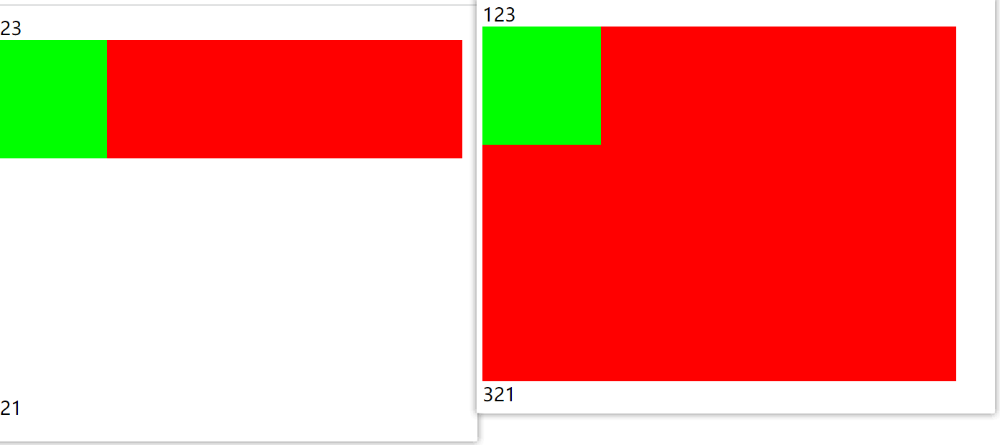

### 1.认识盒子

- HTML中的每一个元素都可以看作是一个盒子

  

  - 内容（content）
    - 我们之前设置的宽度和高度就是在设置内容
  - 内边距（padding）
    - 边框和内容之间的间距
  - 边框（border）
    - 元素自己的边框
  - 外边距（margin）
    - 元素与元素之间的间距

### 2.内容——content

- 内容是通过宽度和高度设置的
  - 宽度：width
  - 高度：height
- 对于行内级非可替换元素来说，设置宽度与高度是无效的
- 关于width的默认值
  - 无论什么元素width都是auto
  - 当你是块级元素时，auto表示占满一行
  - 当你是行内非替换元素时，auto表示宽度随内容而变化
  - 当你是行内可替换元素时，auto表示宽度随内容而变化，但是可以设置宽度
- min-width
  - 最小宽度，当浏览器缩小到一定程度，即浏览器宽度小于某个元素设置的最小宽度时
  - 这个元素不再缩小
- max-width
  - 最大宽度，当浏览器变大到一定程度，即浏览器宽度大于某个元素设置的最大宽度时
  - 这个元素不再变大
- min-height和max-height不常用

### 3.内边距——padding

- 设置边框和内容之间的间距

### 4.边框——border

- 设置边框的大小、样式、颜色

- 边框的样式

  

### 5.圆角——border-radius

- border-radius
  - 数值：设置小的圆角
  - 百分比：通常用50%把正方形设置成圆
- 百分比相对于谁？
  - 相对于border-box
  - 那么border-box包含什么？
    - 水平：(两个boder+两个padding+width) * 百分比 = 水平的圆角
    - 垂直：(两个border+两个padding+height) * 百分比 = 垂直的圆角

### 6.外边距——margin

- 通常用于设置元素与元素之间的间距

### 7.上下margin的传递

- margin-top

  ```html
  <style>
    .abc {
      background-color: #f00;
  
      width: 400px;
      height: 400px;
      overflow: auto;  /* 触发BFC */
    }
    .cba {
      background-color: #0f0;
  
      width: 100px;
      height: 100px;
      margin-top: 200px;
    }
  </style>
  
  <div class="abc">
    <div class="cba"></div>
  </div>
  ```

  - 块级元素的顶部线和父元素的顶部线重叠
  - 那么这个块级元素的margin-top值会传递给父元素

- margin-bottom

  ```html
  <style>
    .abc {
      background-color: #f00;
  
      width: 400px;
      height: auto;  /* 修改这里，默认值就是auto */
      overflow: auto;
    }
    .cba {
      background-color: #0f0;
  
      width: 100px;
      height: 100px;
      margin-bottom: 200px;
    }
  </style>
  
  <div>123</div>
  <div class="abc">
    <div class="cba"></div>
  </div>
  <div>321</div>
  ```
  



- 如果块级元素的底部线和父元素的底部线重叠，并且父元素的高度是auto
- 那么这个块级元素的margin-bottom值会传递给父元素
  
- 出现这种问题的解决方案

  - 使用padding
  - 给父元素使用border
  - 触发BFC：设置overflow为auto
  
- 其实使用padding也会出现问题

  - 问题：将整个元素撑大了
  - 解决：为整个元素（父元素）设置：box-sizing: border-box;

### 8.上下margin的折叠

- collapse（折叠）
  - 垂直方向上相邻的两个margin（margin-top、margin-bottom）会合并成一个margin
  - 水平方向上永远不会collapse
- 折叠后最终值的计算规则
  - 两个值中取较大的值
- 如何防止margin collapse
  - 只为其中一个元素设置margin

### 9.块级元素水平居中

- 块级元素的宽度 = 父元素的宽度 - ml - mr

- 对这个块级元素设置margin: 0 auto;
  - 之所以水平可以居中，是因为水平占满一行
  - 垂直用margin: auto 0;可以吗？
    - 当然是不可以的，垂直又不占满一行

### 10.行内非替换元素的特殊性

- 在这之前的9个点，基本上都是在围绕块级元素进行描述
- 现在我们说的是行内级元素中的行内非替换元素的特殊性
- width、height、margin-top、margin-bottom
  - 不起作用
-  padding-top、padding-bottom、border-top、border-bottom
  - 只有内容的填充，但不占据空间
- 行内替换元素没有什么特殊性，跟inline-block几乎一样
  - inline-block几乎没有任何特殊性
    - 什么传递、折叠、非替换元素的特殊性均没有

### 11.CSS属性：box-sizing

- box-sizing: content-box;
  - 除去margin的宽度 = (border-left + border-right) + (padding-left + padding-right) + width
  - 除去margin的高度 = (border-top + border-bottom) + (padding-top + padding-bottom) + height
- box-sizing: border-box;
  - 你设置的width = (border-left + border-right) + (padding-left + padding-right) + 内容宽度为剩余宽度
  - 你设置的height = (border-top + border-bottom) + (padding-top + padding-bottom) +内容高度为剩余高度
- IE盒子模型
  - W3C的盒子模型是：box-sizing: content-box;
  - IE（IE8以下浏览器）盒子模型是：box-sizing: border-box;

### 12.外轮廓——outline

- outline: outline-width outline-style outline-color;跟border一样
- 不占据空间
- 应用场景
  - 去除a元素和input元素在focus状态下的外轮廓
  - outline: none;

### 13.盒子阴影——box-shadow

- box-shadow: offset-x offset-y blur-radius spread-radius color inset;
  - offset-x：水平偏移
  - offset-y：垂直偏移
  - blur-radius [blɜːr]  [ˈreɪdiəs] ：模糊半径
  - spread-radius：延伸半径
  - color：颜色
  - inset：外框阴影变内框阴影
- 想要设置多个阴影，用逗号隔开
- 调试网站
  - https://html-css-js.com/css/generator/box-shadow/

### 14.文字阴影——text-shadow

- text-shadow: offset-x offset-y blur-radius color;
  - 没有spread-radius和inset
- 设置多个阴影用逗号隔开
- 调试网站
  - https://html-css-js.com/css/generator/text-shadow/

### 15.测试：背景色和前景色会延伸到哪里

- 会延伸到padding和border上

### 16.其他

- 如何拿网站的hover状态

  

- 拿图片的技巧

  ```html
  
  ```
  
  - referrerpolicy="referrer"
  - referrer [rɪ'fɜːrə] ：引荐


