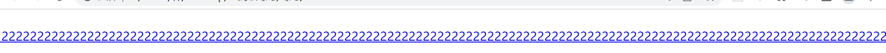

```html
<style>
  a {
    display: inline-block;
  }
  p {
    white-space: nowrap;
    overflow: hidden;
    text-overflow: ellipsis; [ɪ ˈlɪp sɪ s] 
  }
</style>

<a href="#">     <p>222222222222222222222222222222222222222222222222222222222222222222222222222222222222222222222222222222222222222222222222222222222</p>
</a>
```



没有给a宽度，宽度自适应了

其实出现这种情况可以尝试给它的父元素或者更高层级的元素设置overflow: hidden;

但是一般给父元素设置了固定宽度就可以了

不过有时候我们不能给父元素设置固定宽度，就得尝试给它的父元素或者更高层级的元素设置overflow: hidden;

