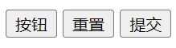

### 1.input元素的属性

- type属性

  ```html
  <input type="text">
  <input type="password">
  ```

- 其他属性

  ```html
  <input type="text" readonly>
  <input type="text" disabled>
  <input type="text" autofocus>
  ```

  - readonly：只读
  - disabled：不可选中，变灰
  - autofocus：自动聚焦

- type类型的其它取值以及input的其他属性，请查看下面的链接

  - https://developer.mozilla.org/zh-CN/docs/Web/HTML/Element/Input

### 2.布尔属性

- 1中的其他属性中的三个属性均属于布尔属性
- 除了1中的三个布尔属性外还有其它布尔属性
  - checked：默认选中某个单选按钮或某个复选框
  - multiple [ˈmʌltɪpl] ：在选项列表中开启多选模式
  - selected：在选项列表中默认选中某个选项

### 3.表单按钮

- 通过input实现按钮效果

  - 普通按钮（type="button"）：使用value属性设置按钮文字

  - 重置按钮（type="reset"）：重置它所属form下的所有表单元素

  - 提交按钮（type="submit"）：提交它所属form下的所有表单数据给服务器

    ```html
    <input type="button" value="按钮">
    <input type="reset">
    <input type="submit">
    ```

    

- 给button设置一样的type也能实现相同的效果
  ```html
  <button>按钮</button>
  <button type="reset">重置</button>
  <button type="submit">提交</button>
  ```

### 4.input和label结合

- label可以绑定某个input，从而能够点击label即可激活对应的input，并将其聚焦选中

  ```html
  <label for="username">
    用户名：
    <input id="username" type="text">
  </label>
  <label for="password">
    密码：
    <input id="password" type="password">
  </label>
  ```

### 5.单选框——radio

- 只有name值相同才可以实现单选功能

  ```html
  <label for="male">
    <input id="male" type="radio" name="sex">男
  </label>
  <label for="female">
    <input id="female" type="radio" name="sex">女
  </label>
  ```

- 提交表单的做法

  ```html
  <form action="/abc" target="_blank">
    <label for="male">
      <input id="male" type="radio" name="sex" value="male">男
    </label>
    <label for="female">
      <input id="female" type="radio" name="sex" value="female">女
    </label>
  
    <input type="submit">
  </form>
  ```

  

  - target="_blank"：跳转到新的页面进行数据提交

### 6.复选框——checkbox

- 属于同一类型的checkbox，name值要一样

  ```html
  <form action="/abc" target="_blank">
    <h2>您的爱好：</h2>
    <label for="basketball">
      <input id="basketball" type="checkbox" name="hobby" value="basketball">篮球
    </label>
    <label for="football">
      <input id="football" type="checkbox" name="hobby" value="football">足球
    </label>
    <label for="waterball">
      <input id="waterball" type="checkbox" name="hobby" value="waterball">水球
    </label>
  
    <input type="submit">
  </form>
  ```

- 提交

  

### 7.多行输入——textarea

- textarea的常用属性

  - cols：列数

  - rows：行数

    ```html
    <label for="info">
      个人信息：
      <textarea id="info" name="info" cols="30" rows="10"></textarea>
    </label>
    ```

- css设置缩放

  ```css
  textarea {
    resize: none;  /* 禁止缩放 */
    resize: horizontal; [ˌhɔːrɪˈzɑːntl]   /* 水平缩放 */
    resize: vertical;  /* 垂直缩放 */
    resize: both;  /* 默认值 */
  }
  ```

- 提交

  ```html
  <form action="/abc" target="_blank">
    <label for="info">
      个人信息：
      <textarea id="info" name="info" cols="30" rows="10"></textarea>
    </label>
  
    <input type="submit">
  </form>
  ```

  

### 8.选项列表

select和option的使用

- 初识

  ```html
  <select name="fruits">
    <option value="apple">苹果</option>
    <option value="orange">橙子</option>
    <option value="banana">香蕉</option>
  </select>
  ```

  

- select元素的属性

  - multiple：多选，需要按住ctrl才可以多选

  - size：显示多少个option

    ```html
    <select name="fruits" multiple size="2">
      <option value="apple">苹果</option>
      <option value="orange">橙子</option>
      <option value="banana">香蕉</option>
    </select>
    ```

- option元素的属性

  - selected：默认选中

    ```html
    <select name="fruits" multiple size="2">
      <option value="apple">苹果</option>
      <option value="orange" selected>橙子</option>
      <option value="banana">香蕉</option>
    </select>
    ```

    

- 提交

  ```html
  <form action="/abc" target="_blank">
    <select name="fruits" multiple size="2">
      <option value="apple">苹果</option>
      <option value="orange" selected>橙子</option>
      <option value="banana">香蕉</option>
    </select>
  
    <input type="submit">
  </form>
  ```

  

### 9.form元素和它的属性

- form元素是所有表单的父元素，如果把所有表单包裹在内就可以实现以下功能

  - 对form表单的整体通过重置按钮进行数据重置
  - 对form表单的整体通过提交按钮，把数据提交到服务器

- form元素的属性

  - action
    - 提交数据的URL
  - method
    - 请求方法：get和post
    - 默认是get
    - 最好用post方法传递数据，密码最好发送加密后的密文，数据库不解密，直接将密文存入数据库，当我们要登录时，再将密码加密把密文发送给服务器，然后对比密文，正确就登录成功
  - target
    - _self：默认值
    - _blank：在新的页面提交数据

  ```html
  <form action="/abc" method="get" target="_blank">
    <label for="username">
      <input id="username" type="text" name="username">
    </label>
    <label for="password">
      <input id="password" type="password" name="password">
    </label>
      
    <input type="reset">
    <input type="submit">
  </form>
  ```

  

### 10.模拟百度

```html
<form action="https://www.baidu.com/s">
  <input id="search" type="text" name="wd">

  <input type="submit">
</form>
```

