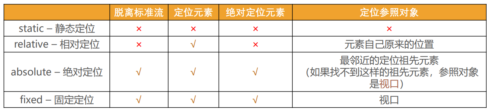
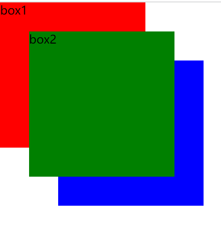
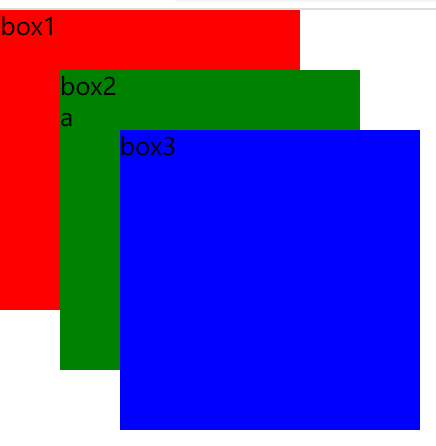

### 1.absolute——绝对定位

- 脱离标准流
- 可以通过left、right、top、bottom进行定位
  - 定位所参照的对象是：所有定位元素中，最临近的祖先元素
  - 如果找不到符合要求的祖先元素，参照对象是：视口
  - 我并不认为视口这个回答是准确的
  - 经过我的测试，我觉得如果你给一个被绝对定位过的元素设置了right为0，bottom为0
  - 那么其实你给right设置了一个死值，这个死值是整个浏览器排除掉右边滚动条的宽度
  - top也设置了一个死值，这个死值是整个浏览器排除掉底部滚动条的高度
  - 所以如果你设置了上面两个值，元素并不会跟随着你的滚动而滚动，而是固定在了那个位置
- 只要你是一个定位元素，我就可以把你作为我的参照
  - 子绝父相、子绝父绝、子绝父固
  - 以上三种情况均是正确的
  - 什么是定位元素？
    - 把position的值设为relative、absolute、fixed的元素

### 2.绝对和固定定位的元素特点一

- 可以随意设置宽高
- 宽高默认由内容决定
- 不再受标准流的约束
- 不再区分块级、行内级
- 块级、行内级的很多特性会消失
- 不再给父元素汇报宽高
- 脱标元素内部依然是按照标准流进行布局

### 3.绝对和固定定位的元素特点二

- 被定位的元素所参照对象的宽度 = left + right + ml + mr + 被定位的元素实际占用的宽度
- 被定位的元素所参照对象的高度 = top + bottom + mt + mb + 被定位的元素的实际占用高度
- 除此之外我们还要知道
  - top、bottom、left、right的初始值均为auto
    - auto的意思就是交给浏览器来处理
    - 浏览器可能设置0，可能设置其他值，具体不知道
  - mt、mb、ml、mr的初始值都为零
- 如果你想让被定位的元素的宽高和参照对象的宽高一样，那么就不应该设置被定位元素的宽高
  - 然后让top、bottom、left、right、mt、mb、ml、mr全部为零
  - 当然mt、mb、ml、mr本身就为零
- 如果你想让被定位的元素在参照对象的水平方向上居中
  - 让left、right为零，让ml、mr为auto
- 如果你想让被定位的元素在参照对象的垂直方向上居中
  - 让top、bottom为零，让mt、mb为auto
- 如果你想把被定位的元素放在参照对象的正中央
  - 让top、bottom、left、right为零
  - 让mt、mb、ml、mr为auto

### 4.sticky——粘性定位

- 相对定位和固定定位或绝对定位的结合体
- 被粘性定位的元素表现的像相对定位一样，直到滚动到某个阈值
- 当达到这个阈值就会变成固定定位或绝对定位
- 被粘性定位的元素的父元素启动了滚动功能，粘性定位才会起作用

### 5.position的值对比



### 6.z-index

- 定位元素的层叠顺序，仅对定位元素有效

- 取值：

  - 正整数、负整数、零

- 定位之后是兄弟关系

  - z-index值越大，就越在上面

  - z-index值越小，就越在下面

    ```html
    <style>
      .item {
        width: 200px;
        height: 200px;
        background-color: red;
        position: fixed;
        top: 0;
        left: 0;
      }
      .box2 {
        top: 40px;
        left: 40px;
        background-color: green;
        z-index: 1;
      }
      .box3 {
        top: 80px;
        left: 80px;
        background-color: blue;
      }
    </style>
    
    <div class="item box1">box1</div>
    <div>
      <div class="item box2">box2</div>
    </div>
    <div class="item box3">box3</div>
    ```

    

- 定位之后不是兄弟关系

  - 互相之间没有影响

    ```html
    <style>
      .item {
        width: 200px;
        height: 200px;
        background-color: red;
        position: fixed;
        top: 0;
        left: 0;
      }
      .box2 {
        top: 40px;
        left: 40px;
        background-color: green;
        z-index: 0;
      }
      .box3 {
        top: 80px;
        left: 80px;
        background-color: blue;
      }
      .a {
        position: absolute;
        z-index: 100000;
      }
    </style>
    
    <div class="item box1">box1</div>
    <div>
      <div class="item box2">
        box2
        <div class="a">a</div>
      </div>
    </div>
    <div class="item box3">box3</div>
    ```

    