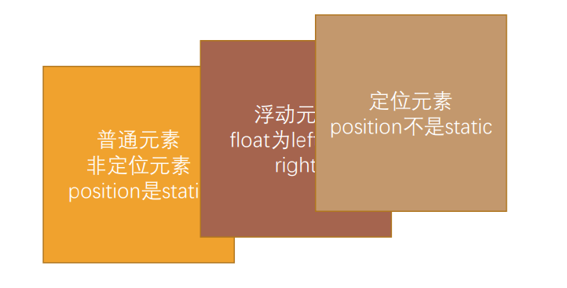

### 1.认识浮动

- float属性可以指定元素沿着容器的左侧或者右侧放置，允许文本和内联元素环绕着它
- float最初设计它的目的是实现图文混排
  - 在某段文字内浮动图片，让文字环绕着图片
- 绝对定位、固定定位、float都会让元素脱离标准流
- float常用取值
  - none：默认值（不浮动）
  - left：左浮动
  - right：右浮动

### 2.浮动规则

1. 元素浮动后，脱离标准流

   - 向左或向右移动，直到自己的边界紧贴着包含块或者其他浮动元素的边界为止

     - 但是不管是向左浮动还是向右浮动，浮动元素的边界是不能超出包含块的

   - 浮动元素会层叠在定位元素的下面

     

2. 浮动元素之间不能层叠

   - 后浮动的元素紧贴着先浮动的元素
   - 如果包含块的水平方向剩余空间不够浮动元素的放置，那么浮动元素将向下移动，直到有充足的空间为止

3. 浮动元素无法与行内级元素、文字层叠

   - 行内级元素在前，浮动元素紧跟在后面
   - 浮动元素在前，行内级元素紧跟在后面
   - 不管文字在前还是在后，都会被推到浮动元素的后面

4. 行内级元素浮动后，浮动元素的顶部将与所在行的顶部对齐

### 3.行内级元素空隙的解决方案

- 空隙出现的原因，是行内级元素之间的换行符造成的
- 用浮动就能解决

### 4.练习一


- .container>.box>元素*5
- 总长度为1190px
- 每一个元素为230px
- 每个空隙为10px
- 为每个元素设置margin-right: 10px;
- 最终会多出来10px
- 给.box的margin-right: -10px;

### 5.练习二


- 六个一起左浮
- 最后两个会因为空间不足而被挤下来

### 6.练习三


- 方法一：
  - 给.box设置边框，只有右边框什么都不给
  - 给每一个元素一个右边框
  - 总长度为1100px
  - 每一个元素为220px，并且设置了box-sizing: boder-box;
  - 所以最后多出来了.box的左边框的一像素
  - 所以给.box的margin-right: -1px;
- 方法二
  - 给每一个元素一个全边框
  - 每个元素的宽度为221px
  - 然后每个元素给margin-right: -1px;
  - 虽然可以全部放下，但是左边凸出来一像素，所以我们会给.box一个margin-left: 1px;
  - 但是给了1px宽度就多出来一像素，所以给第一个元素的宽度设置为220px

### 7.清除浮动

- 为什么需要清除浮动

  - 元素浮动后脱离标准流，不再向父元素汇报高度
  - 父元素没有浮动元素的高度，父元素会出现高度塌陷的问题
  - 父元素下面的正常布局就会往上移动，并被脱标元素所覆盖
  - 清除浮动的目的在于：
    - 在父元素计算总高度时把浮动元素所占据的高度也计算进去

- 如何清楚浮动

  - 方法一：给父元素设置相应的宽高

  - 方法二：在所有的浮动元素下面放置一个块级元素，并为其设置css属性clear: both;

  - 方法三：为父元素添加伪元素

    ```css
    父元素::after {
      content: "";
      display: block;
      clear: both;
    }
    ```

    - 兼容性写法

      ```css
      .clear_fix::after {
        content: "";
        display: block;
        clear: both;
        
        visibility: hidden;
        height: 0;
      }
      
      .clear_fix {
        *zoom: 1;
      }
      ```

      