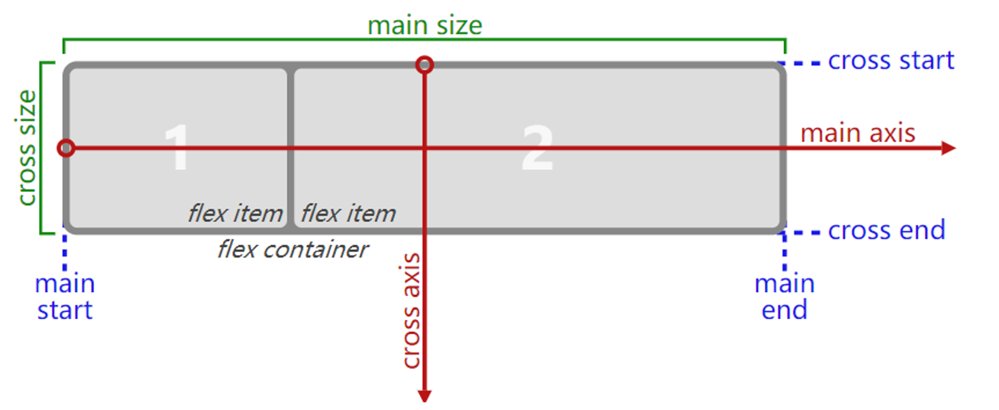

### 1.认识flexbox

- flexbox是弹性盒子的意思
  - 弹性盒子是一种用于按行或按列布局盒中元素的一维布局方案
  - 盒中元素可以膨胀以填充额外的空间，可以收缩以适应更小的空间
  - 我们使用flexbox进行布局的方案称之为flex布局（flex layout）

### 2.重要概念

- flex container
  - 开启flex布局的元素叫做：flex container
- flex item
  - flex container中的每个直接子元素叫做：flex item
- flex item的特点
  - flex item如何布置将受flex container的属性控制
  - flex item不再严格区分是块级元素还是行内级元素
  - flex item的宽高默认由内容撑起，但是可以设置宽度和高度
- 如何为某个元素开启flex布局，让其成为flex container
  - 为display属性设置flex或者inline-flex
    - flex：flex container以块级（block-level）的形式存在
    - inline-flex：flex container以行内级（inline-level）的形式存在

### 3.flex布局模型

- main axis [ˈæksɪs] ：主轴
- cross axis：交叉轴

### 4.属于flex container的属性

- flex-direction
  - 改变主轴的方向
- flex-wrap
  - 决定container中的items是以单行显示还是以多行显示
- flex-flow
  - flex-direction和flex-wrap的缩写属性
- justify-content
  - 决定items在主轴上的对齐方式
- align-items
  - 决定items在交叉轴上的对齐方式
- align-content
  - container有多行items，决定这些多行items的对齐方式，类似于justify-content在主轴的工作

### 5.属于flex item的属性

- order
  - 决定items的排布顺序
  - 数字越小越往前排，越大越往后排
- align-self
  - 可以单独设置每一个item在交叉轴上的对齐方式，对应的是align-items
- flex-grow
  - 决定items如何扩展
- flex-shrink
  - 决定items如何收缩
- flex-basis
  - 设置items在主轴上的base size
- flex
  - flex-grow、flex-shrink、flex-basis的缩写属性