### 1.flex-direction

- 决定主轴的方向
  - row：默认值，主轴水平向右，元素排布起始点在左上角，水平向右排布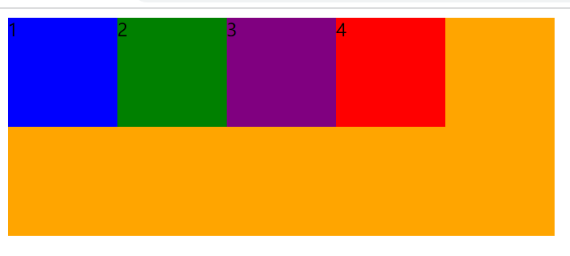

  - row-reverse：主轴水平向左，元素排布起始点在右上角，水平向左排布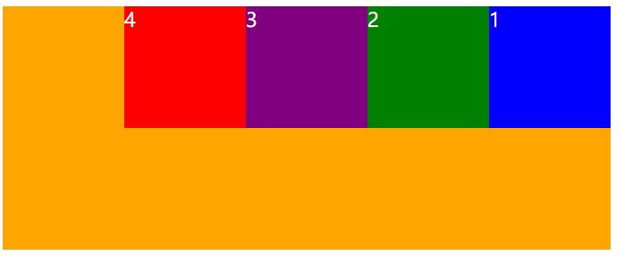

  - column [ˈkɒləm] ：主轴垂直向下，元素排布起始点在左上角，垂直向下排布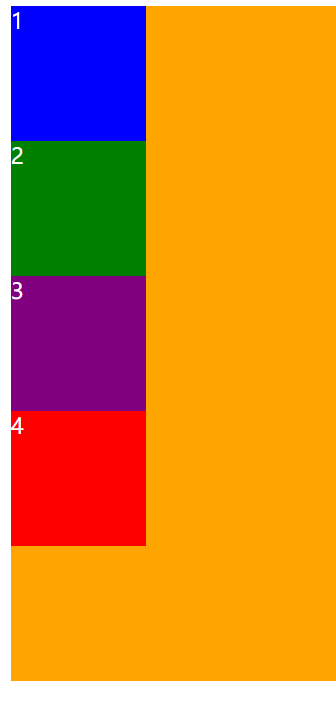

  - column-reverse：主轴垂直向上，元素排布起始点在左下角，垂直向上排布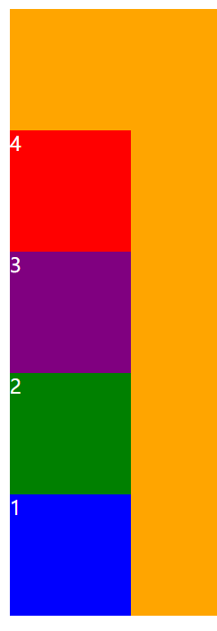

### 2.flex-wrap

- 决定了flex container中的每个flex item是以单行显示还是以多行显示

  - nowrap：默认值，以单行显示，但是如果所有item的宽度或高度加在一起超出container的宽度或高度，为item所设置的宽度和高度就不再起作用，而是平分container的宽度或高度，压缩每一个item

    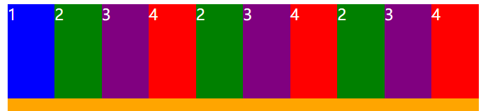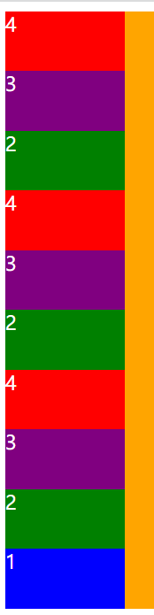

    - 之所以设置的宽度或高度不起作用，是因为flex-shrink的默认值为1

  - wrap：以多行显示，这时items的宽度或高度就起作用了

    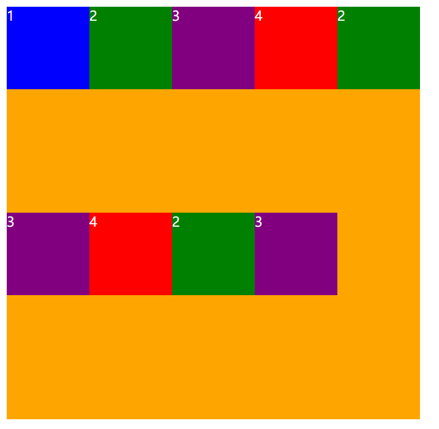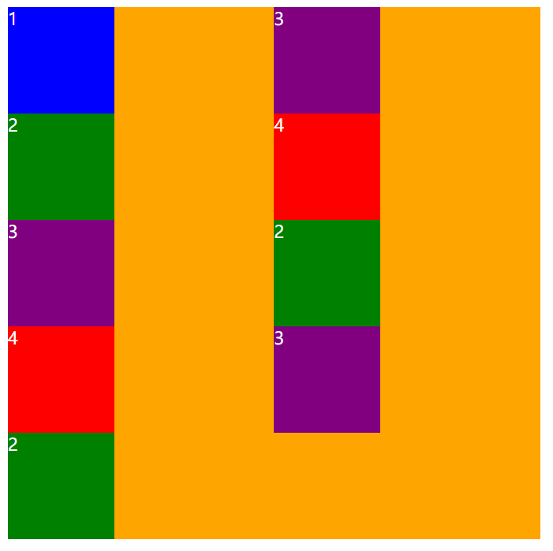

  - wrap-reverse，以多行显示，但是变换了交叉轴方向

    - flex-direction为row时，元素排布起始点在左下角，水平向右排布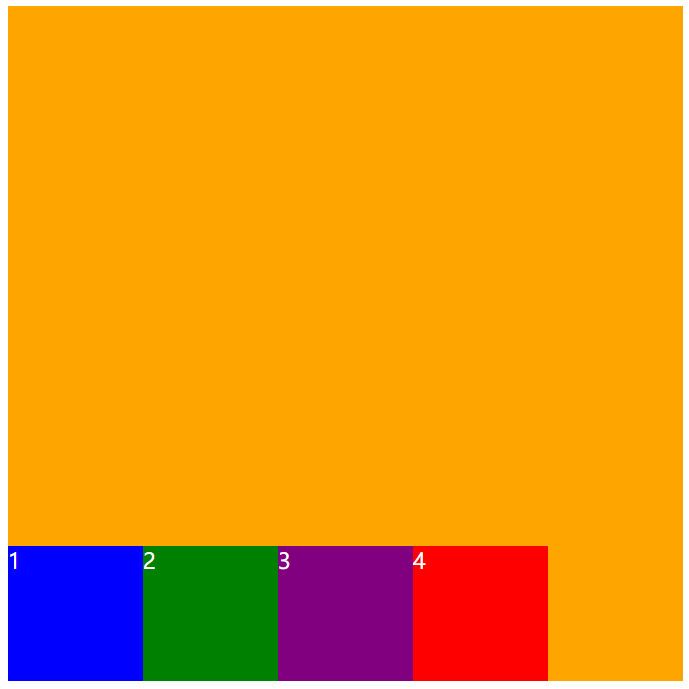

    - flex-direction为row-reverse时，元素排布起始点在右下角，水平向左排布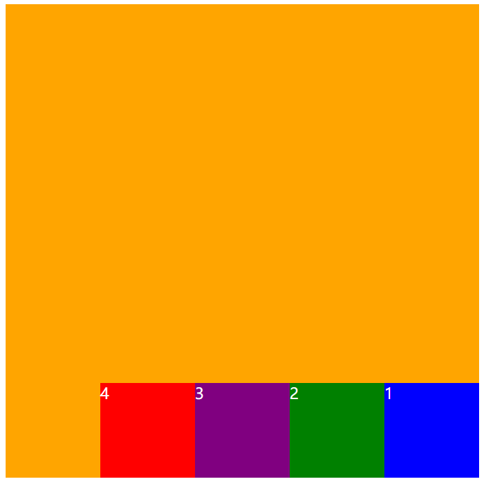

    - flex-direction为column时，元素排布起始点在右上角，垂直向下排布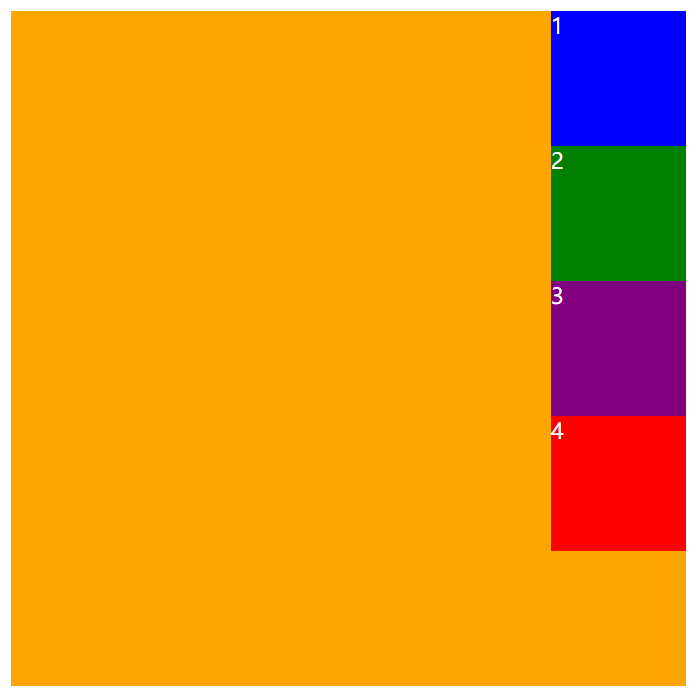

    - flex-direction为column-reverse时，元素的起始点在右下角，垂直向上排布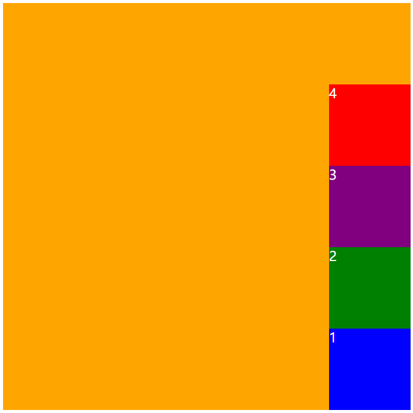

### 3.flex-flow

- flex-flow是flex-direction和flex-wrap属性的简写

### 4.justify-content

- flex-star：与main start对齐
- flex-end：与main end对齐
- center：居中对齐
- space-between：
  - flex items之间的距离相等
  - 与marin start和main end两端对其
  - 如果只有一个元素，就对齐main start
- space-evenly：
  - 每个flex item之间的距离都相等
  - 第一个item与main start的距离，最后一个item与main end的距离
    - 这两个的距离与item之间的距离相等
  - 就是所有的间距都是一样的，等分
- space-around：
  - main start和main end距离item的间距是每一个item之间间距的一半
- space-evenly和space-around：如果container只有一个item就在main axis上居中显示

### 5.align-items：对每一行进行位置设置

- 我们要明确一点，这个属性目前以我的测试结果，它好像只对一行的item起作用
- 想要对多行进行设置请使用align-content
- normal：默认值
- stretch：normal效果和stretch一样，会在cross axis上拉伸元素，前提是每个item不能有高度或宽度
- flex-start：与cross start对齐
- flex-end：与cross end对齐
- center：居中对齐，如果有多行，它可以让每个元素在这一行的所占的空间内居中
- baseline：与基线（应该是文字基线）对齐

### 6.align-content：对所有行统一设置位置

- stretch与align-items的stretch效果一样
- flex-start：与cross start对齐，每行之间没有距离
- flex-end：与cross end对齐，每行之间没有距离
- center：居中对齐，每行之间没有距离

- space-between：
  - 每行元素之间的距离相等
  - 与cross start和cross end两端对其
  - 如果只有一行元素，就对齐cross start
- space-evenly：
  - 每行元素之间的距离都相等
  - 第一行元素与cross start的距离，最后一行元素与cross end的距离
    - 这两行元素的距离与行与行之间的距离相等
  - 就是行与行之间的间距都是一样的，等分
- space-around：
  - cross start和cross end距离行的间距是每一行之间间距的一半
- space-evenly和space-around：如果只有一行元素，这一行元素应该在cross axis上居中显示