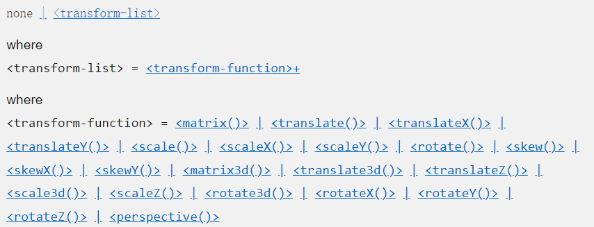

### 1.transform属性

- transform属性可以对某一个元素进行形变
- 形变包括：
  - 平移
  - 缩放
  - 旋转
  - 倾斜
- 注意：
  - 不能对行内非可替换元素进行形变
  - 比如不能对a元素、span元素进行形变
- 特点：
  - 虽然它可以改变自身的盒子大小，但是不影响其他任何盒子，也不影响文本流

### 2.transform属性的语法



- where：我猜是起解释说明的作用
- +：1个或多个，多个以空格分割
- #：1个或多个，多个以逗号分割
- transform-function：形变函数
- 常用的形变函数有如下四个
  - translate(x, y);
  - scale(x, y);
  - rotate(deg);
  - skew(deg, deg);

### 3.translate

- 语法：
  - translate(x, y); 这里应该注意一下，一定要写逗号，自己老是忘记
  - translate是平移的意思，它可以移动平面上的元素
  - translate本身是翻译的意思，在这里取物理上的平移之意
- 值的个数
  - 一个值，表示在x轴上位移
  - 两个值，表示在x轴和y轴上位移
- 数值的类型
  - 像素：比如 translate(100px, 100px);
  - 百分比：百分比相对于自身的宽高
- translate函数是translateX函数和translateY函数的缩写
- 注意x和y之间一定要用逗号进行分割，用空格分割，会出问题

### 4.通过translate实现垂直居中

- 前提条件

  - 被垂直居中的元素，必须在一个拥有高度的盒子内
  - body比较特殊，body的子元素无法通过这种方式进行垂直居中

- 实现

  ```html
  <style>
    .container {
      width: 600px;
      height: 600px;
      background-color: #f00;
    }
    .box {
      position: relative;
      top: 50%;
      /* transform: translate(0, -50%); */
      transform: translateY(-50%);
  
      width: 100px;
      height: 100px;
      background-color: #ff0;
    }
  </style>
  
  <div class="container">
      <div class="box"></div>
  </div>
  ```

- 虽然这种方式做垂直居中会比flex做垂直居中的兼容性好一点点，但是还是推荐使用flex布局

### 5.scale

- 语法：
  - scale(x, y);
  - scale是缩放的意思，scale函数可以改变元素的大小
- 值的个数
  - 一个值，同时在x轴和y轴上进行缩放
  - 两个值，分别在x轴和y轴上进行缩放
- 以元素的中心点为基点进行缩放
- 值类型
  - 数字
    - 1：保持原大小
    - 2：放大两倍
    - 0.5或.5：缩小一半
  - 百分比：不常用

### 6.rotate

- 语法：
  - rotate(deg);
- 值的个数
  - 只有一个值，表示旋转多少度
- 值的单位
  - deg：degrees
    - 正值：顺时针旋转
    - 负值：逆时针旋转

### 7.transform-origin属性

- transform-origin属性主要用来改变形变的原点
  - scale和rotate都会有一个缩放或旋转依据点，这个依据点一般是元素的中心点
  - 如果我们想要改变依据点的位置就需要用到这个transform-origin属性
  
- 值的个数
  - 一个值：设置x轴的原点
  - 两个值：设置x轴和y轴的原点
  
- 值的类型
  - 像素
  - 百分比：参考对象是自身
  - 关键字：top，bottom，left，right
  
- 书写方式

  ```css
  transform-origin: center 25%;
  ```

### 8.skew

- 语法：
  - skew(x, y);
  - 倾斜
- 值的个数
  - 一个值：表示在x轴上倾斜
  - 两个值：表示在x轴和y轴上倾斜
- 值的类型
  - deg：倾斜的角度
  - 负数

### 9.同时设置多种形变

- transform: translate(x, y) scale(.8) rotate(90deg) skew(10deg);
- 以空格分隔
- 不能一个一个的写transform属性，因为后来写的transform会把前面写的transform给层叠掉