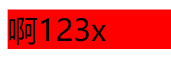
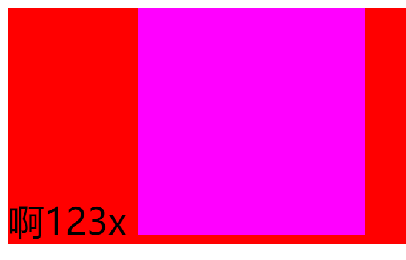
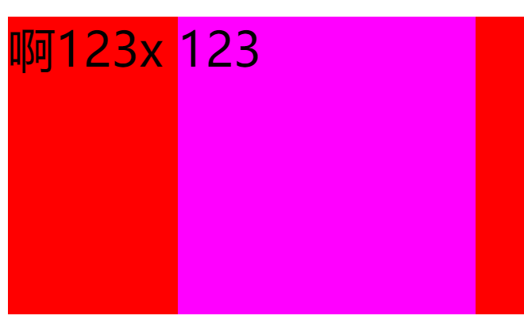
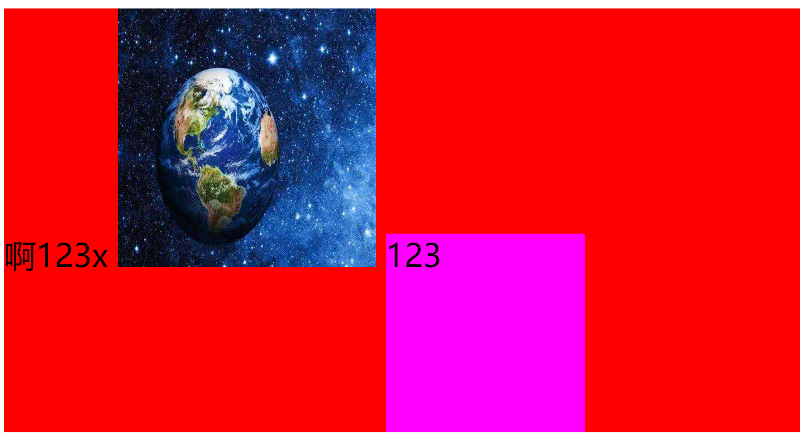

### 1.先明白一件事

- vertical-align影响的是什么元素？
- 一定是某个盒子内的行内级元素
- 为什么不是块级元素？
  - 因为块级元素独占一行，没有什么对齐不对齐的概念，因为没人能和块级元素在同一行显示

### 2.基线对齐

- 在div中有文字

  - 我们可以单独把文字拿出来，把它看做是一个行内级元素

  - 之前学过文字是有行高的，并且为了显示起来好看，文字是有基线和行距的

    ```html
    <div class="container">啊123x</div>
    ```

    

    - 你会发现在文字的上下都会有距离，从底部到x的距离就是：行距÷2 + 行距顶部到基线的距离

      

    - 也就是7 + 7的顶部到基线的距离

    - 整个div的高度是文字的默认行高

- 在div中有span元素，span元素是inline-block

  
  
  - 发没发现一个问题，他们底部的对其方式好像都是以文字的基线对齐的，那，行内元素在没有内容的时候，最底部就是它的基线

### 3.两个条件

- 条件一：行盒要完全包裹内容
  - 比如文字，行盒的高度就是文字的行高
  - 比如span元素，行盒的高度就必须是span的高度
- 条件二：基线对齐
  - 文字的基线我们知道，在x的最下面，span的基线我们也知道，在span的底部
  - 如果让它俩以基线对齐，必须把div的下面撑起一点，这一点之前说过：行距÷2 + 行距顶部到基线的距离

### 4.如果span中有内容呢？

- span还有一个固定高度

  ```html
  <div class="container">
    啊123x
    <span>123</span>
  </div>
  ```

  

  - 咦，怎么是这个样子？
  - 条件一：行盒包裹整个元素，满足吗？满足
  - 条件二：基线对齐？这里有一个原则，span中有文字，span的基线变为span中文字的基线，所以基线对齐也满足，没问题。如果有多行文字，把最后一行文字的基线作为span的基线

### 5.既有文字又有图片

```html
<div class="container">
  啊123x
  
  <span>123</span>
</div>
```



- 第一个文字的基线和图片的基线对齐，再和span中的文字基线对齐

- 如果行内级元素有margin-bottom，行盒也要把margin-bottom包裹在内
- 比如span有margin-bottom，红色还会往下多出margin-bottom的距离

### 6.罪魁祸首

- vertical-align: baseline;
  - 就是这个属性，让所有的行内级元素以基线对齐，默认值
- 除此之外还有很多值
  - top：行内级盒子的顶部跟line boxes顶部对齐
  - middle：行内级盒子的中心点与父盒基线加上x-height一半的线对齐
  - bottom：把行内级盒子的底部跟line box底部对齐
- 这里主要说一下middle
  - middle是无法完美做到让两个行内级元素垂直居中的
  - 因为这个middle是以小写字母x的交叉点为基准对齐
  - 但是为了视觉上好看，文本会下沉，导致x的交叉点并不是整个元素的中心点，所以总会偏差那么一些

### 7.最重要的

- 解决图片下边缘的距离
  - 方法一：vertical-align: 除了baseline以外，另外三个值中常用的是top
  - 方法二：将其设置为block

### 8.一般

- 我们在项目开发时遇到对齐出现问题，没有浮动或flex布局的情况下，一般为行内级元素设置vertical-align: top;暂时能够缓解一下这个问题，但是不推荐为最终方案