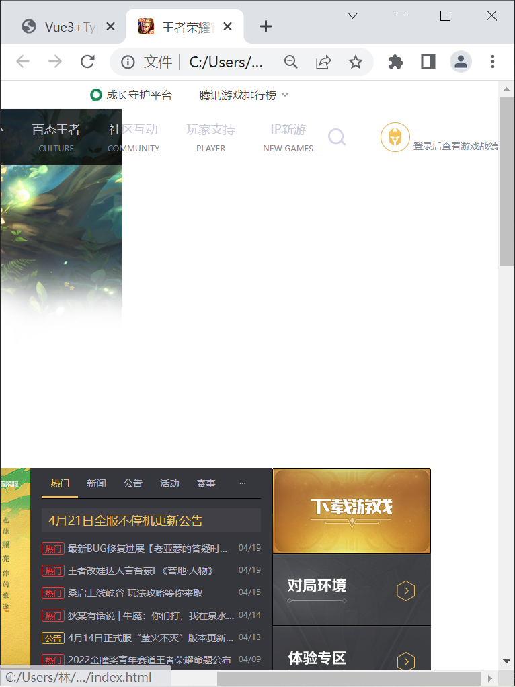

### 1.CSS样式的字符编码

- 之前我们有制定过HTML页面的编码，但是并没有制定CSS样式的编码

  - 那么CSS样式的字符编码会按照什么规则来使用呢

- 在样式表中有多种方法去声明字符编码，浏览器会按照以下顺序进行尝试（一旦找到就停止并得出结果）

  1. 文件的开头的 Unicode byte-order（字节顺序标记） 字符值。
     - https://en.wikipedia.org/wiki/Byte_order_mark
  2. 由Content-Type：HTTP header 中的 charset 属性给出的值或用于提供样式表的协议中的等效值。
  3. CSS @规则 @charset。
  4. 使用参考文档定义的字符编码：  元素的 charset 属性。
     - 该方法在 HTML5 标准中已废除，无法使用。
  5. 假设文档是 UTF-8。

- 开发中推荐在CSS的开头编写@charset指定编码为：

  ```css
  @charset "UTF-8";
  ```

### 2.缩小浏览器宽度遇到的问题

- 缩小浏览器会出现下面这种情况：

- 为什么会出现这种情况？

  - 因为没有给背景设置一个具体的宽度，所以当我放大整个页面的时候，背景的宽度就会随着放大而缩小
  - 整个网页变小，背景也跟着缩小，但是内容依然是1300px
  - 所以当背景的宽度达不到1300px的时候就会出现这个问题
  - 或者缩小整个浏览器，也会出现这种问题

- 如何解决呢？

  - 给body设置min-width: 整个项目中的最大宽度;

    ```css
    body {
      min-width: 1300px;
    }
    ```

    

