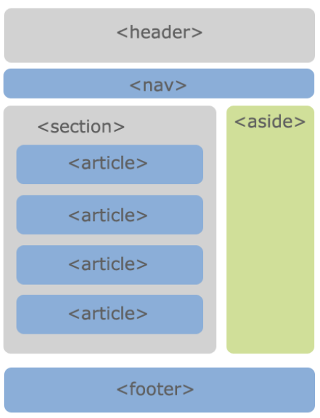
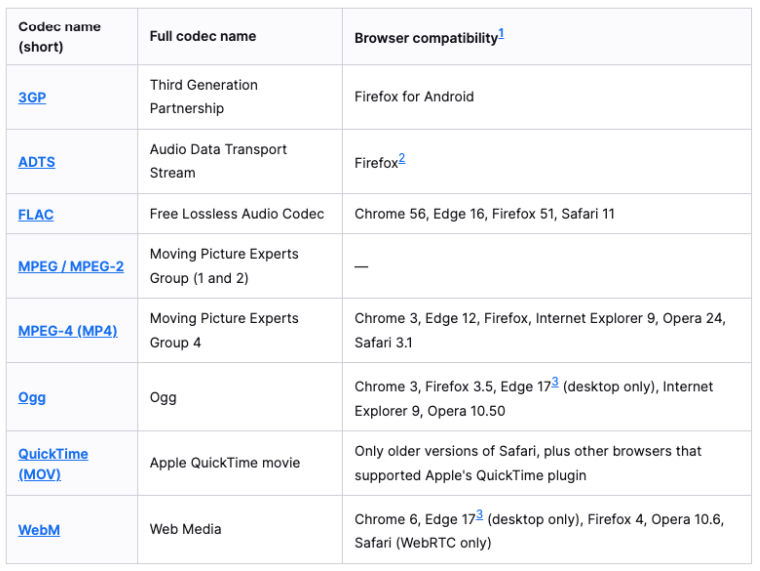
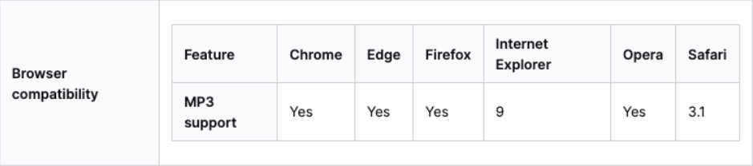
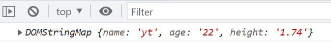

### 1.html5新增——语义化元素

- header元素
- nav元素
- section元素
- article元素
- aside元素
- footer元素

- 它们有一个特点：与div没啥区别，只是名字不一样：

### 2.html5新增——video元素

- video的常见属性：

  | 常见属性 |         值的类型         |       作用       |
  | :------: | :----------------------: | :--------------: |
  |   src    |           url            |     视频地址     |
  |  width   |            px            |       宽度       |
  |  height  |            px            |       高度       |
  | controls |       boolean属性        |     控制视频     |
  | autoplay |       boolean属性        |     自动播放     |
  |  muted   |       boolean属性        |       静音       |
  | preload  | none/metadata/auto(常用) |    预加载视频    |
  |  poster  |           url            | 海报（图片）地址 |

- video支持的视频格式：

- video的兼容性写法

  ```html
  <video src="./assets/fcrs.mp4" controls autoplay muted width="700">
    <source src="./assets/fcrs.ogg">
    <source src="./assets/fcrs.webm">
  
    <p>当前浏览器不支持视频播放，请更换或升级浏览器！</p>
  </video>
  ```

  - 通过source元素指定更多的视频源
  - 只有在静音的状态下才可以自动播放
  -  [ˈmjuːtɪd] 

### 3.html5新增——audio元素

- audio的常见属性

  | 常见属性 |         值的类型         |    作用    |
  | :------: | :----------------------: | :--------: |
  |   src    |           url            |  音频地址  |
  | controls |       boolean属性        |  控制音频  |
  | autoplay |       boolean属性        |  自动播放  |
  |  muted   |       boolean属性        |    静音    |
  | preload  | none/metadata/auto(常用) | 预加载音频 |

  - autoplay：一进入网页是无法自动播放音频的，即便设置成静音状态也不行，但是切换歌曲应该可以生效

- audio支持的音频格式

  - 我们这里只说mp3格式的音频：

  - 具体支持哪些音频格式请参考下面的链接

    - https://developer.mozilla.org/en-US/docs/Web/Media/Formats/Audio_codecs

- audio的兼容性写法

  ```html
  <audio src="./assets/yhbk.mp3" controls>
    <source src="./assets/yhbk.其他扩展名">
  </audio>
  ```

### 4.表单新增

- 新增属性

  - placeholder：输入框占位文字

  - autofocus：自动聚焦

  - multiple：多选

    ```html
    <select multiple>
      <option value="">苹果</option>
      <option value="">香蕉</option>
      <option value="">橘子</option>
    </select>
    ```

- type新增类型（仅举几个例子）

  - color
  - date
  - range

- 具体的新增请参考文档

  - https://developer.mozilla.org/zh-CN/docs/Web/HTML/Element/Input

### 5.全局属性新增——data-*

- data-*：自定义属性，主要用于HTML和JS之间传递数据

  ```html
  <div data-name="yt" data-age="22" data-height="1.74"></div>
  
  <script>
    console.log(document.querySelector("div").dataset);
  </script>
  ```

  

