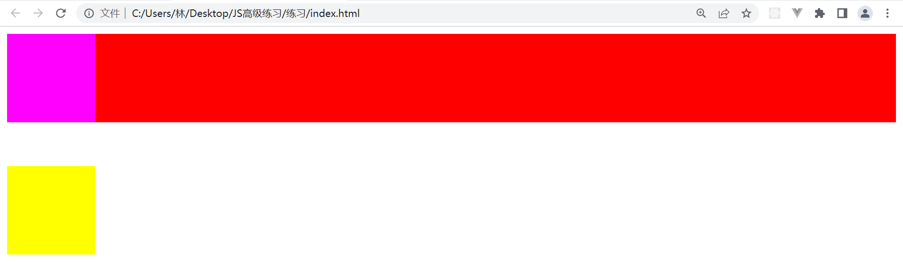
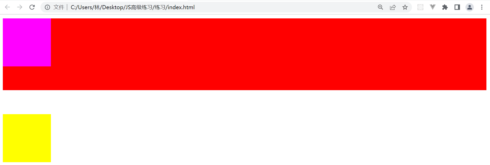
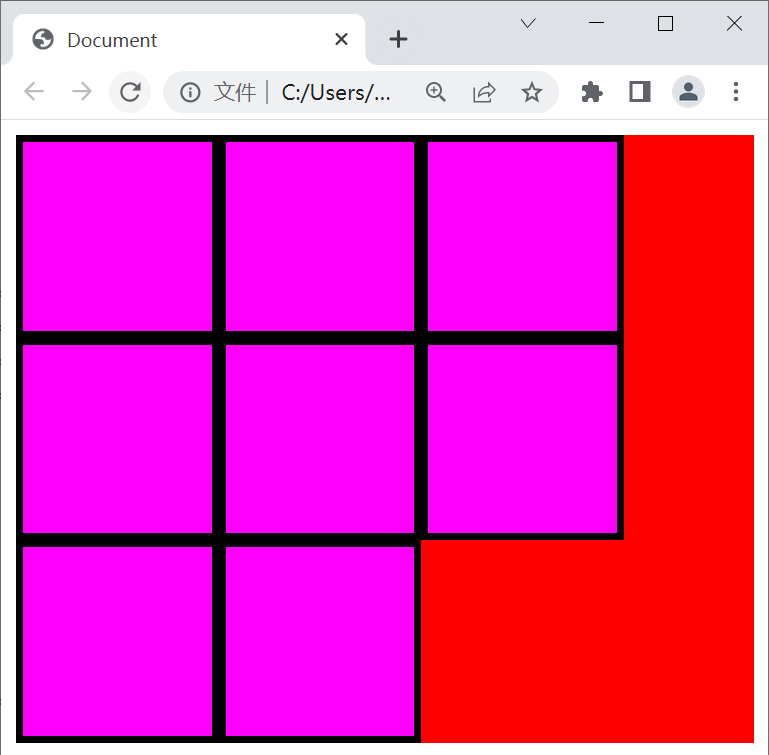

### 1.FC：formatting context

-  [ˈfɔːrmætɪŋ] 格式化

- 在说BFC之前，我们先来说一说FC
  - 无论你是什么元素都会有一个属于它的FC
- 块级元素都是在BFC中布局
- 行内级元素都是在IFC中布局

### 2.哪些元素会创建BFC

- 根元素（html）
- 浮动元素（元素的 float 不是 none）
- 绝对定位元素（元素的 position 为 absolute 或 fixed）
- 行内块元素（元素的 display 为 inline-block）
- 表格单元格（元素的 display 为 table-cell，HTML表格单元格默认为该值）
- 表格标题（元素的 display 为 table-caption，HTML表格标题默认为该值）
- 匿名表格单元格元素（元素的 display 为 table、table-row、 table-row-group、table-header-group、table-footer-group（分别是HTML table、 row、tbody、thead、tfoot 的默认属性）或 inline-table） 
- overflow 计算值(Computed)不为 visible 的块元素
- 弹性元素（display 为 flex 或 inline-flex 元素的直接子元素）
- 网格元素（display 为 grid 或 inline-grid 元素的直接子元素）
- display的值为 flow-root 的元素

### 3.BFC的作用

- 在BFC中，box会在垂直方向上一个挨着一个的进行排布
- 垂直方向的间距由margin属性决定
- 在同一个BFC中，相邻两个box之间的margin会折叠（collapse）
- 在BFC中，每个元素的左边缘是紧挨着包含块的左边缘

### 4.解决margin折叠问题

- 有如下代码，请问在container1中的box会与container2中折叠吗？

  ```html
  <style>
    .container1 {
      background-color: #f00;
    }
    .container1 .box {
      margin-bottom: 50px;
      width: 100px;
      height: 100px;
      background-color: #f0f;
    }
    .container2 {
      margin-top: 50px;
      width: 100px;
      height: 100px;
      background-color: #ff0;
    }
  </style>
  
  <div class="container1">
    <div class="box"></div>
  </div>
  <div class="container2">
  </div>
  ```

  

  - 你会发现它折叠了
  - 首先粉色的margin-bottom传递给父元素的margin-bottom
  - 随后黄色和红色的上下margin折叠了

- 我们在3中有一句话

  - 在同一个BFC中，相邻两个box之间的margin会折叠（collapse）
    - 紫色和黄色均在html元素所创建的BFC下
  - 只要我们想办法把红色变成一个BFC，那么紫色就不和黄色在同一个BFC下了

  ```html
  <style>
    .container1 {
      background-color: #f00;
      overflow: auto;
    }
    .container1 .box {
      margin-bottom: 50px;
      width: 100px;
      height: 100px;
      background-color: #f0f;
    }
    .container2 {
      margin-top: 50px;
      width: 100px;
      height: 100px;
      background-color: #ff0;
    }
  </style>
  
  <div class="container1">
    <div class="box"></div>
  </div>
  <div class="container2">
  </div>
  ```

  

  - 折叠的问题就消失了

### 5.解决浮动的高度塌陷问题

- 浮动的高度塌陷因为：浮动元素不再向父元素汇报高度
- 解决这个问题除了用清除浮动的方案，还可以用BFC来解决，但是要满足两个条件
  - 浮动元素的父元素触发BFC
  - 浮动元素的父元素的高度是auto
- 为什么？
- 要知道为什么，要明白，触发了BFC的元素，在高度为auto的时候，它的高度是如何计算的？
  - 如果它只有inline-level，它的高度是行高的顶部到底部的距离
  - 如果它有block-level，它的高度是最上面的块上边缘和最下面的块下边缘之间的距离
  - 如果有绝对定位元素，高度将被忽略
  - 如果有浮动元素，那么它就会增加自身高度以包括这些浮动元素的下边缘

```html
<style>
  .container {
    background-color: #f00;
    overflow: auto;
  }
  .container .box {
    float: left;
    width: 100px;
    height: 100px;
    border: 4px solid #000;
    background-color: #f0f;
  }
</style>

<div class="container">
  <div class="box"></div>
  <div class="box"></div>
  <div class="box"></div>
  <div class="box"></div>
  <div class="box"></div>
  <div class="box"></div>
  <div class="box"></div>
  <div class="box"></div>
</div>
```



