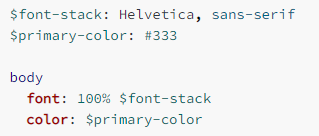

### 1.CSS存在的不足

- 存在大量的重复代码，虽然可以用类来勉强管理和抽取，但是使用起来非常不方便
- 无法自如的定义变量
- 没有专门的作用域和嵌套，需要定义大量的class来保证选择器的准确性

- 社区为了解决CSS所面临的大量问题，出现了一系列CSS预处理器（CSS preprocessor）

### 2.常见的CSS预处理器

- Sass/Scss：
  - 2007年诞生，最早也是最成熟的CSS预处理器
  - 拥有ruby社区的支持，属于Haml（一种模板系统）的一部分
  - 目前受LESS影响，已经进化到了全面兼容CSS的SCSS
- Less:
  - 2009年出现，受SASS的影响较大，但又使用CSS的语法，让大部分开发者更容易上手
  - 比起SASS，可编程功能不够，不过优点是使用方式简单、便捷，兼容CSS，并且已经足够使用
  - 另外反过来也影响了SASS演变到了SCSS的时代
  - 著名的Twitter Bootstrap就是采用LESS做底层语言的，也包括React的UI框架AntDesign
- Stylus:
  - 2010年产生，来自Node.js社区，主要用来给Node项目进行CSS预处理支持
  - 语法偏向于Python, 使用率相对于Sass/Less少很多

### 3.认识less

- It's CSS, with just a little more.
- Less（Leaner Style Sheets的缩写） 是一门CSS扩展语言，且兼容CSS
- Less增加了很多相比于CSS更好用的特性
  - 比如定义变量、混入、嵌套、计算
  - Less最终需要被编译成CSS运行于浏览器中（包括部署到服务器）

### 4.编译less代码的方式

- 方式一：下载Node环境，通过npm包管理工具下载less工具，使用less工具对代码进行编译

- 方式二：通过VSCode插件把less编译成CSS

  - Easy LESS插件

- 方式三：在线编译

  - https://lesscss.org/less-preview/

- 方式四：在CDN引入编译less的js代码，对less进行实时编译

  ```html
  <link rel="stylesheet/less" href="./less/01less基本使用.less">
  <script src="https://cdn.jsdelivr.net/npm/less@4" ></script>
  ```

  - rel="stylesheet/less"：/less必须写

- 方式五：将CDN编译less的js代码全选复制粘贴到本地，再像方式四一样引入，只是src改为引入本地文件即可

### 5.less语法一：兼容CSS

- less兼容css，意味着我们可以在less文件中直接编写css代码
- 只是less文件的扩展名是.less

### 6.less语法二：变量

```html
<div class="container">
  <h1><p>123</p>987</h1>
  <span>asdasjdhf<a href="#">asdjhfjh</a></span>
  <div>asdasdaf<p>1232</p></div>
</div>
```

```less
@mainColor: #f00;
@smallFont: 12px;
@mainFont: 14px;
@bigFont: 50px;

.container h1 p {
  color: @mainColor;
  font-size: @bigFont;
}
.container span a {
  color: #f0f;
  font-size: @smallFont;
}
.container div p {
  color: #ff0;
  font-size: @mainFont;
}
```

### 7.less语法三：嵌套

```less
@mainColor: #f00;
@smallFont: 12px;
@mainFont: 14px;
@bigFont: 50px;

.container {
  h1 {
    p {
      color: @mainColor;
      font-size: @bigFont;
    }
  }
  span {
    a {
      color: #f0f;
      font-size: @smallFont;
    }
  }
  div {
    p {
      color: #ff0;
      font-size: @mainFont;
    }
  }
}
```

### 8.less语法四：&

```html
<ul>
  <li>1</li>
  <li>2</li>
  <li>3</li>
  <li>4</li>
  <li>5</li>
  <li>6</li>
  <li>7</li>
  <li>8</li>
</ul>
```

```less
ul {
  li {
    &:hover {
      color: #f00;
    }

    &:nth-child(-n + 3) {
      color: #f0f;
    }
    &:nth-last-child(-n + 3) {
      color: #ff0;
    }
    &::after {
      content: "asdjhfjahsld";
    }
  }
}
```

### 9.less语法五：运算

- 存在问题，不做说明

### 10.less语法六：混入

```less
.white-space {
  white-space: nowrap;
  overflow: hidden;
  text-overflow: ellipsis;
}

div {
  p {
    width: 100px;
    height: 100px;

    background-color: orange;
    .white-space();
  }
}
```

### 11.less语法七：混入和参数

```less
.main-whb(@mainWith: 100px, @mainHeight: 100px, @bacColor: orange) {
  width: @mainWith;
  height: @mainHeight;
  background-color: @bacColor;
}

div {
  p {
    .main-whb(10px, 10px, red);
    // width: 100px;
    // height: 100px;
    // background-color: orange;
  }
}
```

### 12.less语法八：混入和映射

```less
.main-whb(@mainWith: 100px, @mainHeight: 100px, @bacColor: orange) {
  width: @mainWith;
  height: @mainHeight;
  background-color: @bacColor;
}

div {
  p {
    width: .main-whb()[width];
    height: .main-whb()[height];
    background-color: .main-whb()[background-color];
  }
}
```

- 弥补less中不能自定义函数的缺陷

### 13.less语法九：继承

```less
.boxW {
  width: 100px;
}
div {
  p {
    height: 100px;
    background-color: #f00;
    &:extend(.boxW);
  }
}
```

- 不推荐

### 14.less语法十：内置函数

```less
div {
  p {
    width: ceil(100.5px);
    height: floor(100.5px);
    background-color: color(red);  // 计算成16进制颜色
  }
}
```

### 15.less语法十一：作用域

- 在查找一个变量时，首先在自身查找变量和混入，即便变量和混入在自身同一作用域的下面，也可以找到
- 如果找不到，则从“父”级作用域进行查找

### 16.less语法十二：注释

```less
// 单行注释
/* 
多行注释 
*/
```

### 17.less语法十三：导入

```less
@import url(./importA.less);
```

### 18.了解Sass和Scss

- 由于Sass是Haml的一部分，由Ruby的开发者设计和研发

- 所以Sass的语法类似于Ruby的语法，没有花括号，没有分号，具有严格的缩进

  

- 后来官方推出了全新的语法：SCSS，意思是Sassy CSS，SCSS是完全兼容CSS的
- 在前端想学习Sass直接学习Scss即可
  - SCSS的语法也包括变量、嵌套、混入、函数、操作符、作用域
  - 通常也包括更为强大的控制语句、更灵活的函数、插值语法
  - 大家可以根据之前学习的less语法来学习一些Scss语法
  - 学习参考网站：
    - https://sass-lang.com/guide

