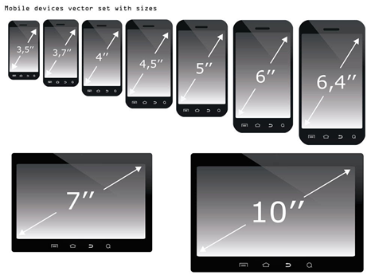

### 1.一些概念

- 移动端开发的分类：

  - 原生App开发（iOS、Android、RN、uniapp、Flutter等）
    - 在应用商店下载的那些app就是原生app，一般是iOS、Android一统天下
  - 小程序开发（原生小程序、uniapp、Taro等）
  - Web页面（移动端的Web页面，可以使用浏览器或者webview浏览）

- 移动端适配

  - 移动端设备很多，我们需要对其进行一些适配：

- 自适应和响应式

  - 自适应：根据不同的设备屏幕大小来自动调整尺寸、大小
  - 响应式：随着屏幕的实时变动而自动调整，也算是自适应的一种

### 2.三种视口

- 布局视口（layout viewport）
- 视觉视口（visual viewport） [ˈvɪʒuəl] 
- 理想视口（ideal viewport）

### 3.首要明白的问题

- 2中所说的三个视口均是针对移动端来说的，也是针对移动端来分类的，pc端是没有这些概念的
- pc端只有一个概念，就是视口：viewport

### 4.布局视口

- 首先一般的设备屏幕可视宽度在300px到600px之间
- 但是我们所写的项目，默认情况下是在一个980px的宽度下进行布局的
- 如果我们直接将这个980px的布局页面给到300px的设备，那么一定会超出设备，有些东西就会无法查看

### 5.视觉视口

- 针对上面的问题，手机端就会按照比例将项目进行缩放
- 比如我们之前的100px所显示的长度是在980px的情况下，到了手机端100px所显示的长度就会变小，当然它依然是100px，只是为了能够把所有的东西显示出来，将其在视觉上缩小了而已
- 缩放之后的可见区域，就是视觉视口，不会左右滚动，因为全部都显示在这里了
- 这是默认情况下，什么是默认情况呢？就是在head元素内不设置meta的name="viewport"
- 有时候你会遇到这种情况，我设置的最大宽度是1300px，而你的布局视口宽度只有980px啊，为什么你能包裹一个1300px的盒子呢？
  - 因为980px是默认的，当你主动设置你的整个网页的最大宽度是1300px的话，那么你的布局视口就变成了1300px了
  - 那么视觉视口就会根据1300px再进行缩放

### 6.理想视口

- 我们并不希望移动端对我们的项目进行缩放，我们设置了100px，在视觉上就是100px，与原来一样

- 如何做到这一点呢？设置理想视口就可以了

- 如何设置理想视口呢？

  ```html
  <meta name="viewport" 
        content="width=device-width, 
                 initial-scale=1.0, 
                 maximum-scale=1.0, 
                 minimum-scale=1.0, 
                 user-scalable=no">
  ```

  - name="viewport"：设置理想视口
  - width=device-width：布局视口为设备的宽度，就是布局视口宽度为视觉视口宽度
    - 假如视觉视口为300px，那么布局视口就是300px
    - 这样这两个的比值就是1，所以整个页面都不会进行缩放
  - initial-scale=1.0：定义视觉视口和布局视口的比例，一般是1.0，如果是2.0就会增大
  - maximum-scale=1.0：最大缩放比例为1.0
  - minimum-scale=1.0：最小缩放比例为1.0
  - user-scalable=no：用户能否进行自主缩放，no表示不能，yes表示可以（默认是yes）