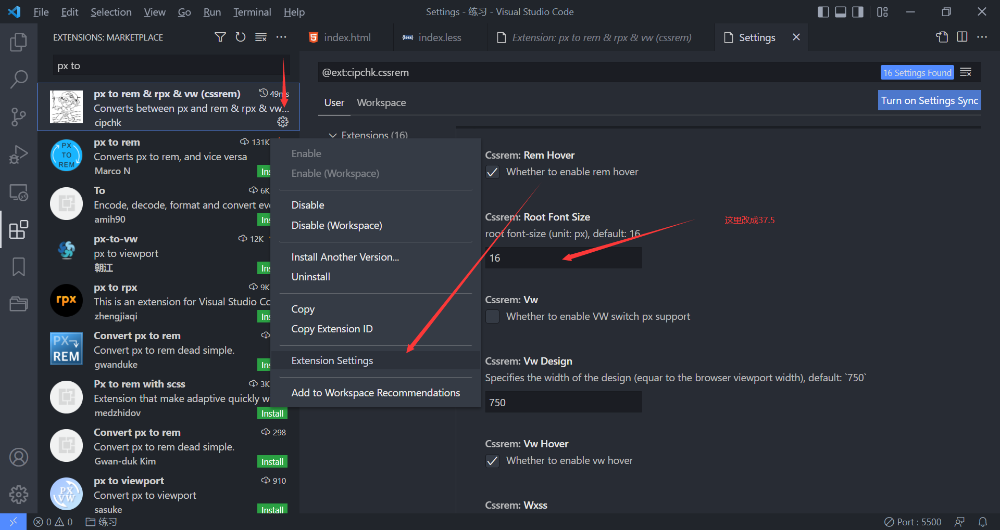
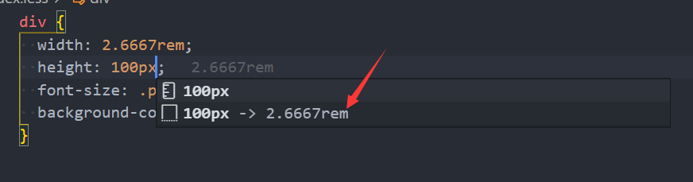
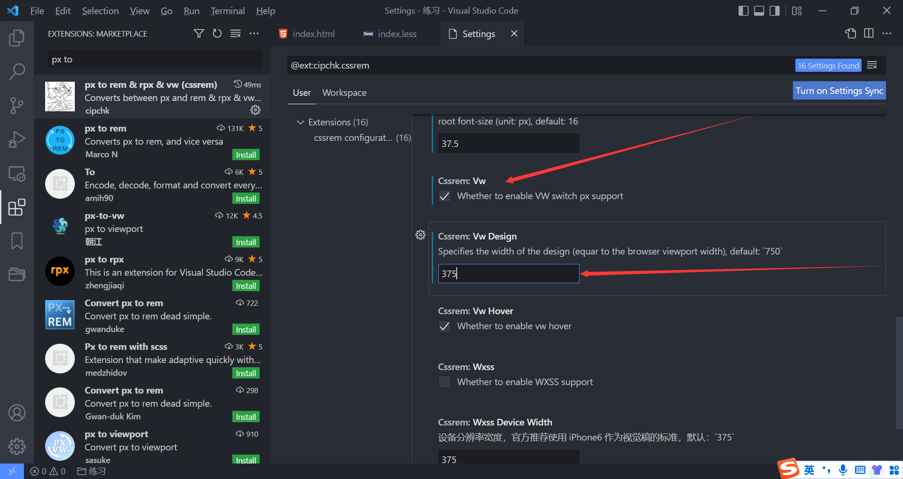
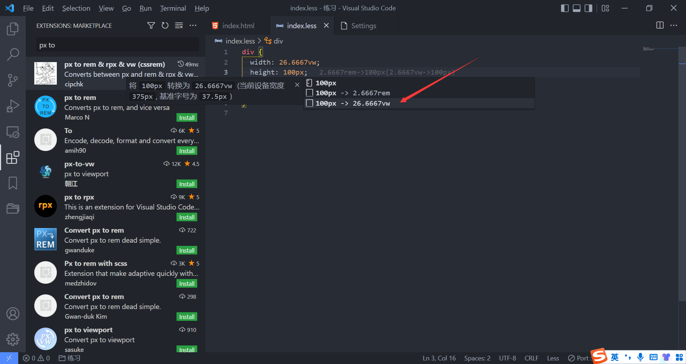

### 1.开发移动端所面临的问题

- 移动端设备的屏幕尺寸是非常多的
- 我们希望可以在不同的屏幕尺寸上显示不同的大小
- 比如我们有一个div
  - 在375px的屏幕上width为100px
  - 在320px的屏幕上width为90px
  - 在414px的屏幕上width为110px
- 同理，其他的可以设置尺寸的属性，也可以根据屏幕大小的变化而变化

### 2.移动端适配方案

- 方案一：为尺寸设置百分比
  - 由于不同属性的百分比参照物不同，所以在移动端大量使用百分比是非常少见的，也是不提倡的
- 方案二：rem单位 + 动态修改html元素的font-size属性值
- 方案三：vw单位
- 方案四：flex布局

### 3.方案二的解析

- rem单位是相对于html元素的font-size来设置的
  - 比如我给html设置的font-size为16px
  - 那么1rem = 16px

- 如果我们需要在不同的屏幕下有不同的尺寸，可以动态的修改html元素的font-size属性值

- 这样我们就只需要去考虑两个问题

  1. 给不同屏幕的html元素设置不同的font-size属性值

     - 一般屏幕是375px，就给html元素的font-size设置37.5px
     - 同理其他的尺寸的屏幕也是这样，屏幕尺寸除以10就是html元素的font-size值

  2. 将原来要设置的尺寸转化成rem单位的值

     - 比如我们的屏幕宽度是375px，html元素的font-size值就为37.5px

     - 所以1rem = 37.5px，那么我想设置100px应该等于多少rem呢
     - 100px = (100 / 37.5)rem = 2.667rem

### 4.解决第一个问题：设置font-size

- 方案一：媒体查询

  - 缺点一：需要针对不同的屏幕书写大量的媒体查询代码
  - 缺点二：动态改变尺寸，html元素的font-size不会实时的进行变化

- 方案二：编写js代码

  ```js
  const htmlEl = document.documentElement;
  function setFont() {
    const screenW = htmlEl.clientWidth;
    const hFontSize = screenW / 10;
    htmlEl.style.fontSize = hFontSize + "px";
  };
  setFont();
  addEventListener("resize", setFont);
  ```

- 方案三：lib-flexible

  - https://github.com/amfe/lib-flexible 进入这个网址，复制index.js中的代码

    ```js
    // 页面切换，页面是缓存的情况下，重新设置font-size
    window.addEventListener('pageshow', function (e) {
      if (e.persisted) {
        setFont()
      }
    })
    
    // 判断是否支持0.5px
    // detect 0.5px supports
    if (dpr >= 2) {}
    ```

### 5.解决第二个问题：转化成rem单位

- 方案一：手动换算（计算器）

  - 375px的屏幕，1rem = 37.5px
  - 100px = (100 / 37.5)rem = 2.667rem

- 方案二：less

  ```less
  @designFontSize: 37.5;
  
  .pxTorem(@px) {
    result: 1rem * (@px / @designFontSize);
  }
  
  div {
    width: .pxTorem(100)[result];
    height: .pxTorem(100)[result];
    font-size: .pxTorem(18)[result];
    background-color: orange;
  }
  ```

- 方案三：webpack插件——postcss-pxtorem

- 方案四：VSCode插件——px to rem & rpx & vw (cssrem)

  

  

### 6.疑问

- 到这里你可能有个疑问，为什么非得把根的font-size修改为37.5呢
- 是这样的，设计人员会设计一套方案，设计人员总不能把每个尺寸的屏幕都设计一遍吧
- 比如他只在375px屏幕下设计了一套方案，其中有一个方块宽100px，高100px
- 那么换算成rem应该怎么换算呢？之前说过，宽为2.667rem，高为2.667rem
- 如果我们变换了屏幕尺寸，那么根font-size会变，从而rem也会变，所以宽高也会变
- 所以37.5只是在375这个屏幕下的设计尺寸，是一个定值
- 假如你的设计稿是750px，那么就应该设置为75

### 7.方案三的解析

- 经过我们的设定，10rem等于屏幕宽度
- 现在100vw也等于屏幕的宽度
- vw相对于rem的优势
  - 优势一：不需要去计算html的font-size大小，也不需要给html设置这样一个font-size
  - 优势二：不会因为设置html的font-size大小，而必须给body再设置一个font-size，防止继承
  - 优势三：因为不依赖font-size的尺寸，所以不用担心某些原因下html的font-size被篡改
  - 优势四：vw相比于rem更加语义化，1vw刚好是1/100的viewport的大小
  - 优势五：可以具备rem之前的所有优点；
- 面对vw我们只有一个问题：转化

### 8.将px转化为vw

- 方案一：手动换算

  - 100vw = 375px
  - 100px = (100 / 3.75)vw = 26.667vw正好是rem的10倍

- 方案二：less

  ```less
  @design: 3.75;
  
  .pxTovw(@px) {
    result: 1vw * (@px / @design);
  }
  
  div {
    width: .pxTovw(100)[result];
    height: .pxTovw(100)[result];
    font-size: .pxTovw(18)[result];
    background-color: orange;
  }
  ```

- 方案三：webpack插件——postcss-px-to-viewport-8-plugin

- 方案四：VSCode插件——px to rem & rpx & vw (cssrem)

  

  

### 9.为什么要设置375

- 因为我们的设计稿暂定的是375px
- 那么100px = (100 / 3.75)vw = 26.667vw