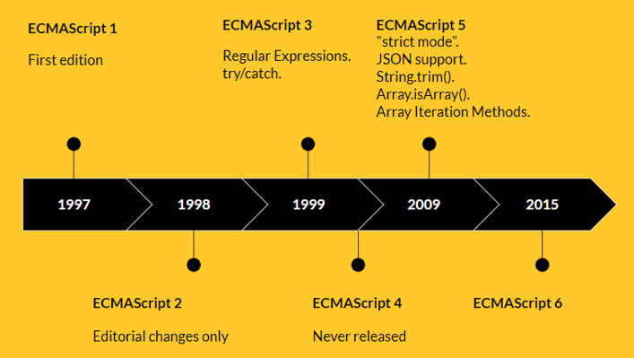

### 1.计算机语言

- 计算机语言（computer language）是指：人与计算机之间通讯的语言，是人与计算机之间传递信息的介质
- 但是其概念比通用的编程语言要更广泛
- 例如，HTML是标记语言，属于计算机语言，但并不是编程语言
- 例如，CSS是样式语言，也属于计算机语言，但并不是编程语言

### 2.编程语言

- 编程语言（programming [ˈprəʊɡræmɪŋ]  language）：用来定义计算机程序的形式语言
- 它是一种被标准化的交流技巧，用来向计算机发出指令
- 一种能够让程序员准确地定义计算机所需要使用数据的计算机语言
- 精确地定义在不同情况下所应当采取的行动

### 3.编程语言的特点

- 数据、数据结构、算法
  - 数据：物品
  - 数据结构：存放物品的空间，有的空间适合放人，有的空间适合放动物，有的空间适合放商品
  - 算法：如何存放物品，如何更好地安排每个人的座次，如何更好地安排动物的生活空间，如何更好的摆放商品便于取出
- 指令、流程控制
- 引用机制、重用机制
- 设计哲学

### 4.ECMAScript发展历程

- released [rɪˈliːst] ：释放、放走
- never released：表示从来没有发布过
- edition [ɪˈdɪʃn] 版本、版次
- editorial  [ˌedɪˈtɔːriəl] 编辑的
- editorial changes only：只在编辑上做了一些改动
- regular [ˈreɡjʊlə(r)] 规则的
- regular expressions：正则表达式
- strict [strɪkt]：严格的

### 5.JS的起源

94年，网景公司发布了Navigator浏览器，版本为0.9

此浏览器是历史上第一个比较成熟的网络浏览器，但是此浏览器只能浏览，不能与用户互动

网景公司急需把一种脚本嵌入到网页中，实现用户与网页互动的功能

网景公司想要采用scheme [skiːm] 语言作为网页的脚本语言

所以它招募了一个程序员：Brendan [ˈbrɛndən]  Eich

在1995年，发生了一件大事，Sun公司将Oak语言正式更名为Java，Java就此横空出世

Java的出世引起了巨大轰动，也因此流行一句口号："write once run anywhere"

网景公司动心了，决定与Sun公司结成联盟，并希望把Java内嵌到网页中运行，进而实现交互的功能

但是Brendan Eich热衷于Scheme [skiːm] （密谋、计划），所以并不以为然，而且仅用10天时间就设计出了JavaScript

JavaScript最初叫做Mocha（摩卡）

当Navigator浏览器为2.0 beta版本时又更名为：LiveScript

当Navigator浏览器为2.0 beta 3版本时正式更名为：JavaScript，自此JavaScript横空出世

这门语言在设计上是一个大杂烩，借鉴了很多语言

借鉴了C语言的基本语法

借鉴了Java语言的数据类型和内存管理方式

借鉴了Scheme语言函数是第一公民的观点

借鉴了Self语言的原型继承机制

在1995年微软公司首次推出Internet Explorer也就是IE浏览器，并向网景公司宣战

1996年11月，网景公司正式向ECMA协会提交了一份语言标准

97年6月，ECMA协会以JavaScript语言为基础，制定了一份ECMAScript标准规范，命名为：ECMA-262

JavaScript实现了这个规范，当然除了JavaScript还有ActionScript和JScript也实现了这一规范

就像是政府发了一个公告，说在北京建一个鸟巢，某个组织实现了这一公告

ECMA协会发布了一个ECMAScript标准规范，说这样实现网页脚本功能，JavaScript施工队实现了这个规范