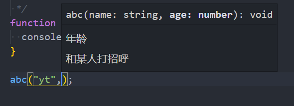
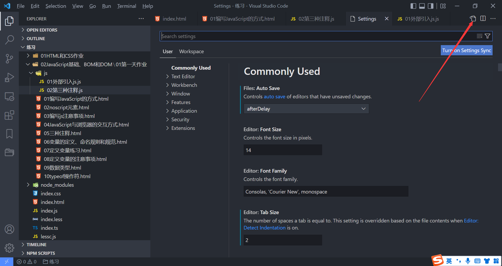
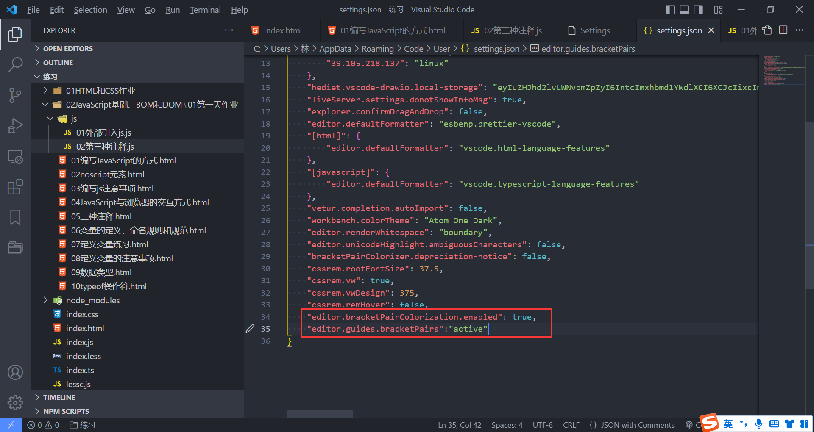
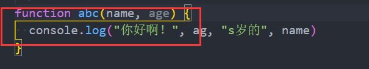

### 1.JavaScript的编写方式

- 在HTML代码行内编写JavaScript代码

  ```html
  <div onclick="alert('触发点击事件')">触发点击</div>
  <a href="javascript: alert('触发点击事件')">触发点击</a>
  ```

- 在script元素中编写JavaScript代码

  ```html
  <div class="click">触发点击事件</div>
  <script>
    var click = document.querySelector(".click");
    click.onclick = function() {
      alert("触发点击事件");
    };
  </script>
  ```

- 在外部文件中编写JavaScript代码

  ```js
  var click = document.querySelector(".click");
  click.onclick = function() {
    alert("触发点击事件");
  };
  ```

  ```html
  <div class="click">触发点击事件</div>
  <script src="./js/01外部引入js.js"></script>
  ```

### 2.noscript元素

- 浏览器不支持JavaScript脚本

- 或者浏览器关闭了对JavaScript脚本的支持

- 以上两个条件达成其一，就可以触发这个元素

  ```html
  <noscript>当前浏览器不支持JavaScript</noscript>
  ```

### 3.JavaScript编写的注意事项

- script元素不能写成单标签
- type属性可以省略
- JavaScript代码严格区分大小写

### 4.JavaScript的交互方式

- 方式1：alert函数

  ```js
  alert("Hello World");
  ```

- 方式2：console.log();

  ```js
  console.log("Hello YT");
  ```

- 方式3：document.write();

  ```js
  document.write("Hello HHH");
  ```

- 方式4：prompt函数，此函数可以获取到用户输入的内容

  ```js
  var result = prompt("请输入你想写的东西！");
  console.log(result);
  ```

### 5.JavaScript的注释

- 第一种：单行注释

  ```js
  //
  ```

- 第二种：多行注释

  ```js
  /*
  
  */
  ```

- 第三种：文档注释

  ```js
  /**
  ```

  - 在js文件中，写这三个字符再按回车，可以自动生成文档注释

    ```js
    /**
     * 和某人打招呼
     * @param {string} name 姓名
     * @param {number} age 年龄
     */
    function abc(name, age) {
      console.log("你好啊！", age, "岁的", name)
    }
    
    abc("yt", 22);
    ```

    

### 6.VSCode插件推荐和手动配置

- 插件推荐：ES7+ React/Redux/React-Native snippets [ˈsnɪpɪts] 片段

- VSCode配置

  

  

  


