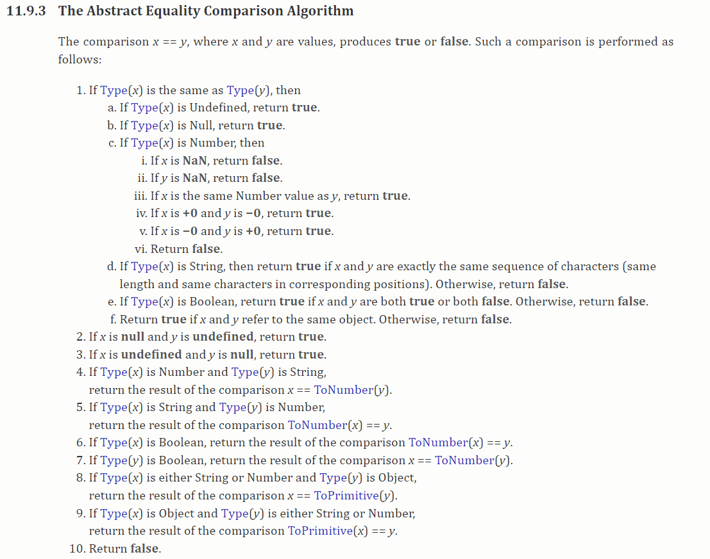

### 1.运算元

- 运算符应用的对象
  - 比如 5 * 2，5和2就是两个运算元，左运算元5和右运算元2
- 如果运算符只有一个运算元：一元运算符
  - 比如负数
- 如果运算符有两个运算元：二元运算符
  - 比如刚才的5 * 2

### 2.算数运算符

- 加减乘除

- 取余：%

  ```js
  var num = 20;
  var result = num % 3;
  console.log(result);  // 2
  ```

- 幂运算：**

  ```js
  console.log(3 ** 3);  // 27
  ```

### 3.赋值运算符

- 等号

- 链式赋值

  ```js
  var num1, num2, num3
  num1 = num2 = num3 = 3;
  console.log(num1, num2, num3);
  ```

  - 把3赋值给num1、num2、num3
  - 不推荐这样写

- 原地修改

  ```js
  var num = 100;
  num += 10;
  console.log(num);
  num *= 10;
  console.log(num);
  num **= 2;
  console.log(num);
  ```

### 4.自增和自减

```js
var currentIndex = 1;
console.log(currentIndex++);
console.log(currentIndex);
console.log(currentIndex--);
console.log(currentIndex);

var currentIndex2 = 1;
console.log(++currentIndex2);
console.log(currentIndex2);
console.log(--currentIndex2);
console.log(currentIndex2);
```

- 与自增自减在同一行使用
  - 自增自减在变量后：先使用变量，再自增或自减
  - 自增自减在变量前：先自增或自减，再使用变量

### 5.运算符的优先级

- https://developer.mozilla.org/zh-CN/docs/Web/JavaScript/Reference/Operators/Operator_Precedence

### 6.比较 [bǐ jiào] 运算符

- 补充质量的读音： [zhì liàng]

- 补充载人航天的读音：zài rén háng tiān

- `> < >= <=`

  ```js
  var num1 = 12;
  var num2 = 14;
  
  var calc1 = num1 > num2;
  console.log(calc1);  // false
  var calc2 = num1 < num2;
  console.log(calc2);  // true
  console.log(num1 >= num2);  // false
  console.log(num1 <= num2);  // true
  ```

- ==和!=

  ```js
  var num1 = 12;
  var num2 = 14;
  console.log(num1 == num2);  // false
  console.log(num1 != num2);  // true
  ```


### 7.==和===的区别

- ==

  

- ===

  - 一旦发现类型不同, 就返回false, 如果类型相同, 再进行值的比较

