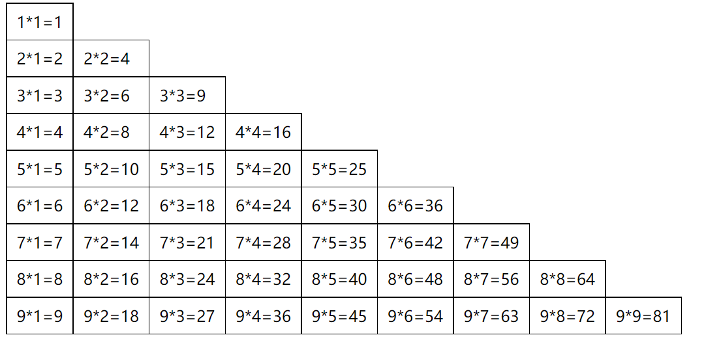

### 1.while循环

- 死循环

  ```js
  while(true) {
    console.log("123");
  };
  ```

- 计算0~99奇数的和

  ```js
  var count = 0;
  var totalCount = 0;
  while(count < 100) {
    if(count % 2 !== 0) {
      totalCount += count;
    }
    count++;
  };
  console.log(totalCount);
  
  // 优化
  var count = 1;
  var totalCount = 0;
  while(count < 100) {
    totalCount += count;
    count += 2;
  };
  console.log(totalCount);
  ```

### 2.do-while循环

- 计算0~99数字之和

  ```js
  var count = 0;
  var totalCount = 0;
  do {
    totalCount += count;
    count++;
  } while(count < 100);
  console.log(totalCount);
  ```

### 3.for循环

- for循环的执行顺序
  - for循环语法结构
    - for(变量; 条件; step) {代码块};
  - 变量只声明一次, 然后判断条件, 条件成立执行代码块, 代码块执行完再执行step
  - 执行完step再判断条件, 条件成立, 再执行代码块
  - 直到step和条件不成立, 跳出循环

- 打印0~99偶数之和

  ```js
  var totalCount = 0;
  for(var count = 0; count < 100; count+=2) {
    totalCount += count;
  };
  console.log(totalCount);
  ```

### 4.循环的嵌套

```js
for(var i = 0; i < 2; i++) {
  console.log("外层开始", i);
  for(var j = 0; j < 3; j++) {
    console.log("里层j", j);
  };
  console.log("外层结束", i);
};

/*
外层开始 0
里层j 0
里层j 1
里层j 2
外层结束 0

外层开始 1
里层j 0
里层j 1
里层j 2
外层结束 1
*/
```

### 5.案例一

- 打印6行5列❤

  ```js
  for(var i = 0; i < 6; i++) {
    document.write("<div>");
    for(var j = 0; j < 5; j++) {
      document.write("❤ ")
    }
    document.write("</div>");
  }
  ```

  

### 6.案例二

- 总共6行❤, 第一行一个❤，第二行两个❤, 依次递增

  ```js
  var abc = 6;
  for(var i = 0; i < 6; i++) {
    document.write("<div>");
    for(var j = 0; j < i + 1; j++) {
      document.write("❤");
    }
    document.write("</div>");
  }
  ```
  


- 总共6行❤, 第一行6个❤，第二行5个❤, 依次递减

  ```js
  var abc = 6;
  for(var i = 0; i < 6; i++) {
    document.write("<div>");
    for(var j = 0; j < abc; j++) {
      document.write("❤");
    }
    abc--;
    document.write("</div>");
  }
  ```

  

### 7.案例三

- 99乘法表

  ```html
  <style>
    table {
      border-collapse: collapse;
    }
    td {
      border: 1px solid #000;
      padding: 8px 10px;
    }
  </style>
  
  <script>
    document.write("<table>");
    for(var i = 0; i < 9; i++) {
      document.write("<tr>");
      for(var j = 0; j < i + 1; j++) {
        document.write(`<td>${i + 1}*${j + 1}=${(i + 1) * (j + 1)}</td>`);
      }
      document.write("</tr>");
    }
    document.write("</table>");
  </script>
  ```

  

### 8.循环的控制

- break：遇到nba, 后面的代码不再执行

  ```js
  var names = ["abc", "cba", "nba", "mba", "lba"];
  
  for(var i = 0; i < names.length; i++) {
    if(names[i] === "nba") {
      break;
    }
    console.log(names[i]);
  };
  /*
  abc
  cba
  */
  ```

- continue：遇到nba就跳过, 继续执行后面的代码

  ```js
  for(var i = 0; i < names.length; i++) {
    if(names[i] === "nba") {
      continue;
    }
    console.log(names[i]);
  };
  
  /*
  abc
  cba
  mba
  lba
  */
  ```

### 9.猜数字游戏

```js
var isSuccess = false;
var num2 = Math.floor(Math.random() * 100);
for (var i = 0; i < 7; i++) {
  var num1 = prompt("请输入您猜测的数字") * 1;
  if(num1 > num2) {
    alert("您猜大了");
  } else if(num1 < num2) {
    alert("您猜小了");
  } else {
    alert("您猜对了");
    isSuccess = true;
    break;
  }
};

if (!isSuccess) {
  console.log("机会用完!");
}
```

```js
// 改进
var num2 = Math.floor(Math.random() * 100);
for (var i = 0; i < 7; i++) {
  var num1 = prompt("请输入您猜测的数字") * 1;
  if(num1 > num2) {
    alert("您猜大了");
  } else if(num1 < num2) {
    alert("您猜小了");
  } else {
    alert("您猜对了");
    break;
  }

  if(i >= 6) {
    alert("机会用完!")
  }
};
```

