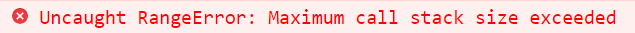

### 1.函数的使用和作用

- 使用：声明函数、调用函数
- 作用：重用代码、提高效率

### 2.形参和实参

- 形参（parameter）：定义函数时，小括号中的参数就是形参，用来接收参数，作为函数的内部变量进行使用
- 实参（argument）：调用函数时，小括号中的参数就是实参，实际传入的参数

### 3.练习

- 传入数字，转为亿、万

  ```js
  function changeNum(num) {
    if(num >= 1_0000_0000) {
      return `${(num / 1_0000_0000)}亿`;
    } else if(num >= 1_0000) {
      return `${(num / 1_0000)}万`;
    }
    return num + "";
  }
  
  console.log(changeNum(100000000));
  console.log(changeNum(10000));
  console.log(changeNum(1000));
  ```

### 4.递归函数

- 认识递归函数

  ```js
  function foo() {
    console.log("递归")
    foo();
  }
  foo();
  ```

  - 递归函数必须有条件，去停止函数的调用

  - 如果无限调用下去，会报错

    

- 封装一个函数，可以实现x的n次方

  ```js
  function sum(x, n) {
    var total = 1;
    for (var i = 0; i < n; i++) {
      total *= x;
    }
    return total
  }
  console.log(sum(5, 4));
  
  function sumN(x, n) {
    if(n === 1) return x;
    return x * sumN(x, n -1);
  }
  console.log(sumN(5, 4));
  ```

- 递归实现斐波那契函数

  ```js
  // 1 1 2 3 5 8 13
  // 1 2 3 4 5 6 7
  function sum(n) {
    if(n === 1 || n === 2) return 1;
    return sum(n - 1) + sum(n - 2);
  };
  console.log(sum(6));
  
  //6
  //第一次：sum(5) + sum(4)
  //第二次：sum(4) + sum(3) + sum(3) + sum(2)
  //第三次：sum(3) + sum(2) + sum(2) + sum(1) + sum(2) + sum(1) + sum(2)
  //第四次：sum(2) + sum(1) + sum(2) + sum(2) + sum(1) + sum(2) + sum(1) + sum(2)
  //1 + 1 + 1 + 1 + 1 + 1 + 1 + 1
  ```

- 不使用递归实现斐波那契函数

  ```js
  function sum(n) {
    var sum1 = 1;
    var sum2 = 1;
    var total = 1;
    for (var i = 2; i < n; i++) {
      total += sum1;
      sum1 = sum2
      sum2 = total;
    }
    return total;
  };
  console.log(sum(6));
  ```

  ```js
  // 原始: 
  //          total
  // sum1     sum2  
  //   1       1    2 3 5 8 13
  //   1       2    3 4 5 6 7
  
  
  // total += sum1
  //                total
  // sum1     sum2  
  //   1       1    2      3 5 8 13
  //   1       2    3      4 5 6 7
  
  
  // sum1 = sum2
  //          sum1 total
  //          sum2
  //   1       1    2      3 5 8 13
  //   1       2    3      4 5 6 7
  
  // sum2 = total
  //               total
  //         sum1  sum2
  //   1       1    2      3 5 8 13
  //   1       2    3      4 5 6 7
  ```


