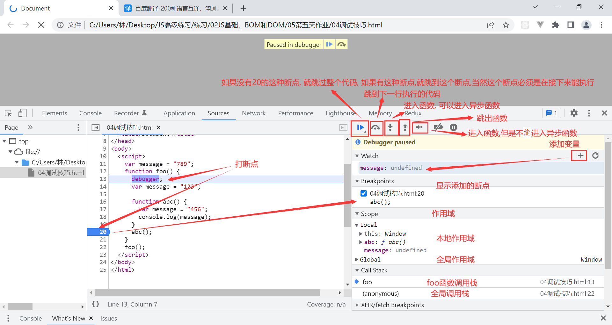

### 1.变量位置的理解

```js
var message = "789"
function foo() {
  var hhh = "123"

  function abc() {
    var abc = "456"
    console.log(message);  // 全局变量、外部变量
    console.log(hhh);  // 外部变量
    console.log(abc);  // 局部变量
  }
  abc()
}
foo();
console.log(message); // 全局变量
```

### 2.函数的表达式

```js
foo()  // 可以执行
function foo() {
  console.log("123");
};
abc();  // abc is not defined
var abc = function() {
  console.log("456")
};
```

### 3.头等函数

- 函数可以作为别的函数的参数
- 函数可以作为别的函数的返回值
- 可以把函数赋值给变量
- 可以把函数存储在数据结构(对象、数组)中

### 4.函数的回调

```js
function request(url, callback) {
  var list = ["abc", "cba", "nba"];
  callback(list);
}

request("http://www.baidu.com", function(abc) {
  console.log(abc)
});
```

- 把一个函数作为实参传给另外一个函数，另外一个函数用形参接收这个函数，然后在自身内部通过这个形参调用这个函数的过程，就是函数的回调
- 回调函数和函数的回调，所有的函数都可以变成回调函数，所以我并不认为有回调函数这么一说，只有函数的回调这么一说，是一种过程
- 函数的回调常用于请求数据，或者异步函数中，由于是异步的，所以并不会阻塞整个js的主线程。
- 那么想要获取异步的结果，就只能在异步函数中拿到结果后再回调传入的函数，继而拿到结果
- 高阶函数一般都是有函数的回调这一过程的，因为只要是把一个函数作为参数，或者返回一个函数，就可以称这个函数为高阶函数
- 高阶函数一般用来实现封装一些复杂的过程，比如实现js数组的find方法
- 我们需要在find方法内部，适时地调用传入的函数，拿到传入函数的结果，返回相应的结果
- 其实并不复杂，多练习就好了

### 5.立即执行函数

- 用途

  - 拥有属于自己的作用域
  - 避免外界访问或修改内部变量

- 应用

  ```html
  <button class="btn">按钮1</button>
  <button class="btn">按钮2</button>
  <button class="btn">按钮3</button>
  <button class="btn">按钮4</button>
  <button class="btn">按钮5</button>
  <script>
    var btns = document.querySelectorAll(".btn");
    for(var i = 0; i < btns.length; i++) {
      var btn = btns[i];
      (function(i) {
        btn.onclick = function() {
          console.log(`按钮${i + 1}`)
        }
      })(i);
    }
  </script>
  ```

### 6.调试技巧




- 删除所有打过的断点