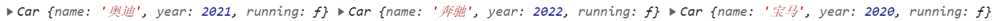

### 1.工厂函数和构造函数

- 我们想创建一系列的对象

- 方法一：工厂函数

  ```js
  function createCar(name, year) {
    var car = {};
    car.name = name;
    car.year = year;
    car.running = function() {
      console.log("奔跑");
    }
    return car;
  }
  
  var car1 = createCar("奥迪", 2021);
  var car2 = createCar("奔驰", 2022);
  var car3 = createCar("宝马", 2020);
  console.log(car1, car2, car3);
  ```

  

- 方法二：构造函数

  ```js
  function Car(name, year) {
    this.name = name;
    this.year = year;
    this.running = function() {
      console.log("奔跑");
    }
  }
  
  var car1 = new Car("奥迪", 2021);
  var car2 = new Car("奔驰", 2022);
  var car3 = new Car("宝马", 2020);
  console.log(car1, car2, car3);
  ```

  

### 2.函数被new操作符调用了

1. 在内存中创建一个新的空对象
2. 让这个对象内部的[[prototype]]属性指向构造函数的prototype属性
3. 让构造函数内部的this指向创建出来的空对象
4. 执行构造函数内部的代码（执行函数体的代码）
5. 如果构造函数没有返回对象，则返回创建的新对象

### 3.window对象的作用

-  作用一: 查找变量先从自身作用域查找, 找不到就去上层作用域进行查找
  - 上层作用域找不到就去全局作用域查找, 全局作用域找不到就去window对象中查找
- 作用二: 存放浏览器为我们提供的变量、函数、对象、方法
- 作用三: 通过var声明的变量也会存放到window对象中

### 4.函数也是对象

- 原始数据类型存放到栈内存中

  ```js
  var num = 12;
  var abc = "abc";
  ```

- 复杂数据类型存放在堆内存中

  ```js
  var obj = {}
  var fn = function() {}
  function fn2() {}
  
  console.log(typeof obj);  // object
  console.log(typeof fn);  // function
  console.log(typeof fn2);  // function
  ```

  - 函数本质上是一个对象，所以它属于复杂数据类型

### 5.类属性和类方法

- 类属性 就是 静态属性

  ```js
  function Abc() {};
  // 类属性, 静态属性
  Abc.name = "yt";
  Abc.age = 15;
  
  console.log(Abc.name);  // 并不会打印yt而是打印Abc, 因为name是函数的内置属性, 换一个名字就好了
  console.log(Abc.age);  // 15
  ```

- 类方法 就是 静态方法

  ```js
  function Abc() {};
  Abc.running = function() {
    console.log("走");
  }
  Abc.running();  // 走
  ```

- 我们要明确一点，类本身是一个对象，或者说函数本身是一个对象
  - 通过new操作符创建出来的对象是实例对象
  - 这是两个完全不同的对象
  - 一定要区分开