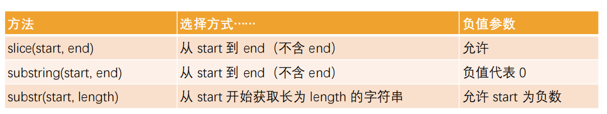

### 1.Math对象的属性

```js
console.log(Math.PI);
```

### 2.Math对象的方法

```js
var num = 4.987;
console.log(Math.floor(num));
console.log(Math.ceil(num));
console.log(Math.round(num));
```

```js
console.log(Math.random());  // [0, 1)
```

```js
// 需求: [5, 50)
console.log(Math.floor(Math.random() * 45) + 5)
// [a, b)
// x = b - a
// y = a
// Math.floor(Math.random() * x) + y
```

```js
console.log(Math.pow(2, 4));
console.log(2 ** 4);
// 这俩一个意思
```

### 3.String实例对象的属性

```js
console.log(message.length);
```

### 4.访问字符串中某个位置的字符

```js
console.log(message[3]);  // l
console.log(message.charAt(3));  // l
console.log(message[100]);  // undefined
console.log(message.charAt(100));  // 空字符串
```

### 5.for of遍历

- 不要用for in进行遍历，可能会遍历出其它鬼东西

  ```js
  for (var item of message) {
    console.log(item);
  }
  ```

### 6.修改字符串

- 明确一个前提：字符串是无法被修改的

- 大小写变换

  ```js
  console.log(message.toUpperCase());
  console.log(message.toLowerCase());
  ```

### 7.查找字符串

```js
var message = "Hello World";
// 判断一个字符串中是否有另外一个字符串：返回索引，或者-1
console.log(message.indexOf("Hello"));
console.log(message.indexOf("b"));

// 判断一个字符串中是否有另外一个字符串：返回true或false
console.log(message.includes("Hello"));
console.log(message.includes("b"));

// 判断是否以某个字符开头或者结尾
console.log(message.startsWith("Hello"));
console.log(message.endsWith("World"));

// 替换字符串中的某部分字符
console.log(message.replace("Hello", "yt"));
console.log(message.replace("Hello", function() {
  return "yt";
}));
```

### 8.子字符串的获取

```js
// 参数一: 从哪个索引开始
// 参数二: 从哪个索引结束, 但是并不包括此索引
console.log(message.slice(3, 4));
console.log(message.slice(3, -1));  // 支持负数, 倒数第一个, 但不包括倒数第一个
console.log(message.slice(3));
```



- 推荐使用slice方法

### 9.字符串拼接

```js
var str1 = "Hello ";
var str2 = "world ";
var str3 = "hhh";

console.log(str1.concat(str2).concat(str3));
console.log(str1.concat(str2, str3));
```

### 10.删除首尾空格

```js
console.log("    why    abc  ".trim());  // 只去除首尾的空格, 中间的不去除
```

### 11.将字符串切割成数组

```js
var message = "abc-cba-nba";
console.log(message.split("-"));  // 以-为分割符创建数组
console.log(message.split("-").join("#"));  // 以#作为分隔符再变回字符串
```

