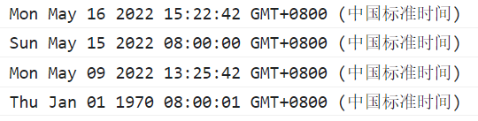
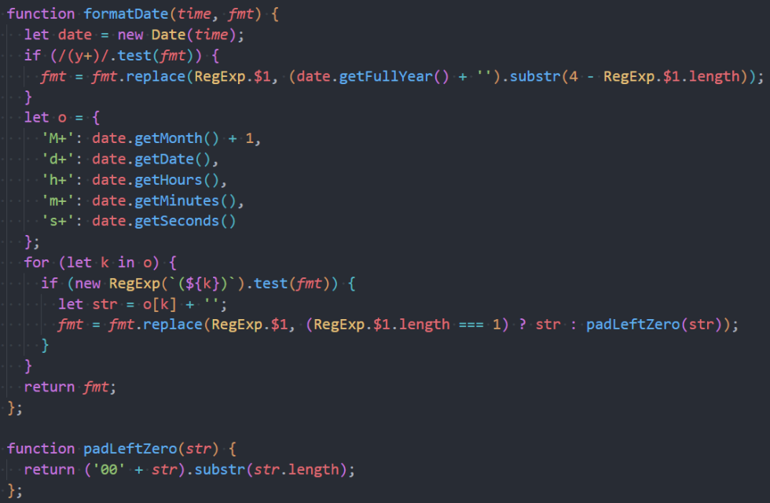

### 1.了解时间的表示方式

- 最初人们通过观察太阳来决定时间，但是这样表示时间，每个地区都会有一套自己的标准
  - 相互之间没法统一时间，不便于沟通和交流
- 在这之后，人们制定了一个标准时间：英国伦敦的皇家格林威治（ Greenwich ）天文台的标准时间
  - 这个时间也称之为GMT（Greenwich Mean Time）
  - 其他时区根据标准时间来确定自己的时间
    - 往东的时区（GMT+hh:mm）
    - 往西的时区（GMT-hh:mm）
- 但是，由于公转有一定的误差，所以GMT的时间存在一定的误差
  - 于是就提出了根据原子钟计算的标准时间UTC（Coordinated Universal Time）
- GMT有一定误差，UTC是标准的时间

### 2.创建Date的实例对象

```js
// 1.不传入任何参数
console.log(new Date());

// 2.传入时间字符串
console.log(new Date("2022-05-15"));

// 3.传入具体的年月日时分秒, 年和月必传
console.log(new Date(2022, 4, 9, 13, 22, 222));
// 月份是从0开始计算, 0就是1月, 相应的这里的4就是5月
// 这里写了个222, 我以为是毫秒, 其实是秒, 但是秒最大为60, 所以自动校验了, 变成了25分42秒

// 4.传入一个Unix时间戳
console.log(new Date(1000))
```



### 3.两种标准

- RFC 2822 标准

  ```js
  console.log(new Date().toDateString());  // Mon May 16 2022
  ```

- ISO 8601 标准。

  ```js
  console.log(new Date().toISOString());  // 2022-05-16T07:24:40.382Z
  ```

  - T是分割符
  - Z是时区
  - 很明显这个不是东八区

- 这两个标准都不推荐使用，不符合阅读方式

### 4.Date实例对象的方法

```js
// 获取
console.log(new Date().getFullYear());
console.log(new Date().getMonth() + 1);
console.log(new Date().getDate());
console.log(new Date().getHours());
console.log(new Date().getMinutes());
console.log(new Date().getSeconds());
console.log(new Date().getMilliseconds());  // 毫秒 [ˈmɪlɪˌsɛkəndz] 
console.log(new Date().getDay());  // 星期天这一天为0

// 设置
var date = new Date();
date.setFullYear(2022);
date.setDate(33);  // 现在是5月15, 设置的是33天, 5月没有第33天, 自动校验为6月2号
console.log(date);
/* 其他
setFullYear(year, [month], [date])
setMonth(month, [date])
setDate(date)
setHours(hour, [min], [sec], [ms])
setMinutes(min, [sec], [ms])
setSeconds(sec, [ms])
setMilliseconds(ms)
setTime(milliseconds)  // 设置时间戳
*/
```

### 5.获取Unix时间戳

```js
// 1.当前时间的时间戳
console.log(Date.now());

// 2.将一个Date的实例对象转成时间戳
console.log(new Date().getTime());
console.log(new Date().valueOf());

// 3.其他方法
console.log(+new Date());  // 了解

// 4.计算某个操作所花费的时间
var startTime = Date.now();
for (var i = 0; i < 100000; i++) {
  console.log(i);
}
var endTime = Date.now();
console.log(endTime - startTime);
```

### 6.将字符串转成Unix时间戳

```js
console.log(new Date("2022-03-04").getTime());
console.log(Date.parse("2022-03-04"));
```

### 7.将时间戳变为时间



### 8.有这么几种需求

- 将时间戳变为符合我们阅读方式的时间：老师封装的
- 获取时间戳：类方法now、实例方法getTime和valueOf
- 获取指定时间的时间戳戳：实例方法（上一个说过，只需要new Date()时传入字符串即可）、类方法parse
- 设置时间：2中说过
- 设置时间后获取设置的时间的时间戳：说过了

### 9.一些测试

```js
setTimeout(() => {
  console.log("aaaaaaaaaaaaaaaaaaaaaaaaaaaaaaaaaaaaaaaaaaaaaaaaaaaaaaa")
}, 1000);

var startTime = Date.now();
for (var i = 0; i < 100000; i++) {
  console.log(i);
}
var endTime = Date.now();
console.log(endTime - startTime);
```

主线程花费的时间大概在10秒左右, 但是setTimeout的回调函数, 在1秒后就放入了事件队列中了

但是要等到10秒后, 主线程结束后才会执行事件队列中的回调函数

所以虽然写了1秒, 但是却在10多秒之后才会执行

所以一定是主线程执行完毕, 才会去执行事件队列中的回调函数