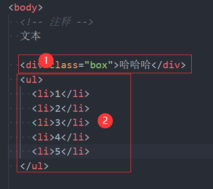

### 1.认识DOM和BOM

- 我们学了什么？接下来要学什么？
  - 我们之前所学的是JavaScript基础语法部分
  - 接下来我们要学习浏览器提供给我们的DOM相关的API和BOM相关的API

- window全局对象

  - 我们之前学习过window，它为我们提供了很多东西：Object、Array、Date等
  - 除此之外还有DOM、BOM


- DOM：文档对象模型（Document Object Model）
  
  - 将页面的所有内容抽象为可以修改的对象
- BOM：浏览器对象模型（Browser Object Model）
  
  - DOM以外的其他对象，比如：navigator、location、history等对象

### 2.理解DOM

- 浏览器会对我们编写的HTML、CSS进行渲染，浏览器也考虑到我们会通过JavaScript来对页面进行操作

  - 所以浏览器就把每一个HTML元素抽象成了一个个对象
  - 这些对象都可以通过JavaScript进行访问，继而可以通过JavaScript来操作页面
  - 我们将这个抽象的过程叫做DOM

- 整个文档都被抽象到document对象中

  ```js
  const doctype = document.doctype;  // 文档声明
  const htmlEl = document.documentElement;  // html元素
  const headEl = document.head;  // head元素
  const bodyEl = document.body;  // body元素
  ```

- 学习DOM，就是在学习如何通过JavaScript对文档进行操作

### 3.DOM Tree

- 把整个文档抽象成DOM对象的时候，会形成一个树结构，我们称其为DOM Tree

  

### 4.DOM的继承关系

- DOM相当于JavaScript和HTML、CSS之间的一座桥梁

- 类型之间有如下继承关系

  

### 5.节点之间的导航

```html
<body>
  <!-- 注释 -->
  文本

  <div class="box">哈哈哈</div>
  <ul>
    <li>1</li>
    <li>2</li>
    <li>3</li>
    <li>4</li>
    <li>5</li>
  </ul>

  <script>
    const bodyEl = document.body;

    // 1.获取body元素的所有子节点
    console.log(bodyEl.childNodes);
    // 2.获取body的第一个子节点
    console.log(bodyEl.firstChild);
    // 3.获取body中的注释
    console.log(bodyEl.firstChild.nextSibling); // [ˈsɪblɪŋ] 
    // 4,获取body的父节点
    console.log(bodyEl.parentNode);
  </script>
</body>
```


- 1和2是body的第一个子节点：文本节点
- 3是body的第二个子节点：注释子节点
- 4、5、6是body的第三个子节点：文本节点
- 7是body的第四个子节点：元素节点（div.box）
- 8、9是body的第五个子节点：文本节点
- 10、11是body的第六个子节点：元素节点（ul）
- 12是body的第七个子节点：文本节点


- parentNode：父节点
- previousSibling [ˈpriːviəs]  [ˈsɪblɪŋ] ：前兄弟节点
- nextSibling：后兄弟节点
- childNodes：所有子节点
- firstChild：第一个子节点
- lastChild：最后一个子节点

### 6.元素之间的导航

```html
<body>
  <!-- 注释 -->
  文本

  <div class="box">哈哈哈</div>
  <ul>
    <li>1</li>
    <li>2</li>
    <li>3</li>
    <li>4</li>
    <li>5</li>
  </ul>

  <script>
    const bodyEl = document.body;

    // 1.获取body的所有子元素
    console.log(bodyEl.children);

    // 2.获取box元素
    console.log(bodyEl.firstElementChild);

    // 3.获取ul元素
    console.log(bodyEl.firstElementChild.nextElementSibling);

    // 4.获取ul中所有的li元素
    console.log(bodyEl.firstElementChild.nextElementSibling.children);
  </script>
</body>
```



- 1是body的第一个子元素
- 2是body的第二个子元素


- parentElement：父元素
- previousElementSibling ：前兄弟元素
- nextElementSibling：后兄弟元素
- children：所有子元素
- firstElementChild：第一个子元素
- lastElementChild：最后一个子元素

### 7.表格之间的导航

```html
<table>
  <thead>
    <tr>
      <th>姓名</th>
      <th>年龄</th>
      <th>身高</th>
    </tr>
  </thead>
  <tbody>
    <tr>
      <td>why</td>
      <td>18</td>
      <td>1.88</td>
    </tr>
    <tr>
      <td>kobe</td>
      <td>30</td>
      <td>1.98</td>
    </tr>
  </tbody>
</table>

<script>
  // 1.获取table元素
  const tableEl = document.body.firstElementChild;

  // 2.通过table元素获取内部的后代元素
  // 2.1. 获取thead元素
  console.log(tableEl.tHead);
  // 2.2. 获取所有的tbody元素
  console.log(tableEl.tBodies);
  // 2.3. 获取tfoot元素
  console.log(tableEl.tFoot);

  // 3.拿到最后一行元素
  console.log(tableEl.rows[2]);
  // 3.1.拿到最后一行的第一个元素
  console.log(tableEl.rows[2].cells[0]);
  // 3.2.获取在tbody中的索引值
  console.log(tableEl.rows[2].sectionRowIndex);  // 1
  // 3.3.获取在所有行之间的索引值
  console.log(tableEl.rows[2].rowIndex);  // 2
</script>
```

### 8.表单之间的导航

```html
<form action="">
  <input name="account" type="text">
  <input name="password" type="password">
  <input name="hobbies" type="checkbox" checked>
  <select name="fruits">
    <option value="apple">苹果</option>
    <option value="orange">橘子</option>
  </select>
</form>

<script>
  // 1.获取form
  const formEl = document.forms[0];

  // 2.获取form中的子元素
  const inputEl = formEl.elements.account;  // name="account"
  console.log(inputEl);
  inputEl.value = "123";
</script>
```

