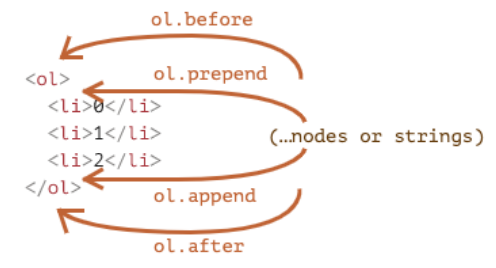
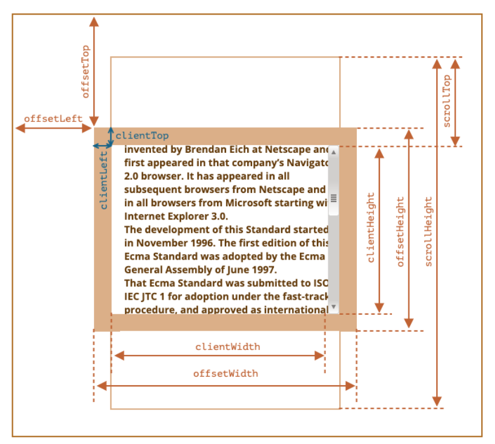

### 1.创建和插入元素

```html
<div class="box">
  <div>容器</div>
  <p>文本</p>
</div>
<script>
  // 获取box
  const boxEl = document.querySelector(".box");

  // 创建一个DOM对象
  const h2El = document.createElement("h2");
  h2El.className = "title";
  h2El.classList.add("active");
  h2El.textContent = "我是标题";

  // 将创建的DOM对象插入到box, 作为box的最后一个子元素
  boxEl.append(h2El);
  // 将创建的DOM对象插入到box, 作为box的第一个子元素
  boxEl.prepend(h2El);
  // 将创建的DOM对象插入到box的上面, 作为box的前兄弟
  boxEl.before(h2El);
  // 将创建的DOM对象插入到box的下面, 作为box的后兄弟
  boxEl.after(h2El);

  // 将box整个元素进行替换, 替换为创建的DOM对象
  boxEl.replaceWith(h2El, "abc");
  // 可以传入多个节点, 节点与节点之间是兄弟关系
  
  
  // 插入到box下的div的后面, 作为div的后兄弟元素
  // 获取到div元素
  // 这里主要是想说明, querySelector可以通过元素去调用, 可以不用document
  const divEl = boxEl.querySelector("div");
  divEl.after(h2El)
</script>
```



- append()：作为元素的最后一个子元素
- prepend()：作为元素的第一个子元素
- after()：作为元素的后兄弟元素
- before()：作为元素的前兄弟元素
- replaceWith(...node)：将整个元素替换为括号中的元素，多个参数的话为兄弟关系

### 2.移除和克隆

```html
<button class="remove-btn">移除box</button>
<button class="clone-btn">克隆box</button>

<div class="box">
  <div>容器</div>
  <p>段落</p>
</div>

<script>
  // 获取按钮的DOM对象
  const removeBtn = document.querySelector(".remove-btn");
  const cloneBtn = document.querySelector(".clone-btn");

  // 获取box的DOM对象
  const boxEl = document.querySelector(".box");
  removeBtn.onclick = function() {
    boxEl.remove();  // 移除自己
  }
  
  cloneBtn.addEventListener("click", function() {
    const cloneDOM = boxEl.cloneNode();  // 浅克隆自己, 不可克隆自己的子元素
    const cloneDOMdeep = boxEl.cloneNode(true);  // 深度克隆, 自己的所有子元素也克隆
    boxEl.after(cloneDOM);
    boxEl.after(cloneDOMdeep);
  });
</script>
```

### 3.element的大小和位置



- clientWidth：contentWith+左右padding（不包含滚动条）
- clientHeight：contentHeight+上下padding（不包含滚动条）
- clientTop：border-top的宽度
- clientLeft：border-left的宽
- offsetWidth：元素完整的宽度
- offsetHeight：元素完整的高度
- offsetLeft：距离父元素的宽度
- offsetHeight：距离父元素的高度
- scrollHeight：整个可滚动的区域高度
- scrollTop：滚动了多少高度

### 4.window的大小和位置

- innerWidth：获取window窗口的宽度（包含滚动条）

- innerHeight：获取window窗口高度（包含滚动条）

- outerWidth：获取整个window窗口的宽度（包括调试工具、工具栏）

- outerHeight：获取整个window窗口的高度（包括调试工具、工具栏） 

- documentElement.clientWidth：获取html的宽度（不包含滚动条）, 可视宽度

- documentElement.clientHeight：获取html的高度（不包含滚动条）, 可视高度

- documentElement.offsetWidth：获取整个可滚动的区域宽度

- documentElement.offsetHeight：获取整个可滚动的区域高度

- scrollX：X轴滚动的位置（别名pageXOffset）滚动条距离x轴顶点的距离

- scrollY：Y轴滚动的位置（别名pageYOffset）滚动条距离y轴顶点的距离
  

- scrollBy(x,y) ：将页面滚动至这个坐标
  - 相对于当前位置的 (x, y) 位置
  - 把当前位置作为(0, 0)吗?
  - 那就有点不太好用了
- scrollTo(pageX, pageY) 将页面滚动至某个坐标
  - 绝对坐标
  - 这个就比较好用了

```html
<button hidden>按钮</button>
<script>
  // 滚动了多远
  window.addEventListener("scroll", function() {
    console.log(window.scrollX);
    console.log(window.scrollY);
  })
	
  // 大于某个距离显示按钮
  // 小于某个距离按钮消失
  const btnEl = document.querySelector("button");
  window.addEventListener("scroll", function() {
    if(window.scrollY > 600) {
      btnEl.hidden = false
    } else {
      btnEl.hidden = true
    }
  });
  btnEl.onclick = function() {
    window.scrollTo(0, 0);
  }
</script>
```

