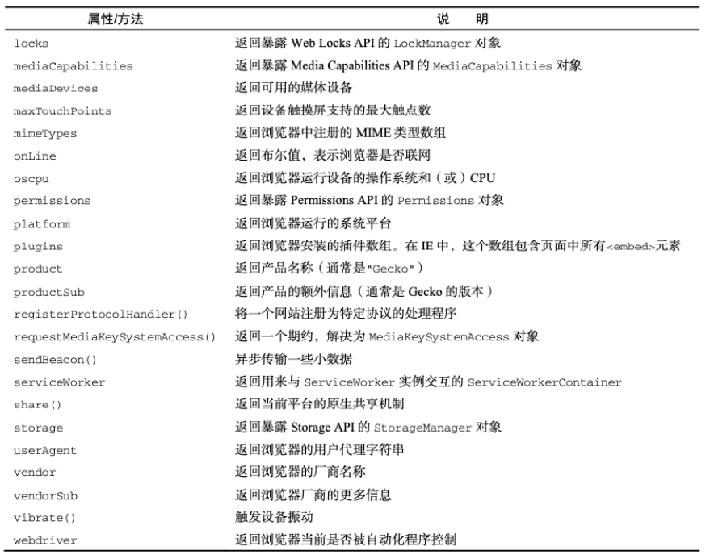
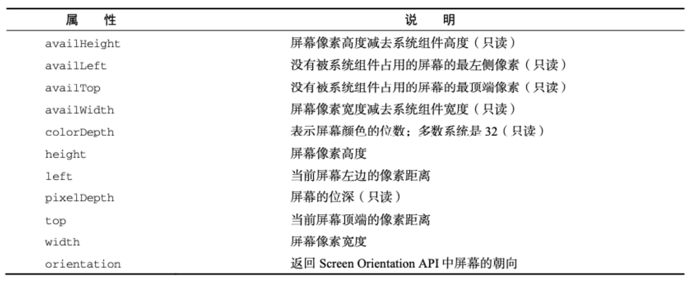

### 1.window对象

```html
<button>打开自己的网页</button>
<button class="btn">关闭自己的网页</button>
<button class="btn1">打开别人的网页</button>

<script>
  // 全局对象
  // 浏览器: window
  // node: global
  // ECMAScript: globalThis

  console.log(window);
  console.log(globalThis);
  console.log(globalThis === window);

  // 1.属性
  console.log(window.outerHeight);

  // 2.方法
  const button = document.querySelector("button");
  const button1 = document.querySelector(".btn");
  button.addEventListener("click", () => {
    window.open("./pages/index.html", "_self");  // 可以回退 相当于location.assign方法
  });
  button1.addEventListener("click", () => {
    window.close();
  });

  const button2 = document.querySelector(".btn1");
  button2.addEventListener("click", () => {
    window.open("https://www.baidu.com", "_blank");
  });

  // 3.事件
  window.addEventListener("focus", () => {
    console.log("网页获得焦点~");
  });
  window.addEventListener("blur", () => {
    console.log("网页失去焦点~");
  });

  window.addEventListener("hashchange", () => {
    console.log("hash值发生了改变~");
  });
</script>
```

### 2.location对象

```html
<button>打开的网页可以回退和前进</button>
<button>打开的网页不可以回退和前进</button>
<button>打开的网页重新加载当前网页</button>

<script>
  // 1.location属性
  // 1.1.获取完整的URL
  console.log(location.href);

  // 1.2.获取URL的信息
  console.log(location.hostname);  // 主机地址(服务器地址)
  console.log(location.host);  // 主机地址和端口号
  console.log(location.protocol);  // 协议
  console.log(location.port);  // 端口号(不带冒号)
  console.log(location.pathname);  // 文件地址(有斜杠)
  console.log(location.search);  // 查询字符串(带问号)
  console.log(location.hash);  // hash值

  // 2.location方法
  const buttonEls = document.querySelectorAll("button");
  // 2.1.assign
  buttonEls[0].addEventListener("click", () => {
    location.assign("https://www.baidu.com");
  });
  // 2.2.replace
  buttonEls[1].addEventListener("click", () => {
    location.replace("https://www.baidu.com");
  });
  // 2.3.reload
  buttonEls[2].addEventListener("click", () => {
    location.reload("https://www.baidu.com");
  });

  // 3.URLSearchParams类
  const queryString = "?name=yt&age=22&height=1.74";
  const searchParams = new URLSearchParams(queryString);
  console.log(searchParams.get("name"));
  console.log(searchParams.get("age"));
  console.log(searchParams.get("height"));

  searchParams.append("address", "济南市");
  console.log(searchParams.get("address"));
  console.log(searchParams.toString());

  // 4.编码和解码
  // encodeURIComponent和decodeURIComponent
  const encode =  encodeURIComponent("济南市");
  const decode =  decodeURIComponent(encode);
  console.log(encode);
  console.log(decode);
</script>
```

### 3.history对象

```html
<button>0</button>
<button class="btn">0</button>
<button class="back">往回</button>
<button class="forward">往前</button>
<script>
  // 前端路由实现的核心: 修改了URL, 但是页面不刷新
  // hash
  // history

  // 1.history属性和方法
  console.log(history.length);
  console.log(history.state);

  const button = document.querySelector("button");
  const button1 = document.querySelector(".btn");
  let count = 0;
  button.addEventListener("click", () => {
    button.textContent = ++count;
  });
  button.addEventListener("click", () => {
    history.pushState({name: 'yt', age: 22}, "", "/yt");
    console.log(history.length);  // 要用pushState
    console.log(history.state);
  });
  button.addEventListener("click", () => {
    history.replaceState({name: 'yt', age: 22}, "", "/yt");
    console.log(history.length);  // replaceState直接替换掉了, 所以length一直是1
    console.log(history.state);
  });
  button1.addEventListener("click", () => {
    history.pushState({name: 'why', age: 18}, "", "/why");
    console.log(history.length);  // 用pushState才能测出它的作用
    console.log(history.state);
  });
  // 这样使用history确实没有刷新网页

  // 2.history的其他方法
  const btnElback = document.querySelector(".back");
  const btnElforward = document.querySelector(".forward");
  btnElback.addEventListener("click", () => {
    history.back();
  });
  btnElforward.addEventListener("click", () => {
    history.forward();
  });

  btnElback.addEventListener("click", () => {
    history.go(-1);
  });
  btnElforward.addEventListener("click", () => {
    history.go(1);
  });

  btnElback.addEventListener("click", () => {
    history.go(-3);
  });
  btnElforward.addEventListener("click", () => {
    history.go(3);
  });
</script>
```

### 4.navigator和screen对象

- navigator对象表示用户代理的状态和标识等信息

  

- screen主要记录的是浏览器窗口外面的客户端显示器的信息

  