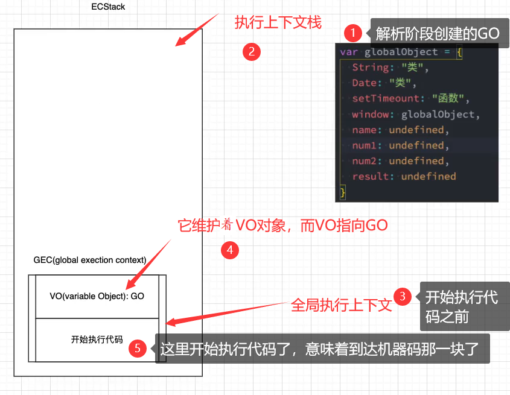

### 1.初始化全局对象

解析阶段

- 代码在解析阶段就会创建一个对象：GlobalObject（它是放到堆内存中的）

- GlobalObject中有我们用到的Math，String，Number，setTimeout，setInterval等

- 除此之外还有一个window属性，这个window属性指向自己，window: this;

  ```js
  var GlobalObject = {
    Math: "类",
    String: "类",
    setTimeout: "函数",
    setInterval: "函数",
    console: "对象",
    window: GlobalObject,
  }
  ```

- 这里有一段代码，在解析阶段有值是一个怎样的过程呢？

  ```js
  var name = "yt";
  var num1 = 12;
  
  var GlobalObject = {
    name: undefined,
    num1: undefined
  }
  ```

### 2.运行代码

- v8引擎为了可以执行我们的代码，它会为我们开辟一个栈内存，这个内存我们叫做执行上下文栈，也叫函数调用栈

  - Execution/ˌeksɪˈkjuːʃn/ Context Stack/stæk/（ECStack）执行上下文栈

- 我们一定要区别开执行上下文栈和执行上下文，执行上下文要放到执行上下文栈里。

  - 执行上下文栈是执行上下文的容器
  - 比如有全局执行上下文，函数执行上下文
  - 默认会有全局执行上下文，在全局执行上下文中运行了一个函数，就会为这个函数创建一个函数执行上下文，并把这个函数执行上下文压栈到执行上下文栈中

- 全局执行上下文（全局代码需要执行时才会被创建）

  

- 开始执行代码

  ```js
  var name = "yt";
  
  var num1 = 12;
  var num2 = 13;
  var result = num1 + num2;
  ```

  GO里面的一个一个的代码就开始被赋值了

  ```js
  var GlobalObject = {
    Math: "类",
    String: "类",
    setTimeout: "函数",
    setInterval: "函数",
    console: "函数",
    window: GlobalObject,
    name: "yt",
    num1: 12,
    num2: 13,
    result: 25
  }
  ```

  假如你这时执行了

  ```js
  console.log(result)
  ```

  它就会去VO里面查，VO又指向GO，所以打印25

  看下面的代码

  ```js
  var name = "yt";
  console.log(num1)
  var num1 = 12;
  var num2 = 13;
  var result = num1 + num2;
  ```

  第二行打印什么？答案：undefined

  它不会报错说找不到，因为GO里有啊，不过是一个undefined而已

### 3.遇到函数

我们先来看一个现象

```js
var name = "yt";
foo();
function foo() {
  console.log("foo");
};
```

- foo会被执行吗？答案是会的
- 打印foo，为什么？

编译阶段

- 首先js引擎在编译阶段发现foo是一个函数，然后就会在堆内存中开辟一块空间来存储foo这个函数
- 这块空间首先会保存foo的父级作用域：[[scope]]: parent scope
  - 在这里它的父级作用域是全局作用域：GO
- 这块空间其次会保存函数的执行体（也就是代码块）
- 只要在内存中开辟了一块空间，它就会有属于它自己的内存地址，比如说这块空间的内存地址是0xa00
  - 0x开头的原因：内存地址的表示一般都是以0x开头
- 在GO中把这块空间的内存地址赋值给foo


- ```js
  const GO = {
    name: undefined,
    foo: 0xa00,
  };
  ```

执行阶段

- 执行var name = "yt";

  ```js
  const GO = {
    name: "yt",
    foo: 0xa00
  }
  ```

- 执行 foo();

  - 在调用栈中创建一个函数执行上下文（Function Execution Context FEC）

  - 创建VO，我们在全局执行上下文中创建的VO指向GO，这里的VO指向AO

    - 我们为了执行这个函数还会在堆内存中创建一个对象叫做AO（Activation Object）

    - 因为函数里也会定义一些东西的，比如var a = 10;比如参数

    - 有如下代码：

      ```js
      foo(123);
      function foo(num) {
        console.log(n);
        var n = 10;
        var m = 20;
        console.log("foo");
      };
      
      // 编译
      var AO = {
        num: undefined,
        n: undefined,
        m: undefined,
      };
      
      // 执行
      var AO = {
        num: 123,
        n: 10,
        m: 20,
      };
      ```

  - 执行结果为

    ```js
    // undefind
    // foo
    ```

函数执行完以后

- 函数执行上下文就会出栈，并销毁掉
- 如果没有东西指向AO，AO也会被销毁掉

假如函数又被执行了一次

- 有如下代码

  ```js
  foo();
  function foo(num) {
    console.log(n);
    var n = 10;
    var m = 20;
  };
  foo();
  ```

- 它会创建新的函数执行上下文，创建新的AO，所以会打印两遍undefined

### 4.参考解释

- 在执行的过程中执行到一个函数时，就会根据函数体创建一个函数执行上下文（Functional Execution Context， 简称FEC），并且压入到ECStack中。（开始执行所做的事情，开始执行一个函数、然后编译、然后再执行）
- FEC中包含三部分内容：
  - 第一部分：在解析函数成为AST树结构时，会创建一个Activation Object（AO）：
    - AO中包含形参、arguments、函数定义和指向函数对象、定义的变量；
  - 第二部分：作用域链：由VO（在函数中就是AO对象）和父级VO组成，查找时会一层层查找；
  - 第三部分：this绑定的值（这个我们后续会详细解析）；

### 5.变量查找规则

作用域链

- 如下两段代码

  ```js
  var name = "yt";
  foo();
  function foo(num) {
    var n = 10;
    var m = 20;
    var name = "ytree"
    console.log(name);
  };
  
  // 结果：ytree
  ```

  ```js
  var name = "yt";
  foo();
  function foo(num) {
    var n = 10;
    var m = 20;
    console.log(name);
  };
  
  // 结果：yt
  ```

- 当我们查找一个变量时，它真实的查找路径是沿着作用域链来查找的

  - 函数执行上下文中还包含另外一个东西：scope chain（作用域链）
    - 作用域链由两个东西组成：VO和ParentScope
    - 父级作用域在编译的时候就已经被确定了
    - 在这里foo的父级作用域就是全局作用域
  - 所以这个foo的作用域链就变成了自己的AO到GO

- 更深层次的函数

  ```js
  var name = "yt";
  foo();
  function foo(num) {
    var n = 10;
    var m = 20;
    function bar() {
      console.log(name);
    }
    bar();
  };
  ```

  - 在创建foo函数的时候，并不会对bar进行编译，只会对bar进行预编译
  - 但是在即将执行foo函数的时候，我们先要编译foo里面的内容，即创建AO对象等操作，此时才会对bar进行编译
  - 对bar进行编译才会创建属于它的存储空间
  - 当我们执行bar()的时候才会创建属于bar的函数执行上下文并压入栈中，并创建属于它的AO
  - bar这个函数首先会寻找自己的AO，看一看有没有name，没有就会进入属于它的父级作用域，去看一看有没有name，而它的父级作用域包含两个对象：分别是foo的AO和属于foo父级作用域的GO
  - 假如GO也没有name，就会报name is not defined错误

### 6.ECMA的一些更改

- 
  - 每一个执行上下文都与一个VO相关联。在源码中声明的变量和函数会被作为属性添加到VO中。对于函数来说，参数也会被作为属性添加到VO中
- 
  - 每一个执行上下文都与一个VE关联。自己翻译去吧~~~
  - 首先它把VO改为了VE，然后没有把VE的类型规定的那么死，变得比较宽泛了，以前必须是一个对象，现在可以是对象，也可以是Map
  - VE中每添加一个东西，称为环境记录。以前叫属性