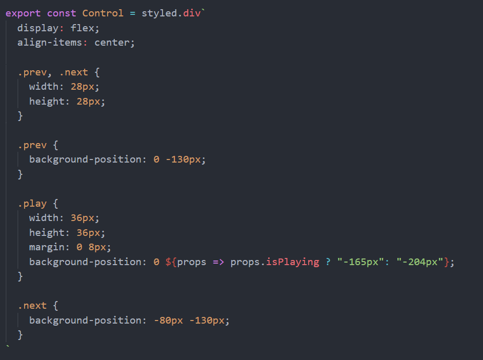

### 1.模板字符串基本使用

```js
const name = "yt";
const age = 22;
const height = 1.88;

const message = `My name is ${name}, age is ${age}, height is ${height}.`;
console.log(message);  // My name is yt, age is 22, height is 1.88.
```

```js
const age = 22;

const ageDouble = `Age double is ${age * 2}.`;
console.log(ageDouble);  // Age double is 44.
```

```js
const age = 22;

const ageDouble = `Age double is ${doubleAge(age)}.`;
console.log(ageDouble);  // Age double is 44.

function doubleAge(age) {
  return age * 2;
};
```

### 2.标签模板字符串

```js
function foo(m, n) {
  console.log(m, n);
};

foo("Hello", "World");  // Hello World
foo`Hello World`;  // [ 'Hello World' ] undefined
```

```js
const name = "yt";
const age = 22;

function foo(m, ...args) {
  console.log(m, args);
};

foo`Hello ${name}, your age is ${age}, welcome to the World`;
// [ 'Hello ', ', your age is ', ', welcome to the World' ] [ 'yt', 22 ]
```

- 第一个参数是一个数组，以模板字符串为基点切成了三份。
- 第二个参数是函数的剩余参数，剩余参数包含所有的${}大括号内的值
- 如果从第二个参数开始，不是以剩余参数的形式接收参数，而是一个一个的接收。
  
  - 那么从第二个参数开始，依次为$大括号中的内容
- 这玩意有什么用呢？
  - 在react中编写css，你大概率会用到一种框架，当然这种框架基于一种编程哲学（all in js或者css in js）
  - 就是在js里面编写css代码，我们会用到css in js的第三方库：styled-components
  
    
  - styled.div``
    
    - 这里的div是styled库里的一个函数

### 3.给函数的形参设置默认值

- ES5之前给参数设置默认值

  ```js
  function foo(m, n) {
    m = m || "aaa";
    n = n || "bbb";
  
    console.log(m, n);
  };
  
  foo();  // aaa bbb
  ```

  - 缺点

    1. 写起来麻烦

    2. 这种写法有漏洞，即有bug

       - 比如我传入0或者空字符串

         ```js
         foo(0, "");  // aaa bbb
         ```

       - 它把0和空字符串判定为false

- ES6开始，可以为函数的形参提供默认值

  ```js
  function foo(m = "aaa", n = "bbb") {
    console.log(m, n);
  };
  
  foo();  // aaa bbb
  foo(0, "");  // 0 
  ```

  - 这种写法，代码可读性强，写法简单，代码没有bug

  - 那么这种写法转成ES5是什么样子的呢？

    ```js
    function foo() {
      var m =
        arguments.length > 0 && arguments[0] !== undefined ? arguments[0] : "aaa";
      var n =
        arguments.length > 1 && arguments[1] !== undefined ? arguments[1] : "bbb";
      console.log(m, n);
    }
    ```

    - 也就是说只有你传入undefined才会用默认值，假如你传入null是不会用默认值的，依然打印null

- 形参的默认值为对象类型，以及解构

  - 写法一：

    ```js
    function foo({name, age} = {name: "yt", age: 22}) {
      console.log(name, age);
    };
    
    foo();  // yt 22
    ```

  - 写法二：

    ```js
    function foo({name = "yt", age = 22} = {}) {
      console.log(name, age);
    };
    
    foo();  // yt 22
    ```

- 有默认值的形参最好放到最后

  ```js
  function foo(a, b, c = "ccc") {
    console.log(a, b, c);
  };
  
  foo("aaa", "bbb");
  ```

- 有默认值的函数的length属性

  - 在之前说过这个length属性，它表示函数的参数个数

  - 但是如果你这个函数有默认值了，默认值参数不算在length内

  - 默认参数之后的所有形参均不算在length内

    ```js
    function foo(a, b, c = "ccc", z, n) {
      console.log(a, b, c);
    };
    
    console.log(foo.length);  // 2
    ```

### 4.函数的剩余参数

- ES6中引入了rest parameter（剩余参数），可以将不定数量的参数放入到一个数组中

  - 如果最后一个参数以 `...` 作为前缀，那么它会将剩余的参数放入到该参数中，该参数以数组的形式呈现

    ```js
    function foo(a, b, ...args) {
      console.log(a, b, args);
    };
    
    foo(10, 20, 30, 40, 50, 60);  // 10 20 [ 30, 40, 50, 60 ]
    ```

- 剩余参数与arguments的区别

  - 剩余参数只包含那些没有对应形参的实参。而arguments包含了传给函数的所有实参
  - arguments不是一个真正的数组。而剩余参数是一个真正的数组，可以进行数组的所有操作
  - arguments是早期的ECMAScript中为了方便获取所有的参数，而提供的一种数据结构。
  - 剩余参数是ES6提供的，并希望取代arguments

- 剩余参数只能作为最后一个形参，不然会报错

  - Rest parameter must be last formal parameter
  - 剩余参数必须作为最后一个形参

### 5.箭头函数的补充

- 箭头函数没有显式原型，所以不能作为构造函数，即不能使用new来实例化它，继而创建对象

  ```js
  const foo = () => {};
  
  console.log(foo.prototype);  // undefined
  
  const f = new foo();  // TypeError: foo is not a constructor（foo不是一个构造函数）
  ```

### 6.展开语法（展开运算符）

- 展开语法（Spread syntax）

  - ES6

    - 在调用函数时

      ```js
      const names = ["abc", "cba", "nba"];
      const message = "why";
      
      // 调用函数时
      function foo(x, y, z) {
        console.log(x, y, z);
      };
      
      foo(...names);  // abc cba nba
      foo(...message);  // w h y
      ```

    - 在数组构造时

      ```js
      const names = ["abc", "cba", "nba"];
      const message = "why";
      
      // 构造数组时
      const newNames = [...names];
      const newMessageArr = [...message];
      console.log(newNames);  // [ 'abc', 'cba', 'nba' ]
      console.log(newMessageArr);  // [ 'w', 'h', 'y' ]
      ```

  - ES9（ES2018）

    - 在构造对象字面量时

      ```js
      const info = { name: "why", age: 18, height: 1.88 };
      
      const obj = { ...info, address: "广州市" };
      console.log(obj);  // { name: 'why', age: 18, height: 1.88 address: '广州市' }
      ```

- 展开运算符其实是浅拷贝

  ```js
  const info = {
    name: "why",
    friend: { name: "yt" },
  };
  
  const obj = { ...info, name: "coderwhy" };
  console.log(obj);  // { name: 'coderwhy', friend: { name: 'yt' } }
  
  obj.friend.name = "kobe";
  console.log(info.friend.name);  // kobe
  ```

### 7.数值的表示方式

```js
const num10 = 100;  // 十进制
const num2 = 0b100;  // 二进制
const num8 = 0o100;  // 八进制
const num16 = 0x100;  // 十六进制

console.log(num10, num2, num8, num16);  // 100 4 64 256
```

- b：binary  /ˈbaɪnəri/

- o：octonary /'ɒktə(ʊ)n(ə)rɪ/

- x：hex（hexadecimal）/ˌheksəˈdesɪml/

```js
// 大数值表示(ES12)
const num = 1_000_000_000
const num = 10_0000_0000
console.log(num);  // 1000000000
```

