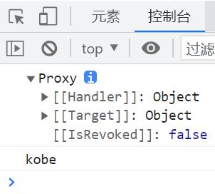

### 1.Reflect

- ES6新增API，它是一个对象，Reflect字面意思是：反射

- 它为我们提供了很多可以操作JavaScript对象的方法，比较像Object

  - 比如Reflect.getPrototypeOf(obj)类似于Object.getPrototypeOf(obj)
  - 再比如Reflect.defineProperty(obj, "name", {})类似于Object.defineProperty(obj, "name", {});

- 既然我们有Object可以做这些操作，那为什么还需要Reflect这样的新增对象？

  - 这是因为在早期的ECMA规范中没有想好如何更好地设计这些操作对象本身的方法，所以将这些方法一股脑的放到了Object上
  - 不过Object作为一个构造函数，这些操作放到它的身上并不合适，即它承担的太多了
  - 除此之外我们在开发的过程中，会用到一些操作符，比如in、delete，而这些操作符会让JS看起来很怪
  - 在ES6，ECMA就把这些本不属于Object上的方法和这些很怪的操作符，放在了这个Reflect上
  - 总的来说，Reflect把一些不规范的东西进行了规范化，把一些看起来奇怪的操作符也集中到了自己身上

- Object和Reflect之间的对应关系可以参考下面的文档

  ```apl
  https://developer.mozilla.org/zh-CN/docs/Web/JavaScript/Reference/Global_Objects/Reflect/Comparing_Reflect_and_Object_methods
  ```

### 2.Reflect的常见方法

- Reflect也是13个，和Proxy一一对应
  - Reflect.getPrototypeOf(target)
    - 获取target对象的隐式原型
    - 类似于Object.getPrototypeOf(target)
  - Reflect.setPrototypeOf(target, prototype)
    - 让target对象的隐式原型指向prototype
    - 类型于Object.setPrototypeOf(target, prototype)
  - Reflect.isExtensible(target)
    - 判断target对象是否是可扩展的
    - 类似于Object.isExtensible(target)
  - Reflect.preventExtensions(target)
    - 阻止target扩展，就是不能在target对象中添加新的属性，但是可以删除
    - 类似于Object.preventExtensions(target)
    - 要区分开Object.seal(target)，它是把obj中的所有属性的configurable设置为了false，不可以delete某个属性，不可以修改它的属性描述符，不可以将它修改为存取属性描述符
    - 还要区分开Object.freeze(obj)，这个方法是让obj的所有属性的writeable属性描述符全部设置为false，设置为false的意思就是，obj对象中的所有属性对应的值不能被修改
  - Reflect.getOwnPropertyDescriptor(target, key)
    - 如果target对象对应的key属性存在的话，就返回这个key属性的属性描述符
    - 类似于Object.getOwnPropertyDescriptor(target, key)
  - Reflect.defineProperty(target, key, {})
    - 设置对象某个属性的属性描述符
    - 类似于Object.defineProperty(target, key, {})
  - Reflect.ownKeys(target)
    - 返回一个包含自身所有属性名的数组，不包括继承的属性，不受enumerable的影响
    - 类似于Object.keys(target)，它受enumerable属性的影响
  - Reflect.has(target, key)
    - 判断对象是否存在某个属性，与in操作符的效果完全一样
  - Reflect.get(target, key, [receiver])
    - 获取对象身上某个属性值，类似于target[key]
  - Reflect.set(target, key, value, [receiver]);
    - 给target对象的key属性设置值
  - Reflect.delete(target, key)
    - 删除target对象的key属性，与delete操作符效果一样
  - Reflect.apply(target, thisArg, args)
    - 对target函数进行调用，第二个参数是绑定的this，第三个参数是存储参数的数组
    - 类似于apply
  - Reflect.construct(target, args, [newTarget])
    - 对target这个构造函数进行new操作
    - 类似于new target(...args)

### 3.重构Proxy的set与get

- 我们之前的set与get其实依然是在改原来的那个对象

- 我们现在要用Reflect对set和get进行重构

  ```js
  var obj = {
    name: "kobe",
    age: 40,
  };
  
  const objProxy = new Proxy(obj, {
    // 获取值时的捕获器
    get(target, key, receiver) {
      console.log(`获取${key}的值`, target);
      return Reflect.get(target, key);
    },
  
    // 设置值时的捕获器
    set(target, key, newValue, receiver) {
      Reflect.set(target, key, newValue)
      console.log(`为${key}设置值`, target);
    },
  });
  
  console.log(objProxy.name);
  objProxy.name = "why";
  console.log(objProxy.name);
  ```

  - 那，这有啥区别吗？以前通过 target[key] = newValue 设置值的时候我们是无法知道到底是设置成功了还是设置失败了，比如Object.freeze(obj)，就不允许修改obj对象中的任何属性所对应的值
  - Reflect.set(target, key, newValue)是有返回值的
    - 如果设置成功了就返回true
    - 如果设置失败了就返回false

### 4.receiver参数的作用

```js
var obj = {
  _name: "kobe",
  get name() {
    return this._name;
  },
  set name(newValue) {
    this._name = newValue;
  },
};

const objP = new Proxy(obj, {
  get(target, key) {
    return Reflect.get(target, key);
  },
  set(target, key, newValue) {
    Reflect.set(target, key, newValue);
  },
});

console.log(objP.name);
```

- Reflect.get(target, key)访问了obj对象的name属性

- 就会来到obj的name的get方法中，从而能够访问_name

- 这里有一个问题，我们这么做的时候get中的this指向谁？指向obj对象

  - 假如this指向objP这个对象，那么一定会两次经过objP的get捕获器，但是没有
  - 不过呢，我们想要让这个this指向objP，为什么，因为`_name`也被代理了，可是对`_name`的访问却是直接访问的，没有经过代理进行访问，这是不对的，因为我监听不到`_name`的改变

- 这个时候receiver就该出场了，receiver是我们创建出来的那个代理对象

  ```js
  const objP = new Proxy(obj, {
    get(target, key, receiver) {
      console.log(receiver);
      console.log(receiver === objP);  // true
    },
  });
  
  console.log(objP.name);
  ```
  
  - 那直接用objP不就行了，非得多一个receiver干嘛？

  - 人家有人家的考量，人家为了方便。

  - 那么这个receiver怎么才能用上呢？这个时候就该Reflect发挥作用了

    - Reflect可以传入最后一个参数，最后一个参数就是receiver

  - Reflect的第三个参数可以改变obj对象的get方法里面的this指向，指向传入的这最后一个参数
  
    ```js
    var obj = {
      _name: "kobe",
      get name() {
        return this._name;
      },
      set name(newValue) {
        this._name = newValue;
      },
    };
    
    const objP = new Proxy(obj, {
      get(target, key, receiver) {
        console.log(`${key}被访问`);
        return Reflect.get(target, key, receiver);
      },
      set(target, key, newValue, receiver) {
        console.log(`${key}被设置`);
        Reflect.set(target, key, newValue, receiver);
      },
    });
    
    console.log(objP.name);
    objP.name = "why";
    
    /*
    name被访问
    _name被访问
    kobe
    name被设置
    _name被设置
    */
    ```

### 5.Reflect中construct的作用

```js
function Student(name, age) {
  this.name = name;
  this.age = age;
};

function Teacher() {};

const stu = new Student("why", 18);
console.log(stu);
```

- 现在的stu类型是Student

- 我们想让stu的类型是Teacher，怎么办？

- 我们想让new Student的时候执行Student构造函数里的内容，但是要改变它的类型为Teacher

  ```js
  function Student(name, age) {
    console.log(this);  // Teacher
    this.name = name;
    this.age = age;
  };
  
  function Teacher() {};
  
  const teacher = Reflect.construct(Student, ["why", 18], Teacher);
  console.log(teacher);  // Teacher { name: 'why', age: 18 }
  console.log(teacher.__proto__ === Teacher.prototype);  // true
  ```

  

