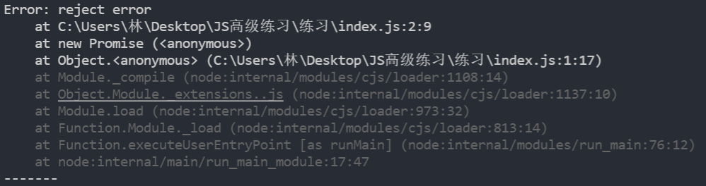

### 1.catch

- 哪几种情况下错误回调函数会被执行

  1. reject

     ```js
     const promise = new Promise((resolve, reject) => {
       reject(123);
     });
     
     promise.then(undefined, (err) => {
       console.log(err);
     });
     ```

  2. 抛出异常

     ```js
     const promise = new Promise((resolve, reject) => {
       throw new Error("reject error")
     });
     
     promise.then(undefined, (err) => {
       console.log(err);  // 这里可不是报错，因为下面代码是可以正常执行的
       console.log("-------")
     });
     ```

     

- catch写法的几种情况分析

  - 写法一：

    ```js
    promise.catch((err) => {
      console.log(err);
    });
    ```

    - 这种写法不允许与then同时出现，不然会报错，为什么？
      - 因为它俩是两个独立的代码，互相无法影响
      - 所以在then方法中必须有一个对reject或者抛出错误的处理

  - 写法二：

    ```js
    promise.then(res => {
      console.log(res);
    }).catch(err => {
      console.log(err);
    });
    ```

    - 对于这种情况，在then中return了某个东西会怎么样？

    - 其实需要分两种情况

      1. 如果在Promise中，直接执行reject或者直接抛出异常，其实根本就不走then方法，更无从谈起有return该怎么办

      2. 但是如果在Promise中，执行了resolve，并且我还在then中return了一个普通值该怎么写

         ```js
         promise.then(res => {
           console.log(res);
           return 1123
         }).catch(err => {
           console.log(err);
         }).then(res => {
           console.log(res);  // 1123
         });
         ```

      3. 如果执行了resolve，并且在then中return了一个Promise对象，Promise对象执行reject或者抛出错误，这个时候catch才会接收这个错误

         ```js
         const promise = new Promise((resolve, reject) => {
           resolve(456)
         });
         
         promise.then(res => {
           console.log(res);  // 456
           return new Promise((resolve, reject) => {
             reject("jjj")
           });
         }).catch(err => {
           console.log("err", err);  // err jjj
           return 5
         }).then(res => {
           console.log("res", res);  // 5
         });
         ```

         这打印结果很有趣

         我们还是推荐这种写法的，因为如果捕获不到promise的reject，就去捕获then方法中的reject

         ```js
         promise.then(res => {
           console.log(res);  // 456
         }).then((res) => {
           throw new Error("then error");
         }).catch(err => {
           console.log("err", err);  // err Error: then error
           return 5
         }).then(res => {
           console.log("res", res)  // 5
         });
         ```

         ```js
         const promise = new Promise((resolve, reject) => {
           resolve(456)
         });
         
         promise.catch(err => {
           console.log(err);
         }).then(res => {
           console.log(res);  // 456
         });
         ```

         这么做也是可以的

         ```js
         const promise = new Promise((resolve, reject) => {
           reject("nba");
         });
         
         promise.catch(err => {
           console.log(err);  // nba
         }).then(res => {
           console.log(res);  // undefined
         });
         ```

         有意思、很有意思，主要的原因是，catch的返回值和then的返回值作用是一样的

### 2.finally

- 不管什么情况下都会执行一次

  ```js
  const promise = new Promise((resolve, reject) => {
    resolve(456)
  });
  
  promise.then(res => {
    console.log("res", res);  // res 456
  }).catch(err => {
    console.log("err", err);
  }).finally(() => {
    console.log("finally");  // finally
  });
  ```

