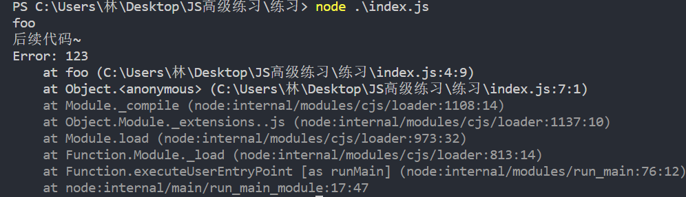

### 1.异步函数

- 异步函数：async function

- async关键字用于声明一个异步函数

  - async是asynchronous [eɪ ˈsɪŋk rə nəs] 单词的缩写（异步、非同时）
  - sync是synchronous [ˈsɪŋk rə nəs] 单词的缩写（同步、同时）

- 异步函数的多种写法

  ```js
  async function foo() {};
  
  const foo = async () => {};
  
  class Foo {
    async foo() {};
  };
  ```


### 2.异步函数的执行流程

- 我们有下面这段代码

  ```js
  async function foo() {
    console.log("foo");
  };
  
  foo();
  ```

- 在异步函数内部没有特殊代码的情况下，与普通函数的执行顺序是一样的

  - 默认情况下内部代码会被同步执行
  - 即，默认情况下与普通函数没有任何区别

### 3.异步函数的返回值

- 异步函数的返回值一定是一个Promise

  ```js
  async function foo() {
    console.log("foo");
  
    return 123
  };
  
  const promise = foo();
  promise.then(res => {
    console.log(res);  // 123
  });
  ```

- 返回值是一个thenable对象

  ```js
  async function foo() {
    console.log("foo");
  
    return {
      then: function(resolve) {
        resolve(123)
      }
    }
  };
  
  const promise = foo();
  promise.then(res => {
    console.log(res);  // 123
  });
  ```

- 返回值是一个promise

  ```js
  async function foo() {
    console.log("foo");
  
    return new Promise((resolve) => {
      setTimeout(() => {
        resolve(123)
      }, 1000)
    })
  };
  
  const promise = foo();
  promise.then(res => {
    console.log(res);  // 123
  });
  ```

### 4.异常

- 在异步函数中抛出异常

  ```js
  async function foo() {
    console.log("foo");
  
    throw new Error(123);
  };
  
  foo().catch(err => {
    console.log(err);
  });
  
  console.log("后续代码~");
  ```

  

- 抛出的异常会作为promise中reject的实参

### 5.await关键字

- await只有在async function中才有效

- 把await放在普通函数中，在解析阶段就会报错

- await关键字有哪些特点呢？

  - 通常情况下，await后面会跟上一个表达式，这个表达式返回一个Promise对象

    ```js
    function requestData() {
      return new Promise((resolve) => {
        setTimeout(() => {
          resolve(123);
        }, 1000);
      });
    };
    
    async function foo() {
      await requestData();
    };
    ```

  - await会有一个结果，这个结果，是Promise中resolve的值

    ```js
    function requestData() {
      return new Promise((resolve) => {
        setTimeout(() => {
          resolve(123);
        }, 1000);
      });
    };
    
    async function foo() {
      const res = await requestData();
      console.log(res);  // 1秒后打印：123
    };
    
    foo();
    ```

  - await有一个特点，如果await没有获取到结果，或者很长时间之内都没有结果，那么await下面的代码，在await拿到结果之前是不会执行的

  - await下面和前面的代码可以看做是，在await后面表达式的then方法中执行

    - await后面和上面的代码会立即执行

  - await后面跟上一个普通的值，那么这个值会被直接返回
  
    ```js
    async function foo() {
      const res = await 123;
      console.log(res);
    };
    
    foo();
    ```

  
  - await后面跟一个实现了thenable的对象
  
    ```js
    async function foo() {
      const res = await {
        then: function(resolve) {
          resolve(123)
        }
      };
      console.log(res);  // 123
    };
    foo();
    ```

  - await后面跟一个Promise
  
    ```js
    async function foo() {
      const res = await new Promise((resolve) => {
        resolve(123);
      });
      console.log(res);  // 123
    };
    foo();
    ```
  

  - await后面的表达式返回的promise是一个rejected状态，会发生什么？
  
    ```js
    function requestData() {
      return new Promise((resolve, reject) => {
        setTimeout(() => {
          reject(123)
        }, 1000)
      });
    };
    
    async function foo() {
      await requestData();
    };
    
    foo().catch(err => {
      console.log(err);
    });
    ```
  
    - 如果不去捕获，就会报错