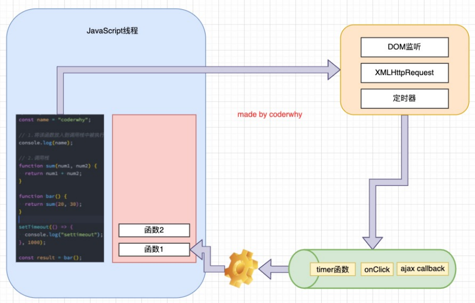

### 	1.事件循环

```js
console.log("script start");

setTimeout(function() {}, 1000);

console.log("后续代码");

console.log("script end");
```

- 这里面有两个函数，分别是setTimeout函数和它里面的function() {}这个函数
- 请问这两个函数，谁是异步的？
  - function() {}这个函数是异步的
  - js看到setTimeout这个函数后，就会把里面的函数放在某个地方进行计时
  - 等到时间到了，会让js对function() {}这个函数进行回调
- 浏览器维护着一个队列
  - 队列是一种数据结构，可以想象成一个特殊的数组，只不过它里面的元素必须是先进先出(隧道)
  - 这个队列就称其为事件队列
  - 默认情况下这个队列是没有东西的
  - 我们之前在浏览器的某个地方对function() {}进行了计时，当时间到了之后，浏览器就会把这个函数放入到这个队列中
  - js就会不断的从这个队列中取东西，进行执行
- 再比如网络请求
  - 在浏览器的某个位置进行网络请求，请求到数据，把包含数据的回调函数加入到事件队列中
  - 然后js再挨个进行执行
- 交给浏览器计时也好，请求数据也好，都是其他线程
  - js主线程、其他线程、事件队列
  - 这三个组成了一个闭环，此闭环就是事件循环



### 3.宏任务队列和微任务队列

- 英文
  - macrotask [ˈmæk roʊ tæsk] queue [kjuː] 
  - microtask [ˈmaɪk roʊ tæsk] queue [kjuː] 
- 宏任务队列中包含哪些函数的回调
  - ajax、setTimeout、setInterval、DOM监听、UI Rendering
- 微任务队列中包含哪些函数的回调
  - Promise的then、Mutation Observer API、queueMicrotask
- 规范
  - 在这之前我们要明白一点
    - 宏任务队列中的每个回调函数，统称为一个一个的宏任务
    - 微任务队列中的每个回调函数，统称为一个一个的微任务
  - 在执行每个宏任务之前都要保证微任务队列被清空了
    - 看好，这里是每个宏任务，不是宏任务队列
    - 这就意味着，在每次执行宏任务队列中的某个回调函数之前，都要看一看所有的微任务是否都已执行完毕

### 3.代码执行顺序

- 先执行main script中的代码，执行完main script中的代码，再执行事件队列中的那些回调函数
- 至于事件队列中的执行顺序，1中已经说道

