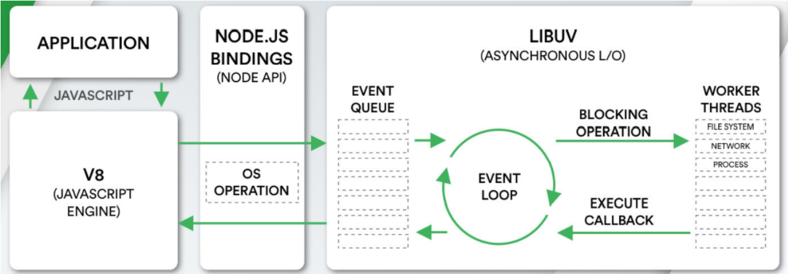
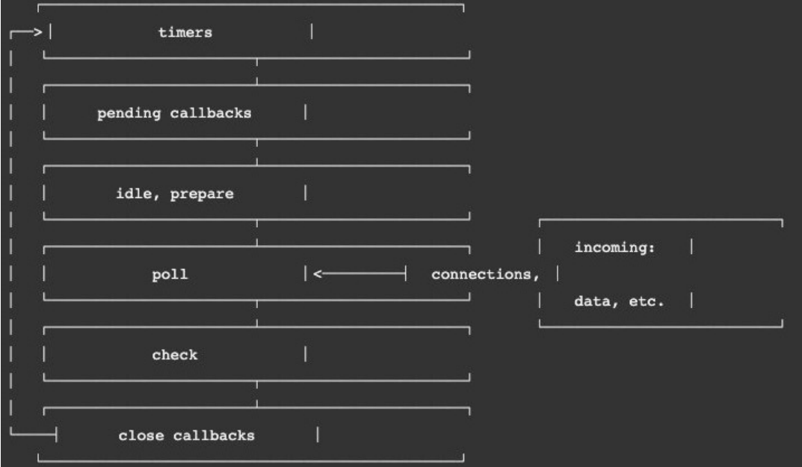

### 1.事件循环

- 浏览器的事件循环是根据HTML5规范来实现的

- node的事件循环是由libuv来实现的，libuv是node中的一个库

  
  - application是应用程序的意思，比如你通过express或者koa开发了一个服务器，这个服务器就是application，其实都是JS代码
  - js代码交给V8引擎进行执行，V8引擎会开一个线程运行js代码，在运行的过程中会遇到很多的异步操作
  - 遇到了异步操作就会交给libuv，libuv也会开一个线程执行这些异步操作
  - 比如读取文件，比如setTimeout，都会在worker threads中进行执行，这个worker threads是一个线程池
  - 当把异步操作做完，就会把异步操作的回调函数放入到event queue（事件队列）中等待执行

- 可以简单的理解为

  - js主线程遇到异步操作，就将其放入线程池中进行执行，执行完把回调函数放入事件队列中等待执行
  - 与浏览器的事件循环还是比较相似的

- libuv是一个多平台的库，专注于异步IO

### 2.事件循环的理解

- 事件循环就像是一搜摆渡船，js代码想要向服务器请求数据，或者想读取操作系统的文件，它会把这些事情交给摆渡船去做，摆渡船经过一通运作，就会把js想要的数据带回来，交给js去处理
- 将js应用在服务器上，有一个非常重要的前提，就是应用在服务器上的编程语言必须具备IO操作
  - IO表示input和output
  - 编程语言可以从服务器的某些文件中输入(获取)某些数据（input）：比如把数据写入数据库
  - 编程语言也可以把一些数据写入到服务器的某些文件中（output）：比如把数据库的数据读取到程序中
- js其实并不具备这样的IO操作，不过js可以调用一些方法，比如readfile方法，然后让libuv帮助js去做这件事
- 拿到数据后再把回调函数放入到事件循环中，js再在事件循环中拿这个回调，并执行回调，取到服务器的数据

### 3.一次完整的事件循环tick

- tick表示：打上对勾，秒钟每走一下的滴答
  - timers：setTimeout的回调、setInterval的回调
  - pending callbacks：系统操作执行的回调，比如TCP连接时，接收到ECONNREFUSED拒绝连接的错误
    - E：error
    - CONN：connection
    - REFUSED：refused
  - idle，prepare：仅系统内部使用
  - poll（轮询）：检索新的I/O事件、执行与I/O相关的回调
  - check：setImmediate的回调
  - close callbacks：socket.on('close', ...)
- 这里的每一个都是一个队列，每次都会一个队列一个队列的查看，看队列中有没有回调，有js就会把这些回调进行执行
- 所有的队列都看过一遍了，就是一次完整的tick
- 这里要多说一点关于poll，在需要的时候node会阻塞在这里

### 4.node中的宏任务与微任务

- 微任务：process.nextTick的回调、Promise的then回调、queueMicrotask
- 宏任务：setTimeout的回调、setInterval的回调、I/O事件、setImmediate的回调、close callbacks

### 5.微任务队列包含两个队列

- next tick queue：process.nextTick，这个队列中的微任务会先执行
- other queue：Promise的then回调、queueMicrotask

### 6.宏任务队列

- timer queue：setTimeout的回调、setInterval的回调
- poll queue：I\O事件
- check queue：setImmediate的回调
- close queue：close callbacks