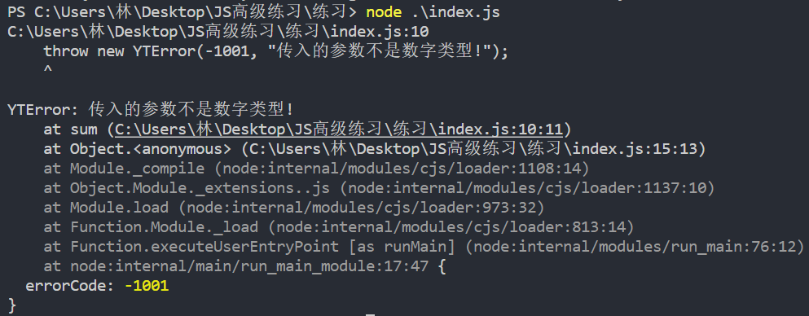

### 1.调用函数出现错误

```js
function sum(num1, num2) {
  // 我们想要实现加法运算, 所以num1和num2必须是数字类型
  // 当然你也可以是字符串类型的数字, 这些暂时先不考虑
  return num1 + num2;
}

console.log(sum({ name: "123" }, true));  // [object Object]true
```

- 这样的函数，被这样调用，是会成功的，但是并不是我们想要的

- 所以我们要对其进行类型判断，当类型不正确的时候抛出一个错误

  ```js
  function sum(num1, num2) {
    if(num1 !== "number" && num2 !== "number") {
      throw "parameters is error type~";
    }
    return num1 + num2;
  }
  
  console.log(sum({ name: "123" }, true));
  ```

- 为什么不return "parameters is error type~";

  - 如果用return，会返回一个字符串
  - 除此之外，js主线程依然会运行下去
    - 而抛出错误，会停止在当前代码

### 2.抛出的数据类型

- 原始数据类型、基本数据类型、值类型，这三个其实指的是一个东西

  - 我们可以抛出一个基本数据类型

- 但是比较常见的是抛出一个对象

  ```js
  function sum(num1, num2) {
    if(num1 !== "number" && num2 !== "number") {
      throw {errorCode: -1001, errorMessage: "参数必须为数字类型"};
    }
    return num1 + num2;
  }
  
  console.log(sum({ name: "123" }, true));
  ```

  - 抛出一个错误码和错误信息	

- 自定义错误类方案：抛出一个类所对应的对象

  ```js
  class YTError {
    constructor(errorCode, errorMessage) {
      this.errorCode = errorCode
      this.errorMessage = errorMessage
    }
  }
  
  function sum(num1, num2) {
    if(num1 !== "number" && num2 !== "number") {
      throw new YTError(-1001, "传入的参数不是数字类型!");
    }
    return num1 + num2;
  }
  
  console.log(sum("1", "2"));
  ```

  

- 最终方案：使用js提供的错误类（Error）

  ```js
  function sum(num1, num2) {
    if(num1 !== "number" && num2 !== "number") {
      throw new Error("传入的参数不是数字类型!");
    }
    return num1 + num2;
  }
  
  console.log(sum("1", "2"));
  ```

  

  - 返回的是Error类

  - Error类只能传入错误信息

  - 如果你想传入错误码，可以继承自Error

    ```js
    class YTError extends Error {
      constructor(errorCode, errorMessage) {
        super(errorMessage)
        this.errorCode = errorCode
      }
    }
    
    function sum(num1, num2) {
      if(num1 !== "number" && num2 !== "number") {
        throw new YTError(-1001, "传入的参数不是数字类型!");
      }
      return num1 + num2;
    }
    
    console.log(sum("1", "2"));
    ```

    

    - 返回的是YTError类

