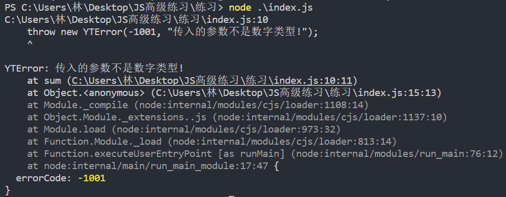
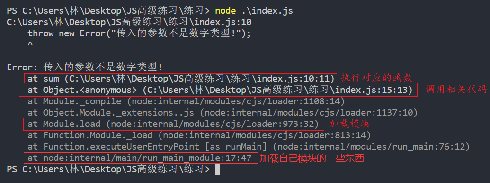
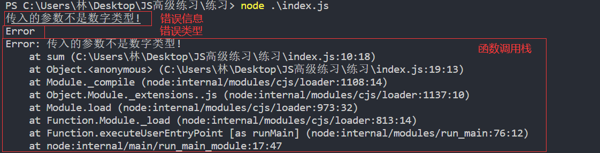
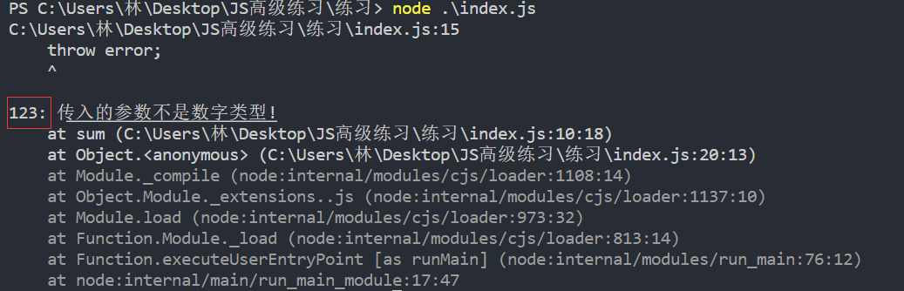
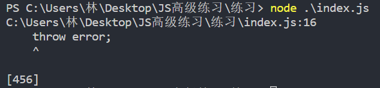
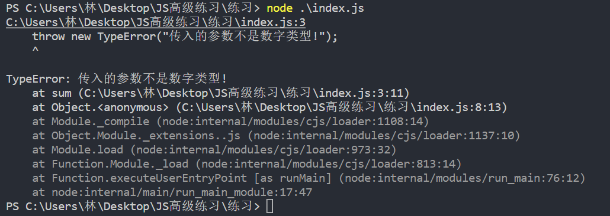

### 1.函数的调用栈



```js
function test() {
  console.log("test");
}

function demo() {
  test();
}

function bar() {
  demo();
}

bar();
```

- 如果test这个函数中发生了错误，我们想知道它是如何一步一步被调用的

  

- test看起来好像是在全局中，其实是node会把它放到一个函数中进行执行

- `Object.<anonymous>` 就相当于放入的函数，sum就是我们写在全局的函数

```js
function sum(num1, num2) {
  if(num1 !== "number" && num2 !== "number") {
    var error =  new Error("传入的参数不是数字类型!");
    console.log(error.message);  // 错误信息
    console.log(error.name);  // 错误类型
    console.log(error.stack);  // 函数调用栈
    throw error;
  }
  return num1 + num2;
}

console.log(sum("1", "2"));
```



修改错误的名字

```js
function sum(num1, num2) {
  if(num1 !== "number" && num2 !== "number") {
    var error =  new Error("传入的参数不是数字类型!");
    error.name = "123"
    throw error;
  }
  return num1 + num2;
}

console.log(sum("1", "2"));
```



修改调用栈

```js
function sum(num1, num2) {
  if(num1 !== "number" && num2 !== "number") {
    var error =  new Error("传入的参数不是数字类型!");
    error.stack = "456";
    throw error;
  }
  return num1 + num2;
}

console.log(sum("1", "2"));
```



### 2.Error的子类

- TypeError：类型错误

  ```js
  function sum(num1, num2) {
    if(num1 !== "number" && num2 !== "number") {
      throw new TypeError("传入的参数不是数字类型!");
    }
    return num1 + num2;
  }
  
  console.log(sum("1", "2"));
  ```

  

- RangeError：下标值越界错误
- SyntaxError：语法错误（解析）

### 3.强调

- 如果函数抛出了异常，后续代码将不再继续执行