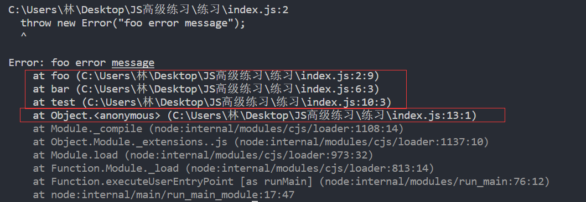
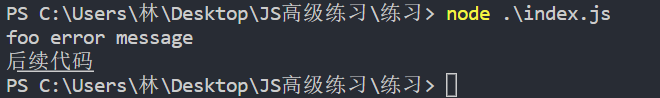

### 1.清晰地看到函数的调用栈

```js
function foo() {
  throw new Error("foo error message");
}

function bar() {
  foo();
}

function test() {
  bar();
}

test();
```



### 2.不处理异常

```js
function foo() {
  throw new Error("foo error message");
}

function bar() {
  foo();
}

function test() {
  bar();
}

test();
```

- foo函数不处理异常，就会把异常抛给bar函数
- bar函数不处理异常，就会把异常抛给test函数
- test函数不处理异常，就会把异常抛给全局
- 异常会一步一步抛出，直到最顶层的调用
- 如果在最顶层依然没有对异常进行处理，那么程序就会终止执行

### 3.使用try-catch捕获异常

```js
function foo() {
  throw new Error("foo error message");
}

function bar() {
  try {
    foo();
  } catch(err) {
    console.log(err.message)
  }
}

function test() {
  bar();
}

test();
console.log("后续代码");
```



- 如果发生了错误可以在catch中做一些处理

### 4.finally

- 不管你的代码是否抛出错误，都会执行finally中的代码

  ```js
  function foo() {
    throw new Error("foo error message");
  }
  
  function bar() {
    try {
      foo();
    } catch(err) {
      console.log(err.message)
    } finally {
      console.log("finally");
    }
  }
  
  function test() {
    bar();
  }
  
  test();
  console.log("后续代码");
  ```

### 5.省略catch后的小括号

- 从ES10开始，可以省略掉catch后面的小括号

  ```js
  function foo() {
    throw new Error("foo error message");
  }
  
  function bar() {
    try {
      foo();
    } catch {
      console.log(123)
    } finally {
      console.log("finally");
    }
  }
  
  function test() {
    bar();
  }
  
  test();
  console.log("后续代码");
  ```

### 6.捕获的位置

- 除了在bar中对foo进行捕获外，我们还可以在test中对bar进行捕获，或者在最外层对test进行捕获
- 但是无论如何，我们都要对错误进行捕获