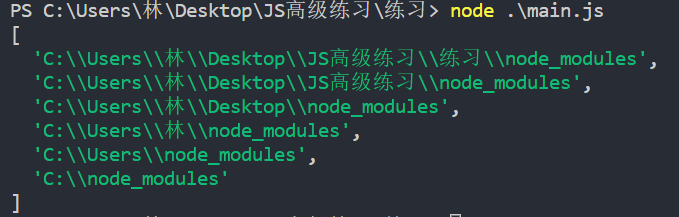
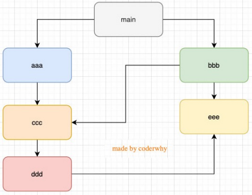

### 1.require回顾

- require是一个函数，能够帮我们把一个文件中导出的对象进行导入

### 2.require的导入格式

```js
require("X");
```

### 3.查找规则一：核心模块

- X是Node提供的一个核心模块，比如path、http、fs，是一个简单的名称
- 直接返回该模块，并停止查找

### 4.查找规则二：路径

- X是以 `./` 或者 `../` 或者 `/` 开头的
  - 第一步：将X作为文件进行查找
    - 如果X有后缀名，按照后缀名的格式查找对应文件
    - 如果X没有后缀名，按照如下顺序进行查找
      1. 直接查找文件X
      2. 查找X.js文件
      3. 查找X.json文件
      4. 查找X.node文件
  - 第二步：没有找到对应的文件，将X作为文件夹（目录）
    - 查找文件夹X下面的index系列文件
      1. 查找X/index.js文件
      2. 查找X/index.json文件
      3. 查找X/index.node文件
  - 以上均没有找到，就报错：
    - not found

### 5.查找规则三

- 既不是核心模块也不是路径

- 比如将X赋值为yt

  ```js
  require("yt");
  ```

- 打印路径

  ```js
  console.log(module.paths);
  ```

  
  - 这里的两个斜杠，第一个斜杠应该是转义字符
  - 我是在main.js文件中进行的打印
  - 这个main.js的路径是：C:\\Users\\林\\Desktop\\JS高级练习\\练习\main.js

- 如果你查找的东西既不是核心模块也不是路径

  - Node会去当前文件所在的文件夹，这里的话就是main.js文件所在的文件夹
  - 查找一个叫node_modules的文件夹，在这个文件夹下做规则二的操作
  - 如果没有找到，就到上一层文件夹下找node_modules，再做规则二的操作
  - 依然没有查到就报错

### 6.Node中模块的加载过程

- 通过require第一次引入某个模块，模块中的代码会被运行一次

- 如果在一个js文件中，通过require多次引入某个模块，模块会被缓存，模块中的代码最终只会运行一次

  - 每个模块都有一个module对象，对象中有一个属性：loaded
  - 当这个属性为false时，表示这个模块还没有被加载过
  - 当这个属性为true是，表示这个模块已经被加载过
  - 你可能要问，如果有多个文件都引用着某个模块，它只会被第一个引用的模块执行啊，其他的模块怎么办
  - 请看下面的循环引用

- 如果有循环引用，那么加载顺序是什么呢？

  

  - 出现上图的引用关系，那么加载顺序是什么呢？
  - 这张图其实是一种数据结构：图结构
  - 图结构在遍历的过程中有两种算法
    - 深度优先搜索
    - 广度优先搜索
  - Node采用的是深度优先搜索
    - main - aaa - ccc - ddd - eee - bbb
  - 这里的ccc和eee都被引用了两次，但是只打印一遍，就证明被多个模块引用，只会执行一次
    - 由于一个Node服务，只有一个入口，一般是main，所以每个模块只执行一次，就可以了

### 7.CommonJS规范的缺点

- CommonJS加载模块是同步的
  - 同步意味着只有等到对应的模块加载完毕，当前模块中的内容才能被运行
  - 这个在服务器不会有什么问题，因为服务器加载的js文件都是本地文件，加载速度非常快
- 如果将它应用于浏览器
  - 浏览器加载js文件需要先从服务器将文件下载下来，之后再加载运行
  - 那么采用同步的就意味着后续的js代码都无法正常运行，即使是一些简单的DOM操作
- 所以在浏览器中，我们通常不使用CommonJS规范
  - 当然在webpack中使用CommonJS是另外一回事
  - 因为它会将我们的代码转成浏览器可以直接执行的代码
- 在早期为了可以在浏览器中使用模块化，通常会采用AMD或CMD
  - 但是目前一方面现代的浏览器已经支持ES Modules
  - 另一方面借助于webpack等工具可以实现对CommonJS或者ES Module代码的转换
  - AMD和CMD已经使用非常少了