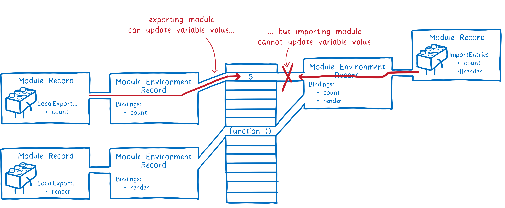

### 1.ES Module的解析过程学习网站

- https://hacks.mozilla.org/2018/03/es-modules-a-cartoon-deep-dive/

### 2.解析过程分为三个阶段

- 阶段一：构建（Construction）
  - 根据地址查找JS文件
  - 对文件进行下载
  - 将文件解析成模块记录（module record）[ˈrekərd , rɪˈkɔːrd] 
- 阶段二：实例化（Instantiation） [ɪnˌstænʃiˈeɪʃən] 
  - 对模块记录进行实例化
  - 分配内存空间
  - 解析模块的导入和导出语句
  - 把模块指向对应的内存地址
- 阶段三：运行（Evaluation）
  - 运行代码
  - 计算值
  - 将值填充到内存地址中


### 3.阶段一：构建（Construction）


- fetch：获取，引申理解为下载

  - 下载需要导入的文件

- parse：解析，这里是静态分析，就是不会运行代码

  ```js
  let isFlag = false;
  ifFlag = true;
  if (isFlag) {
  	import bar from "./bar.js"
  }
  ```

  - 这种代码在ES Module中是不能写的
  - 一般都是把这段引入的代码放到最顶层
  - 静态分析只会分析这个文件有没有import语句
  - 经过解析之后会生成一个Module Record的数据结构
  - 它会分析导入的这个文件还依赖着哪些文件
  - 再去下载这些依赖的文件
  - 再进行解析


- 正在下载的文件会做标记

### 4.阶段二和阶段三



- 导出文件可以更新导出变量的值
- 但是导入文件不能更新导入变量的值

- main.js文件（导出）

  ```js
  export let name = "yt";
  
  console.log("main.js", name);
  
  setTimeout(() => {
    name = "why";
  }, 2000);
  
  setTimeout(() => {
    console.log("main.js", name)
  }, 7000)
  ```

- index.js文件（导入）

  ```js
  import { name } from "./main.js"
  
  console.log(name);
  
  setTimeout(() => {
    console.log("index.js", name)
  }, 3000)
  
  setTimeout(() => {
    name = "uuu"  // 报错
  }, 5000)
  ```

  - 因为这个name是通过const定义的, 在传递的过程中