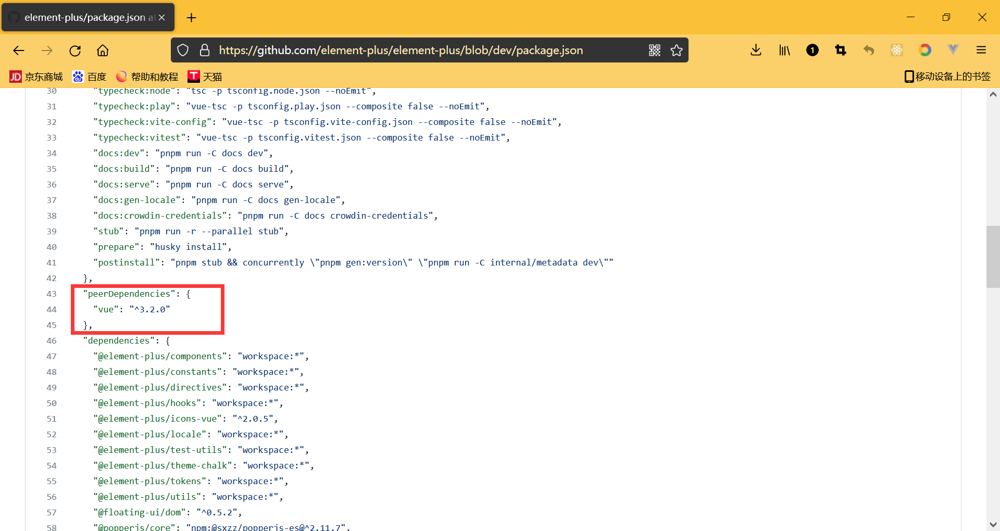
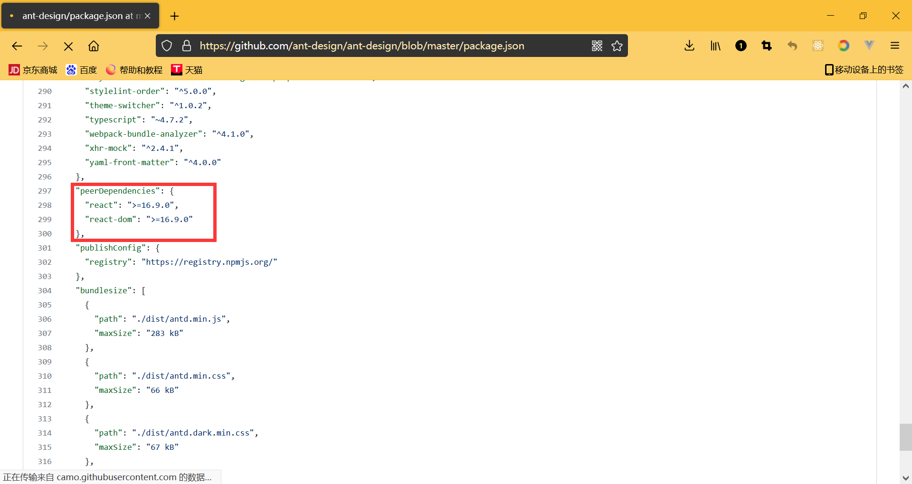

### 1.代码共享方案

- 方案一：把自己写好的代码放在github上
  - 别人在引用的时候，需要下载
  - 整个过程非常的繁琐
  - 容易出错
  - 不利于版本控制

- 方案二：使用一个专业的工具管理代码
  - 开发者通过这个工具将代码发布到特定的位置
  - 使用者通过这个工具在自己本地安装、升级、删除开发者的库
  - 可以让开发者更好的管理自己的工具包，让使用者更好的使用别人开发的工具包
  - 这个工具就是npm（Node Package Manager）Node包管理工具

### 2.查看搜索npm管理的包

- https://www.npmjs.com/

### 3.npm管理的包具体存放位置

- 发布包是发布在registry上
- 安装一个包是在registry上面下载

### 4.记录

- 我们开发一个项目可能会依赖很多的库
- 如果我们想要共享自己的代码给同事或者其他人，需要把node_modules删掉
- 但是又没有记录，同时也可能不知道你这个项目依赖哪些库
- 所以需要一个东西记录你这个项目依赖了哪些库
- 这个记录项目依赖哪些包的东西就是package.json文件

### 5.package.json

- 每个项目都会有一个对应的配置文件，无论是Vue、React前端项目还是Node后端项目
- 这个配置文件会记录着你项目的名称、版本号、项目描述
- 同时会记录着你项目所依赖的其他库的信息和版本号
- npm init
  - name：名字需要是英文，因为中文存在一些解码的问题
  - version：版本号默认1.0.0
  - description：项目描述
  - main：项目的入口
  - test：测试命令
  - registry：git仓库
  - keyword：关键字
  - author：作者
  - license：协议默认是ISC
- 简单方式：npm init -y
  - 但是你的仓库的名字是中文，会报错
- private属性
  - 记录当前项目是否为私有
  - 值为true时，npm是不能发布当前项目的
  - 这个可以防止私有库被不小心发布
  - npm publish
- main属性
  - 设置当前库的入口
  - 默认是查找当前库的index.js
  - 假如我们设置自己的库是在src文件夹下的main.js文件
  - 我们引入一个文件的时候就会去找src文件夹下的main.js文件
  - 开源的项目一般都会有main这个属性

- scripts属性
  - 方便我们执行一些命令
  - start、test、stop、restart这四个在执行命令时可以省略掉run
- dependencies属性
  - 无论开发环境还是生产环境都需要依赖的包
  - 通常是我们项目实际开发用到的一些库模块vue、vuex、vue-router、react、react-dom、axios等等
  - 打包的时候会把这些库打包进去
  - npm install 包 --save 或者 npm install 包

- devDependencies属性
  - 在生产环境中不需要的依赖，比如webpack、webpack-cli、babel等
  - 这个时候我们会通过 npm install webpack --save-dev，将它安装到devDependencies属性中
  - 打包的时候不会把这些包打包进去
  - 也可以这么写：npm install webpack -D
- peerDependencies属性
  - 还有一种项目依赖关系是对等依赖，也就是你依赖的一个包，它必须是以另外一个宿主包为前提的
  - 比如element-plus是依赖于vue3的，ant design是依赖于react、react-dom的
  - 所以在element-plus和ant design中都会有peerDependencies属性

