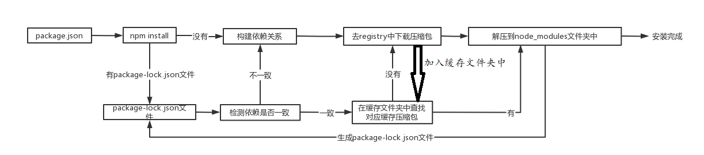
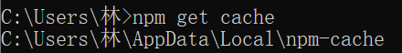
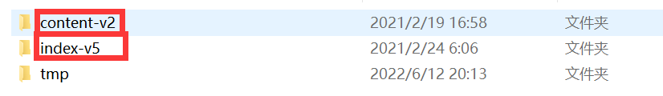
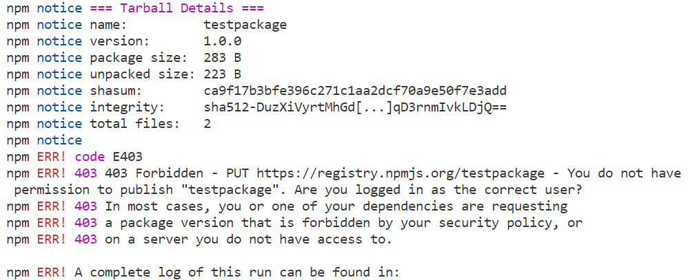

### 1.版本规范

- X.Y.Z

  - X：主版本号（major），当你做了不兼容的 API 修改（可能不兼容之前的版本）
  - Y：次版本号（minor），当你做了向下兼容的功能性新增（新功能增加，但是兼容之前的版本）
  - Z：修订号（patch），当你做了向下兼容的问题修正（没有新功能，修复了之前版本的bug）

- 简单理解

  - X：重大版本变化，可能不兼容之前的版本

  - Y：新增加了一些功能，并且兼容之前的版本
  - Z：修复了之前版本的bug，没有新增功能

- ^x.y.z：表示x是保持不变的，y和z永远安装最新的版本

- ~x.y.z：表示x和y保持不变的，z永远安装最新的版本

- 项目中还有一个package-lock.json文件

  - 这个文件主要是记录我们安装的库的真实版本
  - 这里面不会有^~这样的符号
  - 如果想要安装最新的版本就需要把这个package-lock.json文件给删掉

### 2.package.json中还有一些属性

- engines属性
  - engines属性用于指定Node和npm的版本号
  - 在安装的过程中，会先检查对应的引擎版本，如果不符合就会报错
  - 事实上也可以指定所在的操作系统 "os" : [ "darwin", "linux" ]，只是很少用到

- browserslist属性
  - 用于配置打包后的JavaScript浏览器的兼容情况
  - 否则我们需要手动的添加polyfills来支持某些语法
  - 也就是说它是为webpack等打包工具服务的一个属性
  - 不过我们一般会单独写一个browserslist的配置文件

### 3.npm install相关命令

- 全局安装：npm install webpack -g
  - 一般会安装yarn webpack这样的工具才会进行全局安装
- 局部安装：npm install webpack
- 安装开发和生产依赖：
  - npm install axios
  - npm install axios --save
- 安装开发依赖，或者安装生产环境不需要的依赖
  - npm install webpack --save-dev
  - npm install webpack -D

- 根据package.json文件安装相关依赖包
  - npm install

### 4.npm install的流程

- 当我们安装某个依赖时，我们会去查看本项目有没有lock这个配置文件
  - 如果没有lock这个配置文件就会构建依赖
  - 什么是构建依赖？
    - 比如安装axios，axios也会依赖一些东西
    - 我们就会构建这些依赖
  - 构建完依赖再去registry上进行下载
  - 只不过下载下来的是压缩文件
  - 然后把这个压缩包放入存放缓存文件的文件夹中
  - 存放完成后再把压缩包解压到node_modules文件夹中
  - 最后生成package-lock.js文件
  - 此时完成安装
- 当我们安装某个依赖时，有lock这个配置文件呢？
  - 如果有就需要检测依赖是否一致
  - 什么叫检测依赖是否一致？
    - 如果明确安装某个库的版本
    - 而这个版本与lock文件中的不符，那么就是重新构建依赖
  - 如果一致就会去缓存文件夹中查找对应的缓存文件
  - 如果没有就得去仓库中下载
  - 如果有就拿到这个缓存的压缩文件，对其进行压缩，添加到node_modules中
  - 完成安装

### 5.寻找缓存的位置

- npm get cache

  

  - 进入_cacache文件夹

    

    - 一个是存放具体的包
    - 一个是存放索引

### 6.发布自己的包

- 注册账号
  - 用户名是yt
  - 密码与自己的服务器密码一直, 只是第一个字母不大写

- npm login进行登录

- 出现错误

  

  - 你的包名与仓库的名字重复

- 更新仓库：
  1. 修改版本号(最好符合semver规范) 
  2. 重新发布
- 删除发布的包：
  
  - npm unpublish
  
- 让发布的包过期：
  
  - npm deprecate [ˈdeprəkeɪt] 不赞成