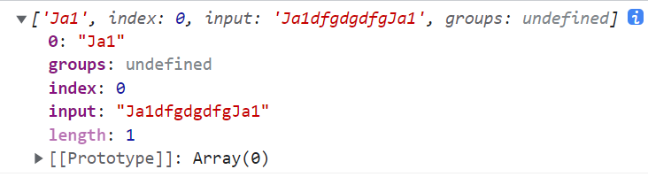
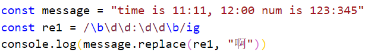
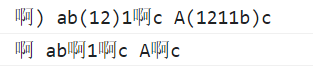
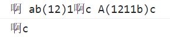

### 1.正则的创建

```js
const regExp = new RegExp("aaa", "ig");
const regExp1 = /aaa/ig;
```

### 2.正则的方法

- test方法

  - 返回一个boolean值

- exec方法

  ```js
  const res = /ja1/gi
  const message = "Ja1dfgdgdfgJa1"
  console.log(res.exec(message))
  ```

  - 返回一个数组

    

### 3.字符串中的方法

- replace方法
- replaceAll方法
  - 正则必须加g
- match方法
  - 正则加了g就返回一个数组, 数组中有好多匹配的结果
  - 正则不加g也返回一个数组, 数组中是详情信息
- matchAll方法
  - 正则必须加g
  - 返回一个迭代器, 通过for of获取每一个的详情信息
- search方法
  - 返回索引
- split方法

### 3.修饰符

- i表示忽略大小写, g表示全局匹配, m表示换行匹配

### 4.字符类

- \d表示匹配从 0 到 9 的字符
- \s表示匹配空格、制表符、换行符
- \w表示匹配字母、数字、下划线
- .表示匹配任意字符(除了换行符)

### 5.锚点

- ^表示以什么开头
- $表示以什么结尾
- /^abc$/表示整个字符串必须是abc

### 6.词边界



```js
// 结果: time is 啊, 啊 num is 123:345
```

### 7.转义字符

```js
// 对.进行转译
const re = /\./ig
// 对/进行转译
const re1 = /\//
```

### 8.集合

```js
const re = /[1257]/  // 代表查找1或者2或者5或者7中的一个
const re1 = /[3-9]/  // 代表查找3到9之间的一个数字
const re2 = /[0-9]/  // 与\d一个意思
const re3 = /[^0-9]/  // 与\D一个意思, 除了0到9之间的任意字符
```

### 9.量词

- 集合

  ```js
  const re = /e{3,5}/ // {3,5} 代表有3个或者4个或者5个e
  ```

- 常见符号

  - +代表{1,}  表示一个或者多个
  - *代表{0,}  表示零个或者多个
  - ?代表{0,1}  表示零个或者一个, 通过它可以开启惰性模式, 开启惰性模式时不代表{0,1}

### 10.开启惰性模式

```js
const message = "()) ab(12)1(2)c A(1211b)c"

console.log(message.replace(/\(.??\)/ig, "啊"))
console.log(message.replace(/\(.+?\)/ig, "啊"))
// 后面的?只是开启惰性模式而已
// 默认是贪婪模式
```



```js
console.log(message.replace(/\(.?\)/ig, "啊"))
console.log(message.replace(/\(.+\)/ig, "啊"))
// 贪婪模式
```



### 11.捕获组

```js
// 1.分组的意义
const re = /(abc){3,5}/
// 为什么要分组, 目前只能一个一个的匹配, 不能多个同时匹配, 分组后就可以了
// 还有你可以拿到括号中的结果

// 一般使用match才能更好的看到效果

// 2.起个名字
const re1 = /(?<why>abc){3,5}/
// 3.不想将括号中的内容作为结果
const re2 = /(?:abc){3,5}/
```

### 12.或

```js
const re = /(abc|cba|ajdh){3,5}/
```

### 13.问题

```js
const names = ["abc.html", "Home.jsx", "index.html", "index.js", "util.js", "format.js",]
const message = /util\.js$/g
const namess = []
for (const item of names) {
  console.log(message.lastIndex)
  if (message.test(item)) {
    namess.push(item)
  }
}
console.log(namess)

// 这么写会记录一个lastIndex, 查到了lastIndex就会记录当前的位置
// 查不到了lastIndex就归零
// 所以util.js就查不出来
```

### 14.更多正则请查询

- https://c.runoob.com/front-end/854/