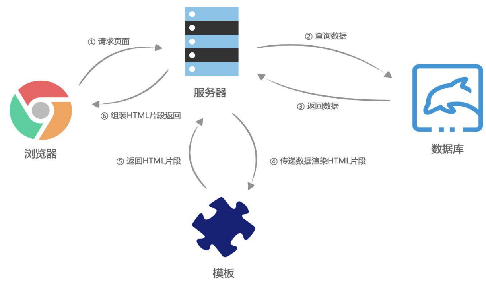
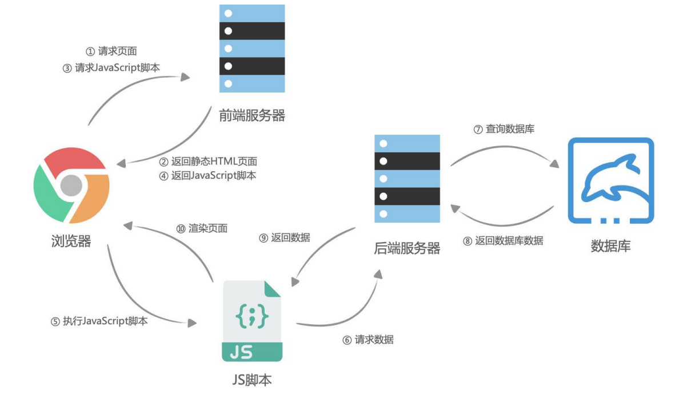

### 1.服务器端渲染流程

- 浏览器向服务器请求一个页面，服务器端接收请求，并向数据库查询数据，数据库返回数据
- 然后服务器利用自身的模块和刚才请求到的数据组成html片段
- 再把这些html片段组装成一个html文件，并把这个文件返回给浏览器
- 浏览器拿到这个html文件后进行渲染，最终能够在浏览器看到效果

### 2.服务器端渲染缺点

- 有如下场景：当用户点击搜索按钮后，本质只是一些数据发生了变化，但是服务器却要重绘整个页面再返回一个新的html文件给到前端进行渲染。
  - 对于开发者来说非常的不友好
  - 对于网络带宽来说也会造成很大的开销

### 3.ajax的作用

- 在页面无需刷新的情况下，向服务器获取数据

### 4.前后端分离的流程

- 浏览器向服务器发送请求，获取静态html文件
- 浏览器解析html文件，向服务器发送获取js文件的请求
- 浏览器获取到js文件后运行js文件
- js文件中有ajax，通过ajax向服务器请求数据
- 服务器向数据库请求特定数据，然后返回给js中的ajax
- 前端再通过ajax中的数据渲染相应的html

