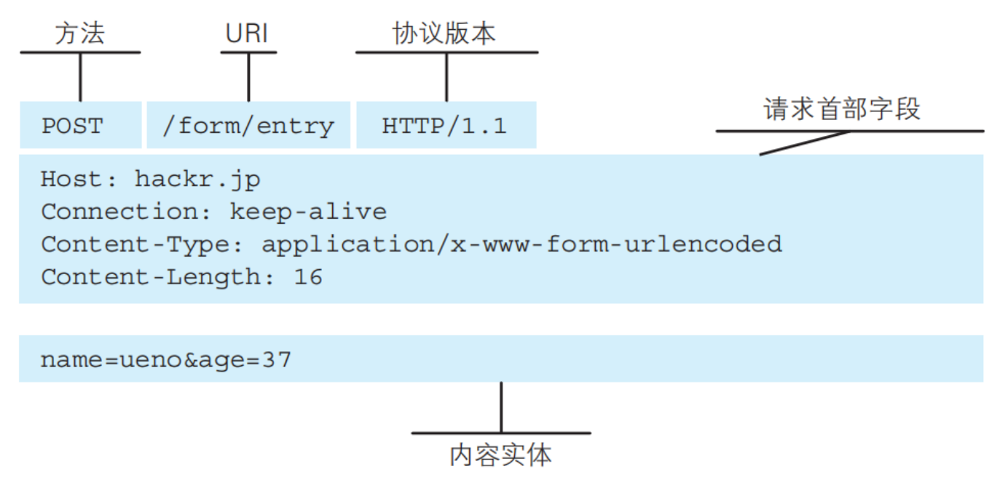
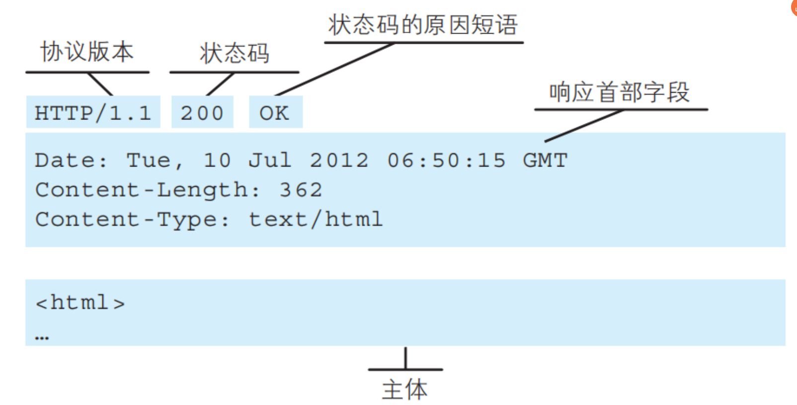
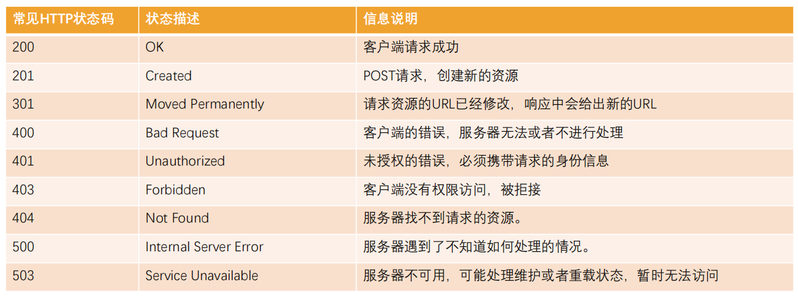

### 1.什么是HTTP协议

- 超文本传输协议，用于分布式、协作式和超媒体信息系统的应用层协议
- 设计HTTP最初的目的是为了提供一种发布和接收HTML页面的方法
- HTTP是一种标准，是一种客户端与服务器端请求和响应的标准
  - 我们把客户端称为用户代理程序（user agent）
  - 把服务端称为源服务器（origin server）

### 2.HTTP的组成

- 请求：request

  - 请求行
    - 方法：get或者post
    - 地址：/home/multidata
    - 协议版本：HTTP/1.1
  - 请求头
  - 请求体

  

- 响应：response

  - 响应行
    - 协议版本：HTTP/1.1
    - 状态码：200
    - 状态码的原因短语：OK
  - 响应头
  - 响应体

  

### 3.HTTP的版本

- HTTP/0.9
  - 发布于1991年
  - 只支持GET方法获取文本数据，主要用来获取HTML页面内容
- HTTP/1.0
  - 发布于1996年
  - 支持POST、HEAD方法，支持请求头、响应头等，支持更多种数据类型(不再局限于文本数据) 
  - 但是浏览器的每次请求都需要与服务器建立一个TCP连接，请求处理完成后立即断开TCP连接
  - 每次建立连接增加了性能损耗
- HTTP/1.1(目前使用最广泛的版本)
  - 发布于1997年
  - 增加了PUT、DELETE方法
  - 采用持久连接(Connection: keep-alive)，多个请求可以共用同一个TCP连接
- 2015年，HTTP/2.0
- 2018年，HTTP/3.0

### 4.HTTP的请求方式

- get、head、post、put、delete、patch、connect、trace
- 使用最多是get和post
  - 深入学习node的时候，会用到patch和delete

### 5.Content-type

- 数据类型
  - application/x-www-form-urlencoded：表示数据被编码成以 '&' 分隔的键值对，同时以 '=' 分隔键和值
  - application/json：表示是一个json类型
  - text/plain：表示是文本类型
  - application/xml：表示是xml类型
  - multipart/form-data：表示是上传文件

### 6.其他

- content-length：文件的大小长度
- Connection：keep-alive
  - http是基于TCP协议的，但是通常在进行一次请求和响应结束后会立刻中断
  - 在http1.0中，如果想要继续保持连接：
    - 浏览器需要在请求头中添加 connection: keep-alive
    - 服务器需要在响应头中添加 connection: keey-alive
    - 当客户端再次发放请求时，就会使用同一个连接，直到一方中断连接
  - 在http1.1中，所有连接默认是 connection: keep-alive
    - 不同的Web服务器会有不同的保持 keep-alive的时间
    - Node中默认是5s钟
- keep-alive: timeout=5
- accept-encoding：告知服务器，客户端支持的文件压缩格式，比如js文件可以使用gzip编码，对应 .gz文件
- accept：告知服务器，客户端可接受文件的格式类型
- user-agent：客户端相关信息

### 7.响应状态码

- Http状态码非常多，可以根据不同的情况，给客户端返回不同的状态码
- 大于等于200小于300都表示正常
- MDN响应码解析地址
  - https://developer.mozilla.org/zh-CN/docs/web/http/status

