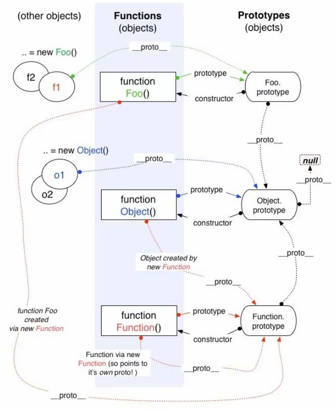

### 1.纯函数的特点

- 不能引用外部变量
- 不能改变外部变量
- 不能有输出，或者键盘事件，或者IO操作

### 2.三个点的应用

- 展开运算符：
  - 数组
  - 对象
  - 实参

- 剩余参数：
  - 形参

### 3.原型链

普通对象由new Object而来，所以它的隐式原型指向Object的显示原型

虽然Object的显示原型也是对象，但是Object的显示原型中的隐式原型指向null


Object可以理解为由new Function而来，所以Object的隐式原型指向Function的显示原型


Function也可以理解为由new Function而来，所以Function的隐式原型指向Function的显示原型

Function的显示原型也是一个对象，所以Function的显示原型中的隐式原型指向Object的显示原型


普通函数由new Function而来，所以它的隐式原型指向Function的显示原型

普通函数还可以作为构造函数（类）来使用。

当用new操作一个普通函数后，所创建的对象的隐式原型指向这个函数的显示原型

显示原型是个对象，所以这个函数的显示原型中的隐式原型指向Object的显示原型



### 4.对象属性的查找特点：

如果想要获取一个对象中属性的值，比如通过 stu.name 获取学生对象中的名字

它首先会在stu这个对象中查找name，找不到就去stu的隐式原型中查找

这个隐式原型指向Object的显示原型，所以最终会到Object的显示原型中进行查找是否有name

还没有就会去Object的显示原型中的隐式原型中进行查找，但是它是null，发现是null后就会返回undefined


这个特点及其重要，因为如果没有这个特点继承是无法实现的

### 5.继承的实现

实现方法的继承：只需要让子类的显示原型中的隐式原型指向父类的显示原型，但是做不到。

不过可以让子类的显示原型指向一个空对象

再让空对象的隐式原型指向父类的显示原型，这样就做到了方法的继承


实现属性的继承：在子类中通过call方法调用父类，并为其绑定this，同时传参

这样就可以在父类中为子类实例对象定义属性，继而实现属性的继承

```js
// ES5实现继承, 有一定兼容性问题
function inherit(SubType, SuperType) {
  SubType.prototype = Object.create(SuperType.prototype);
  Object.defineProperty(SubType.prototype, "constructor", {
    configurable: true,
    enumerable: false,
    writable: true,
    value: SubType,
  });
}

function Person(name, age) {
  this.name = name;
  this.age = age;
  this.friends = [];
};

function Student(name, age, sno) {
  Person.call(this, name, age);
  this.sno = sno;
};

inherit(Student, Person);

Student.prototype.studying = function() {
  console.log(this.name + "在学习~");
};

var stu = new Student("yt", 18, 1);
```

```js
// ES5实现继承, 没有兼容性问题
function createObj(o) {
  function Fn() {};
  Fn.prototype = o;
  return new Fn;
}

function inherit(SubType, SuperType) {
  SubType.prototype = createObject(SuperType.prototype);
  Object.defineProperty(SubType.prototype, "constructor", {
    configurable: true,
    enumerable: false,
    writable: true,
    value: SubType,
  });
}

function Person(name, age) {
  this.name = name;
  this.age = age;
  this.friends = [];
};

function Student(name, age, sno) {
  Person.call(this, name, age);
  this.sno = sno;
};

inherit(Student, Person);
```

```js
// ES6实现继承
class Person {
  constructor(name, age) {
    this.name = name;
    this.age = age;
  };

  eating() {
    console.log(this.name + " 在吃饭~");
  };
};

class Student extends Person {
  constructor(name, age, sno) {
    super(name, age);

    this.sno = sno;
  };

  studying() {
    console.log(this.name + " 在学习~");
  };
};

var stu = new Student("yt", 18, 1);
stu.eating();  // yt 在吃饭~
stu.studying();  // yt 在学习~
```

