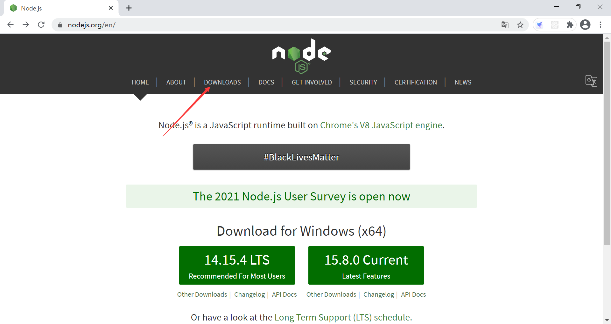
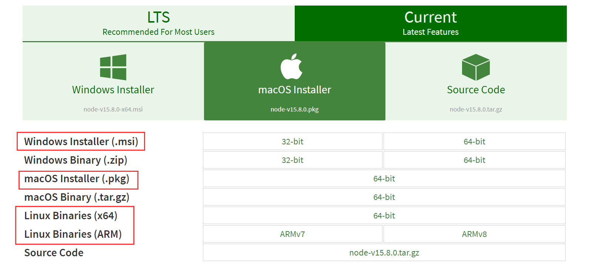
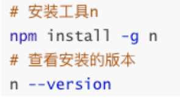
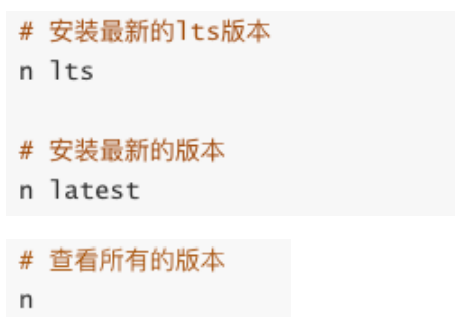
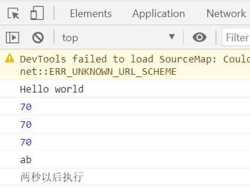
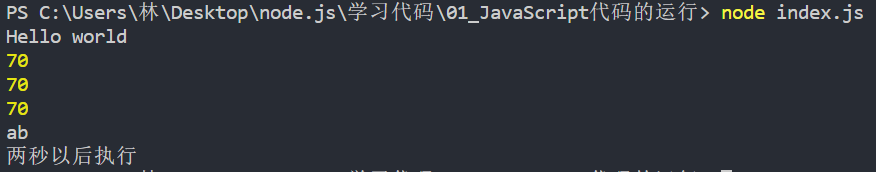
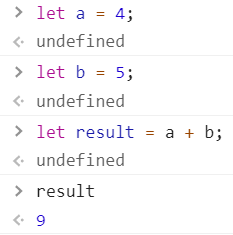
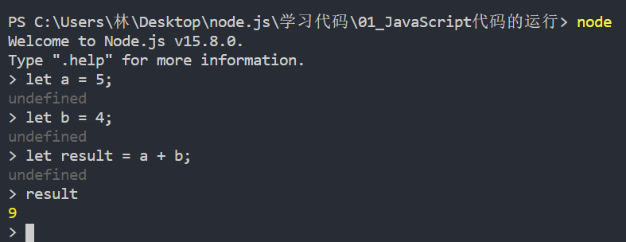
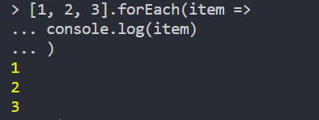

### 1.Node的安装

- Node.js是在2009年诞生的，目前最新的版本分别是LTS 14.15.4以及Current 15.8.0
  - 现在已经是16.15.1和18.4.0了
  - LTS版本：相对稳定一些，推荐线上环境使用该版本
  - Current版本：最新的Node版本，包含很多新特性
- 我们选择什么版本呢？
  - 如果你是学习使用，可以选择current版本
  - 如果你是公司开发，建议选择LTS版本
- Node的安装方式有很多：
  - 可以借助于一些操作系统上的软件管理工具，比如Mac上的homebrew，Linux上的yum、dnf等
  - 也可以直接下载对应的安装包下载安装；
- 我们选择下载安装，下载自己操作系统的安装包直接安装就可以了：
  - Windows选择.msi安装包，Mac选择.pkg安装包，Linux会在后续部署中讲解；
  - 安装过程中会自动配置环境变量（让我们可以在命令行使用）
  - 并且会安装npm（Node Package Manager）工具；

### 2.Node的版本工具

- 在实际开发学习中，我们只需要使用一个Node版本来开发或者学习即可
- 但是，如果你希望快速更新或切换多个版本，可以借助于一些工具
  - nvm：Node Version Manager；
  - n：Interactively Manage Your Node.js Versions（交互式管理你的Node.js版本）
    - 问题：这两个工具都不支持Windows
  - n：n is not supported natively on Windows.
  - nvm：nvm does not support Windows

### 3.版本管理工具：

- 安装最新的lts版本：
  - 前面添加的sudo是权限问题
  - 可以两个版本都安装，之后我们可以通过n快速在两个版本间切换
  
    

### 4.JavaScript代码执行

- 如果我们编写一个js文件，里面存放JavaScript代码，如何来执行它呢？ 

- 目前我们知道有两种方式可以执行：

  - 将代码交给浏览器执行；
  - 将代码载入到node环境中执行；

- 如果我们希望把代码交给浏览器执行：

  - 需要通过浏览器加载、解析html代码，所以我们需要创建一个html文件
  - 在html中通过script标签，引入js文件
  - 当浏览器遇到script标签时，就会根据src加载、执行JavaScript代码

  

- 如果我们希望把js文件交给node执行

  - 首先电脑上需要安装Node.js环境，安装过程中会自动配置环境变量
  - 可以通过终端命令node js文件的方式来载入和执行对应的js文件

  

### 5.Node的REPL

- 什么是REPL？
  - REPL是Read-Eval-Print Loop的简称，翻译为“读取-求值-输出”循环；
  - REPL是一个简单的、交互式的编程环境；

- 浏览器交互环境

- node交互环境

  

  

- 不重要