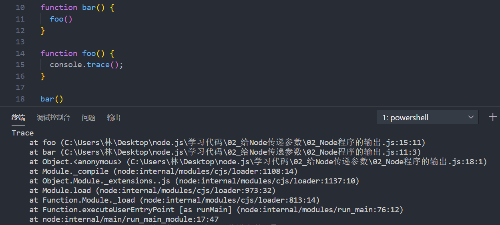

### 1.Node程序传递参数

- 我们首先打印一下process这个内置对象

  ```js
  console.log(process);
  ```

- 在process内置对象里有一个argv属性，这个属性包含了我们所需要的一些参数

  

- 传递参数

  ```js
  node index.js youngtree age=21
  ```

  

- 这个时候再执行上面写的那条命令就可以看到信息了

  ```js
  console.log(process.argv[2]);
  console.log(process.argv[3]);
  process.argv.forEach(element => {
    console.log(element)
  });
  ```

  

### 2.为什么叫argv呢？

- 在C/C++程序的main函数中，可以获取到两个参数
  - argc：argument counter的缩写，传递参数的个数
  - argv：argument vector的缩写，传入的具体参数
    - vector [ˈvektər] 翻译过来是矢量的意思，在程序中表示一种数据结构
    - 在C++、Java中都有这种数据结构，是一种数组结构
    - 在JavaScript中也是一个数组，里面存储一些参数信息

### 3.Node的输出

- console.clear()：清空控制台

  

- console.trace()：打印函数的调用栈

  

- 还有一些其他的方法，其他的一些console方法，可以自己在下面的网站学习研究一下
  
  - https://nodejs.org/dist/latest-v14.x/docs/api/console.html

### 5.特殊的全局对象

- 为什么我称之为特殊的全局对象呢？
  - 这些全局对象可以在模块中任意使用，但是在命令行交互中是不可以使用的
  - 包括：`__dirname`、`__filename`、`exports`、`module`、`require()`
- `__dirname`：获取当前文件所在的路径
  
  - 注意：不包括后面的文件名
- `__filename`：获取当前文件所在的路径和文件名称
  
  - 注意：包括后面的文件名称
  
- 代码演示

  ```js
  console.log(__dirname);
  console.log(__filename);
  ```

  

### 6.常见的全局对象

- 什么是全局对象
  - 在程序的任何位置我都可以访问的对象
- process对象：process提供了Node进程中相关的信息
  - 比如Node的运行环境、参数信息等
  - 后面会讲如何将一些环境变量读取到process的env中
- console对象：提供了简单的调试控制台
  - 更加详细的请查看官网文档：https://nodejs.org/api/console.html

- 定时器函数：在Node中使用定时器有好几种方式
  - setTimeout(callback, delay[, ...args])：callback在delay毫秒后执行一次
  - setInterval(callback, delay[, ...args])：callback每delay毫秒重复执行一次
  - setImmediate(callback[, ...args])：callback I / O事件后的回调的“立即”执行 

- process.nextTick(callback[, ...args])：添加到下一次tick队列中


### 7.global对象

- 在终端输入global.再按两下table键

  

- Node中的global有点类似于浏览器上的window

  - 相同点：

    - Node的global.process和process的输出结果都是同一个
    - 浏览器的window.document和document的输出结果也是同一个

  - 不同点：

    - Node中每个文件都是一个独立的模块

      ```js
      var name = "youngtree";
      console.log(name);
      // youngtree
      console.log(global.name);
      // undefined
      ```

    - 我在浏览器中定义一个变量

      ```js
      var name = "youngtree";
      console.log(name);
      // youngtree
      console.log(window.name);
      // youngtree
      ```

    - 定义的变量默认是放到window中的，所以可以通过window拿到你定义的变量

    - 因为浏览器没有模块的概念，所以window就是一个最顶层的东西